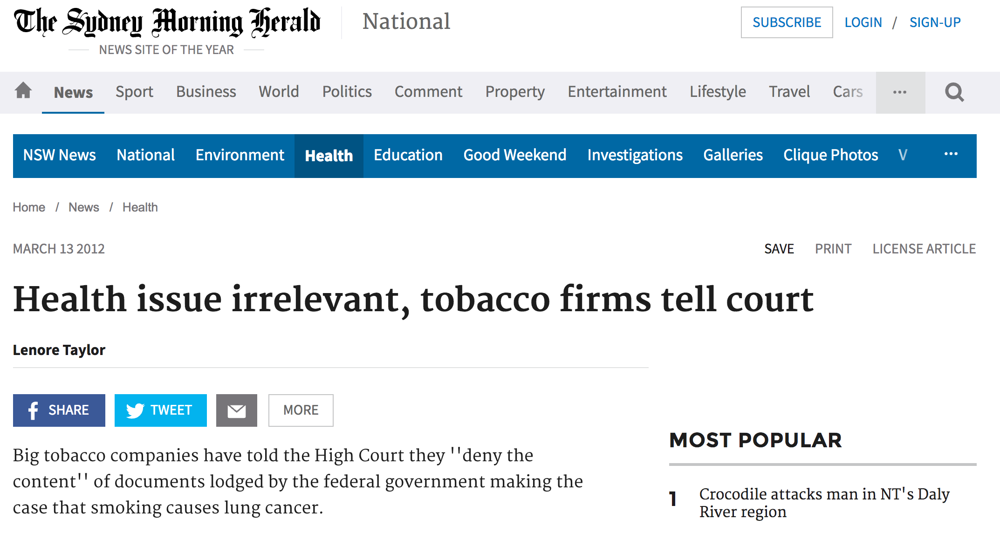

```{=html}
<style>
.title-slide {
  background-image: url("https://raw.githubusercontent.com/tcui001/tcui001.github.io/master/assets/img/smoking.jpg");
  background-size: 100% 100%;
  opacity: 0.1;
}
</style>
```
```{r Lec1, echo=FALSE, warning=FALSE, message=FALSE, cache=FALSE}
library(knitr)
opts_chunk$set(tidy = TRUE, cache = FALSE) 
library(knitr)
```

```{r child='UnitOverview.Rmd'}
```


# Data Story \| Does smoking cause cancer?

## 

<iframe width="560" height="315" src="https://www.youtube.com/embed/3erPHZINp64" frameborder="0" allowfullscreen>

</iframe>

## 

::: {align="center"}

:::

## Does smoking cause cancer?

According to the [Australian Cancer
Council](http://www.cancer.org.au/preventing-cancer/smoking-and-tobacco/)
<br> "Tobacco smoking is the largest preventable cause of cancer,
responsible for more cancer deaths in Australia than any other single
factor. It is also directly responsible for many heart and lung
diseases".

However, in a hearing to the Australian High Court in 2012 disputing the
introduction of cigarette plain packaging with health warnings:

-   While British American Tobacco was prepared to accept that there are
    serious health consequences caused by smoking, Imperial Tobacco
    responded with "some people say that ..."

<i class="fa fa-link"></i>
[SMH](http://www.smh.com.au/national/health/health-issue-irrelevant-tobacco-firms-tell-court-20120312-1uwjg.html)

# Causation and Association

## It is very difficult to establish causation

::: {align="center"}

:::

<i class="fa fa-link"></i> [Cancer
Council](http://www.cancer.org/cancer/news/study-smoking-dramatically-increases-liver-cancer-risk)

## It is very difficult to establish causation

-   It is rather easy to establish association (that one thing is linked
    to another).
    -   Association may **suggest** causation.
    -   But association does not **prove** causation.

- The [**causal graph**]{.kwd}

```{r, out.width = '75%', echo=F, warning=F}
library("DiagrammeR")

DiagrammeR::grViz(" 
digraph rmarkdown {

graph [fontsize = 3, fontname = Arial, nodesep = .5, ranksep = .5]
node [fontsize = 20, fontname = Arial,fontcolor = White, width=0.5, height=0.5]
edge [fontsize = 3, fontname = Arial, width=0.1, length=0.1, arrowsize=2]

Z [shape=oval,style=filled, color=gray, label='Z',fixedsize = true]

X [shape=oval, style=filled, color=gray, label='X',fixedsize = true]

Y [shape=oval, style=filled, color=gray, fixedsize = true]
{rank = same; X; Y}

Z -> X [label='', fixedsize = true, arrowhead=none]

Z -> Y [label='', fixedsize = true]

X -> Y [label='?', fixedsize = true, fontsize=20,fontcolor = Black]


}
", height=200)
detach(package:DiagrammeR)
```
- [**Confounding**]{.kwd} occurs when the
effect of one variable (X) on another variable (Y) is clouded by the
influence of another variable (Z).

- Confounders can be hard to find, and can mislead about a cause and effect relationship.

## 

::: thinkingbox
### [<i class="fa fa-circle fa-stack-2x"></i><i class="fa fa-comment-alt fa-stack-1x fa-inverse"></i>]{.fa-stack .fa} Statistical Thinking

What could explain the fact that smokers have a higher rate of liver
cancer?

-   Smokers tend to drink more alcohol than non-smokers, and excessive
    alcohol consumption causes liver cancer.
-   So the effect of smoking is confounded (mixed-up) with the effect of
    alcohol consumption.
:::

```{r, out.width = '85%', echo=F, warning=F}
library("DiagrammeR")

DiagrammeR::grViz(" 
digraph rmarkdown {

graph [fontsize = 3, fontname = Arial, nodesep = .5, ranksep = .5]
node [fontsize = 6, fontname = Arial,fontcolor = White, width=0.7, height=0.5]
edge [fontsize = 3, fontname = Arial, width=0.1, length=0.1, arrowsize=2]

Z [fontsize = 5, shape=oval,style=filled, color=gray, label='Alcohol Consumption',fixedsize = true]

X [shape=oval, style=filled, color=gray, label='Smoking',fixedsize = true]

Y [shape=oval, style=filled, color=gray, label='Liver cancer', fixedsize = true]
{rank = same; X; Y}

Z -> X [label='', fixedsize = true, arrowhead=none]

Z -> Y [label='', fixedsize = true]

X -> Y [label='?', fixedsize = true, fontsize=20,fontcolor = Black]


}
", height=250)
detach(package:DiagrammeR)
```

## 

::: thinkingbox
<!-- ### [<i class="fa fa-circle fa-stack-2x"></i><i class="fa fa-comment-alt fa-stack-1x fa-inverse"></i>]{.fa-stack .fa} Statistical Thinking -->

### <span class="fa-stack fa"><i class="fa fa-circle fa-stack-2x"></i><i class="fa fa-comment-alt fa-stack-1x fa-inverse"></i></span> Statistical Thinking

> Suppose a study finds that having yellow fingertips is associated with
> lung cancer. Does having yellow fingertips cause lung cancer?

-   Smoking is a confounding factor.
-   People with yellow fingertips tend to smoke, and smoking appears to
    be linked to lung cancer.

> A study finds that [smokers tend to have higher rates of lung
> cancer](http://www.cancerresearchuk.org/about-cancer/causes-of-cancer/smoking-and-cancer/how-smoking-causes-cancer).
> Does smoking cause lung cancer?

-   Possible confounders are diet or alcohol or some genetic reasons.
:::

## Strategy for establishing causation

-   If a confounder is known, we can potentially add it as an additional
    variable. For example, if alcohol consumption is a potential confounding factor for smoking's effect on liver cancer, we can add an variable "drinking" with possible values: 
    - "heavy drinker", "medium drinker", "light drinker", "lifetime abstainer"


-  In some scenarios, for example, in clinical trials, it is possible to [**design controlled experiments**]{.pwd} by manipulating variables to test their effects.

# Simpson's Paradox


## A confounding variable can lead to Simpson's Paradox


-   [Simpson's Paradox]{.kwd} (or the reversing paradox) was first
    mentioned by British statistician [Udny
    Yule](https://en.wikipedia.org/wiki/Udny_Yule) in 1903. It was named
    after [Edward H.
    Simpson](https://en.wikipedia.org/wiki/Edward_H._Simpson).
-   Sometimes there is a clear trend in **individual** groups of data
    that reverses when the groups are **pooled** together.
    -   It occurs when relationships between percentages in subgroups
        are reversed when the subgroups are combined, because of a
        confounding variable.
    -   The association between a pair of variables (X,Y) reverses sign
        upon conditioning of a third variable Z, regardless of the value
        taken by Z.

## Simpson's Paradox and Smoking

-   The effect of smoking on mortality rates in women.
-   The data came from 2 studies:
    -   initial [data](https://www.ncbi.nlm.nih.gov/pubmed/598014) from
        a survey from an electoral roll in a mixed urban
        and rural area near Newcastle upon Tyne in the UK.
        -   follow-up
            [data](https://www.ncbi.nlm.nih.gov/pubmed/7641412) 20 years
            later.
-   The study concentrated on the 1,314 women who were either smokers or
    non-smokers (in the full data, only 162 had stopped smoking and only
    18 did not record their status).

## 

### Initial Results

| Status     | Died | Survived | Total | Mortality Rate |
|------------|------|----------|-------|----------------|
| Smoker     | 139  | 443      | 582   | 23.9%          |
| Non-smoker | 230  | 502      | 732   | 31.4%          |
| Total      | 369  | 945      | 1314  | 28.1%          |

<br>

```{r,echo=F,fig.height=3.5}
barplot(c(23.9,31.4),names.arg=c("Smoker","Non-smoker"),col=c("lightgreen","lightblue"),main="Mortality Rates for Women over 20 years")
# Or
# aggregated <- data.frame(smoker = factor(c("Smoker","Non-Smoker")),perc_dead = c(23.9,31.4))
# barplot(aggregated,names.arg=c("Smoker","Non-smoker"),col=c("lightgreen","lightblue"),main="Mortality Rates for Women over 20 years")
```

## 

::: thinkingbox
### [<i class="fa fa-circle fa-stack-2x"></i><i class="fa fa-comment-alt fa-stack-1x fa-inverse"></i>]{.fa-stack .fa} Statistical Thinking

What does this data seem to say?

-   It seems to imply that smoking has a 'protective effect'.
-   Do smokers live longer?
:::

## 

### Now examine by age group.

```{r, out.width = '85%', echo=F, warning=F}
library("DiagrammeR")

DiagrammeR::grViz(" 
digraph rmarkdown {

graph [fontsize = 3, fontname = Arial, nodesep = .5, ranksep = .5]
node [fontsize = 7, fontname = Arial,fontcolor = White, width=0.7, height=0.5]
edge [fontsize = 3, fontname = Arial, width=0.1, length=0.1, arrowsize=2]

Z [ shape=oval,style=filled, color=gray, label='Age',fixedsize = true]

X [shape=oval, style=filled, color=gray, label='Smoking',fixedsize = true]

Y [shape=oval, style=filled, color=gray, label='Death rate', fixedsize = true]
{rank = same; X; Y}

Z -> X [label='', fixedsize = true]

Z -> Y [label='', fixedsize = true]

X -> Y [label='?', fixedsize = true, fontsize=20,fontcolor = Black]


}
", height=150)
detach(package:DiagrammeR)
```

| Age Group | Smokers Died | Smokers Survived | Non-Smokers Died | Non-Smokers Survived |
|-----------------|-------------|-----------------|-------------|-------------|
| 18-24     | 2            | 53               | 1                | 61                   |
| 25-34     | 3            | 121              | 5                | 152                  |
| 35-44     | 14           | 95               | 7                | 114                  |
| 45-54     | 27           | 103              | 12               | 66                   |
| 55-64     | 51           | 64               | 40               | 81                   |
| 65-74     | 29           | 7                | 101              | 28                   |
| 75+       | 13           | 0                | 64               | 0                    |

## 

```{r,echo=F,warning=F}
library(ggplot2)
age_groups <- data.frame(smoker = factor(c(rep("Yes", 7), rep("No", 7))), age_group = factor(c("18-24", "25-34", "35-44", "45-54", "55-64", "65-74", "75+")), perc_dead = c(3.6, 2.4, 12.8, 20.7, 44.3, 80.5, 100, 1.6, 3.2, 5.8, 1.3, 33.1, 78.3, 100))
plt2 <- ggplot(age_groups, aes(age_group, perc_dead)) + geom_bar(aes(fill = smoker), 
    stat = "identity", position = "dodge") + scale_fill_manual(values = c("lightblue", 
    "lightgreen"))
plt2 + labs(x = "Age Group", y = "Mortality Rate (% Died)") + ggtitle("Mortality Rates for Women over 20 years, by age group")
```

[<i class="fa fa-circle fa-stack-2x"></i><i class="fa fa-comment-alt fa-stack-1x fa-inverse"></i>]{.fa-stack
.fa} Now we see that smokers have higher mortality rates for virtually
every age group!

## 

```{r,echo=F}
perc_smokers_agegroup = c(10, 21, 19, 22, 20, 6, 2, 8, 21, 17, 11, 17, 18, 8)
smokers_age_groups <- data.frame(smoker = factor(c(rep("Yes", 7), rep("No", 7))), age_group = factor(c("18-24", "25-34", "35-44", "45-54", "55-64", "65-74", "75+")), perc_smokers_agegroup)
plt3 <- ggplot(smokers_age_groups, aes(smoker)) + geom_bar(aes(fill = age_group))
ggplot(smokers_age_groups,aes(x=factor(smoker),y=perc_smokers_agegroup,label=paste(perc_smokers_agegroup,"%"),fill=factor(age_group)))+ geom_bar(stat="identity") + geom_text(position="stack") + xlab("Smoking Status") +ylab("Percentage of Smokers") + ggtitle("Percentage of Smokers by each Age Group")
```

## 

::: thinkingbox
### [<i class="fa fa-circle fa-stack-2x"></i><i class="fa fa-comment-alt fa-stack-1x fa-inverse"></i>]{.fa-stack .fa} Statistical Thinking

Now what does this summary of data reveal?

-   As there are many more young women who smoked than older women, and
    as younger women are expected to live longer than older women,
    adding all the groups together makes smoking appear to be
    beneficial.
-   This is a classic example of the Simpson’s Paradox phenomenon; it
    shows that a trend present within multiple groups can reverse when
    the groups are combined.
:::


