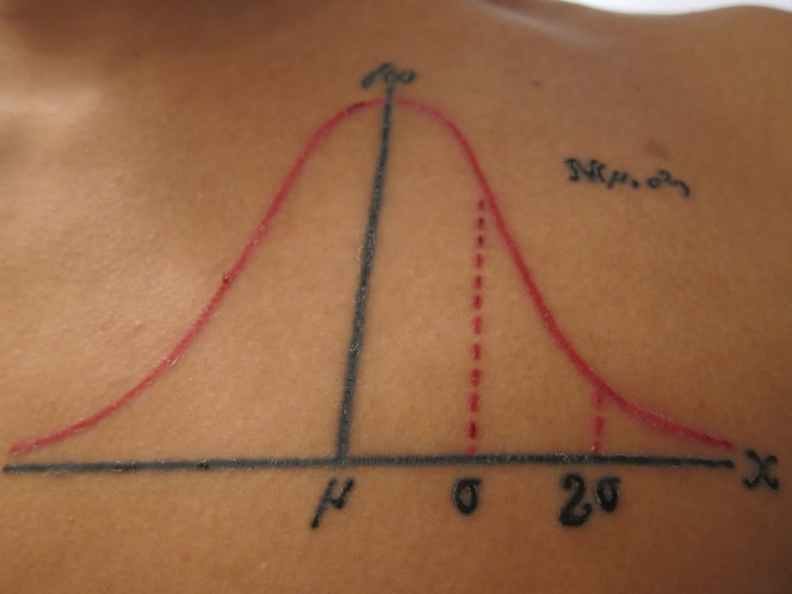
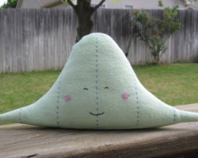

<style>
.title-slide {
  background-image: url("https://raw.githubusercontent.com/tcui001/tcui001.github.io/master/assets/img/hoop.jpg");
  background-size: 100% 100%;
  opacity: 0.1;
}
</style>

```{r Lec1, echo=FALSE, warning=FALSE, message=FALSE, cache=FALSE}
library(knitr)
opts_chunk$set(tidy = TRUE, cache = FALSE) 
library(knitr)
```

```{r child='UnitOverview.Rmd'}
```

```{r child='Module2.Rmd'}
```

## <span class="fa-stack fa"><i class="fa fa-circle fa-stack-2x"></i><i class="fa fa-map-marker-alt fa-stack-1x fa-inverse"></i></span> Normal Curve

<div class="thinkingbox"> 
### [Data Story | How likely is it to find an elite netball goal player in Australia?](#5)
### [The Normal Curve](#9)
### [Area under a Standard Normal Curve](#14)
### [Area under a General Normal Curve](#22)
### [Special Properties](#24)
### [Summary](#32)
</div>

# Data Story | How likely is it to find an elite netball goal player in Australia?

## 
<div align="center">

</div>

<i class="fa fa-link"></i>
[ABC News](http://www.abc.net.au/news/2015-06-14/tall-athletes-get-support-at-ais-to-stand-as-proud-netballers/6544642)

##

"A total of 10 goal players (goal shooters, goal keepers, goal attacks and goal defenders) ... were **all over 189cm** in height". 
<!--
``` {r, echo=FALSE, fig.height=3}
curve(dnorm(x, mean = 161.8, sd = 6), xlim = c(188.5, 191),xlab="Height of Australian women in cms (x)", ylab="",axes=FALSE)
abline(h = 0)
sequence <- seq(189, 191, 0.1)
polygon(x = c(sequence,191,189),
        y = c(dnorm(c(sequence),161.8,6),0,0),
        col = "indianred")
axis(1, at=c(189), pos=0)
```
-->

<br>
<div class="thinkingbox"> 
### <span class="fa-stack fa"><i class="fa fa-circle fa-stack-2x"></i><i class="fa fa-comment-alt fa-stack-1x fa-inverse"></i></span> Statistical Thinking

How could you investigate the proportion of Australian women who are over 189cm in height (potential elite goal players)?

- Collect the heights of Female students in the unit "Statistical Thinking with Data" (MATH1005) in 2022 S2

Then we have two options:

- Use the data to represent the population
- Use the data to create a model for the population

## Investigation: Data from MATH1005, 2022 S2

``` {r fig.height = 3}
math1005 = read.csv("data/math1005_cleaned.csv",header=T)
FemaleHeights = math1005$Height[math1005$Gender == "Female"]
FemaleHeights = na.omit(FemaleHeights)
length(FemaleHeights) # There were 109 female students 
hist(FemaleHeights, main="Histogram of Female students", xlab="Heights (cm)",freq=F)
```

##

``` {r fig.height = 2.5}
mean(FemaleHeights)
sd(FemaleHeights)
sum(FemaleHeights > 189)/length(FemaleHeights) # sum(...) counts the number of FemaleHeights > 189
```

<br>

<span class="fa-stack fa"><i class="fa fa-circle fa-stack-2x"></i><i class="fa fa-comment-alt fa-stack-1x fa-inverse"></i></span> How many students could be elite goal players?

- In this sample, none! But we know there are women in Australia taller than 189cm...

##

``` {r fig.height = 4, echo=F}
hist(FemaleHeights, main="Histogram of Female students", xlab="Heights (cm)", freq = F)
m=mean(FemaleHeights)
sd=sd(FemaleHeights)
curve(dnorm(x, mean=m, sd=sd), 
col="darkblue", lwd=2, add=TRUE)
```

<span class="fa-stack fa"><i class="fa fa-circle fa-stack-2x"></i><i class="fa fa-comment-alt fa-stack-1x fa-inverse"></i></span> If we drew a smooth curve as an approximation of the histogram, how would you describe it's shape?

- Fairly symmetric and bell-shaped. Is there something special about this curve?


# The Normal Curve

## Origins

The Normal curve was defined around 1720 by [Abraham de Moivre](https://en.wikipedia.org/wiki/Abraham_de_Moivre), also famous for the beautiful [de Moivre's formula](https://en.wikipedia.org/wiki/De_Moivre%27s_formula).

<br>
<div align="center">

</div>

## Why is the Normal curve famous? 

<div align="center">



</div>

- The Normal curve approximates many **natural phenomena**.
    
- The Normal curve can model data caused by combining a **large number of independent observations**.
(Coming up in a future lecture)

## General & Standard Normal curves

- The **General** Normal Curve ($X$) has any mean and SD.
Caution: It is denoted by N(mean, **Variance**), where **Variance = SD^2**.

- The **Standard** Normal Curve ($Z$) has mean 0 and SD 1. Short: N(0,1)

```{r, echo= F, fig.height=3}
curve(dnorm(x),-4,4, main="Standard Normal Curve",xlab="z", ylab="")
```


## The Normal curve formula

- It turns out the Normal curve has a simple formula, although you won't need to use it directly.

- The formula for describing the shape of the General Normal Curve is
$$ f(x)  =  \frac{1}{  \sqrt{2 \pi \sigma^2}}  e^{   -\frac{ (x-\mu)^2 }{2 \sigma^2  } } \;\;\;\;\; \mbox{for }  x \in (- \infty, \infty) $$
where $\mu$ and $\sigma$ are the (population) mean and SD respectively.


# Area under a Standard Normal Curve

## Example

The area under the Normal Curve, bounded by some interval (a,b), gives the proportion of data falls into the interval (a,b).

Given the Standard Normal Curve N(0,1), the area up to 0.7 gives the proportion of data is 0.7 or lower.

```{r, echo=FALSE, fig.height=3}
curve(dnorm(x), xlim = c(-2, 2),xlab="z",ylab="",axes=FALSE)
abline(h = 0)
sequence <- seq(-2, 0.7, 0.1)
polygon(x = c(sequence,0.7,-2),
        y = c(dnorm(c(sequence)),0,0),
        col = "indianred")
axis(1, at=c(-2,-1,0,0.7,1,2), pos=0)
```

## Method 1: Integration

Mathematically, we could use integration:

$$ \mbox{area} = \int_{-\infty}^{0.7} \frac{1}{  \sqrt{2 \pi}}  e^{   -\frac{ y^2 }{2 } } dy $$

But this does not have a closed form!


## Method 2: Normal Tables (old school!)

<div align="center">

</div>

## Method 3: Use R

- The `pnorm(x)` command works out the lower tail area.
- The `pnorm(x,lower.tail=F)` works out the upper tail area.

<br>

<div class="thinkingbox"> 
<span class="fa-stack fa"><i class="fa fa-circle fa-stack-2x"></i><i class="fa fa-exclamation fa-stack-1x fa-inverse"></i></span> Remember

Always sketch the Normal curve and the relevant area ... and **then** use R!
</div>

## 

### Lower tail

What proportion of data is 0.7 or lower?

$$ \mbox{area} \approx 0.76 $$

```{r, echo=FALSE, fig.height=3}
curve(dnorm(x), xlim = c(-2, 2),ylab="", xlab='z', axes=FALSE)
abline(h = 0)
sequence <- seq(-2, 0.7, 0.1)
polygon(x = c(sequence,0.7,-2),
        y = c(dnorm(c(sequence)),0,0),
        col = "indianred")
axis(1, at=c(-2,-1,0,0.7,1,2), pos=0)
```

```{r, fig.height=2}
pnorm(0.7)
```

##

### Upper tail

What proportion of data is 0.7 or higher?

$$ \mbox{area} \approx 0.24  $$

```{r, echo=FALSE, fig.height=3}
curve(dnorm(x), xlim = c(-2, 2),ylab="", xlab='z',axes=FALSE)
abline(h = 0)
sequence <- seq(0.7, 2, 0.1)
polygon(x = c(sequence,2,0.7),
        y = c(dnorm(c(sequence)),0,0),
        col = "indianred")
axis(1, at=c(-2,-1,0,0.7,1,2), pos=0)
```

```{r, fig.height=2}
pnorm(0.7,lower.tail=F)
```

##

### Interval 

What proportion of data is between -0.3 and 0.7?

$$ \mbox{area} = P(Z < 0.7)- P(Z < -0.3) \approx 0.38 $$

```{r, echo=FALSE, fig.height=3}
curve(dnorm(x), xlim = c(-2, 2),ylab="",axes=FALSE,xlab="z")
abline(h = 0)
sequence <- seq(-0.3, 0.7, 0.1)
polygon(x = c(sequence,0.7,-0.3),
        y = c(dnorm(c(sequence)),0,0),
        col = "indianred")
axis(1, at=c(-2,-1,0,-0.3,0.7,1,2), pos=0)
```

```{r, fig.height=2}
pnorm(0.7)-pnorm(-0.3)
```

# Area under a General Normal Curve

## Heights of female students in MATH1005

The heights of female students in MATH1005 has a mean of `r round(mean(FemaleHeights),1)`cm and a standard deviation of `r round(sd(FemaleHeights),2)`cm.

``` {r fig.height = 4}
mean(FemaleHeights)
sd(FemaleHeights)
```

Now we can model the heights of all Australian women with a normal distribution with mean `r round(mean(FemaleHeights),1)`cm and standard deviation of `r round(sd(FemaleHeights),1)`cm.

##
### Lower tail 

Suppose the heights of Australian women follow a normal distribution with mean `r round(mean(FemaleHeights),1)`cm and sd `r round(sd(FemaleHeights),1)`cm. What proportion of women will have height less than 170cm?

```{r, echo=FALSE, fig.height=3}
x <- seq(130, 190, 0.1)
m = round(mean(FemaleHeights),1)
s = round(sd(FemaleHeights),1)
curve(dnorm(x, mean = m, sd = s), xlim = c(130, 190),xlab="Height of Australian women in cms (x)", ylab="",axes=FALSE)
abline(h = 0)
sequence <- seq(130, 170, 0.1)
polygon(x = c(sequence,170,130),
        y = c(dnorm(c(sequence),m,s),0,0),
        col = "indianred")
axis(1, at=c(m,170), pos=0)
```

```{r, fig.height=2}
m = mean(FemaleHeights)
s = sd(FemaleHeights)
pnorm(170, m, s)   #pnorm(x,mean,sd)
```

##
### Upper tail 

What proportion of women will have height greater than 189cm?

```{r, echo=FALSE, fig.height=3}
x <- seq(130, 190, 0.1)
m = round(mean(FemaleHeights),1)
s = round(sd(FemaleHeights),1)
curve(dnorm(x, mean =m, sd = s), xlim = c(130, 190),xlab="Height of Australian women in cms (x)", ylab="",axes=FALSE)
abline(h = 0)
sequence <- seq(189, 190, 0.1)
polygon(x = c(sequence,189,190),
        y = c(dnorm(c(sequence),m,s),0,0),
        col = "indianred")
axis(1, at=c(m,189), pos=0)
```

```{r, fig.height=2}
m = mean(FemaleHeights); s = sd(FemaleHeights)
pnorm(189, m, s, lower.tail = FALSE)   #pnorm(x,mean,sd)
```

<span class="fa-stack fa"><i class="fa fa-circle fa-stack-2x"></i><i class="fa fa-comment-alt fa-stack-1x fa-inverse"></i></span> How likely is to find an elite netball goal player in Australia?

# Properties of the Normal Curve

## 1. All Normal curves satisfy the "68\%-95\%-99.7\% Rule" 

- The area **1** SD out from the mean in both directions is **0.68** (68%).
- The area **2** SDs out from the mean in both directions is **0.95** (95%).
- The area **3** SDs out from the mean in both directions is **0.997** (99.7%).

<!-- Number of sds $\sigma$ from the mean $\mu$ | \% of Probability 
---|-----
1 | 68\%  
2 | 95\% 
3 | 99.7\%
-->

<br>

```{r, echo=FALSE, fig.height=3, fig.width = 9.5}
par(mfrow=c(1,3))
curve(dnorm(x), xlim = c(-3, 3),, xlab='z',ylab="",axes=FALSE)
abline(h = 0)
sequence <- seq(-1, 1, 0.1)
polygon(x = c(sequence,1,-1),
        y = c(dnorm(c(sequence)),0,0),
        col = "indianred1")
axis(1, at=seq(-3, 3, 1), pos=0)
curve(dnorm(x), xlim = c(-3, 3),ylab="", xlab='z',axes=FALSE)
abline(h = 0)
sequence <- seq(-2, 2, 0.1)
polygon(x = c(sequence,2,-2),
        y = c(dnorm(c(sequence)),0,0),
        col = "indianred1")
axis(1, at=seq(-3, 3, 1), pos=0)
curve(dnorm(x), xlim = c(-3, 3),ylab="", xlab='z',axes=FALSE)
abline(h = 0)
sequence <- seq(-3, 3, 0.1)
polygon(x = c(sequence,3,-3),
        y = c(dnorm(c(sequence)),0,0),
        col = "indianred1")
axis(1, at=seq(-3, 3, 1), pos=0)
par(oma=c(0,0,2,0))
title(main="1,2 and 3 SDs from mean: N(0,1)",outer=T)
```

## 2. Any General Normal can be rescaled into the Standard Normal

<div class="thinkingbox"> 
### <span class="fa-stack fa"><i class="fa fa-circle fa-stack-2x"></i><i class="fa fa-book fa-stack-1x fa-inverse"></i></span> Standard units

For any point on a Normal curve, the standard units (or $z$ score) is how many standard deviations that point is above (+) or below (-) the mean.

$$ \mbox{standard units} = \frac{\mbox{data point - sample mean}}{\mbox{sample SD}} $$
The standard units give the relative location of a data point on the Standard Normal Curve. 
</div>

## 

### Example 1

``` {r, echo = F, fig.height= 4}
m=5
s=3
threshold = 8
curve(dnorm(x, mean=m, sd=s), -4,14, col="indianred", lwd=2, xlab="", ylab="", main ="General Normal", axes=F)
sequence <- seq(-4, threshold, 0.1)
polygon(x = c(sequence,threshold),
        y = c(dnorm(c(sequence),m,s),0),
        col = "indianred")
axis(1,-4:14,line=1,col="black",col.ticks="black",col.axis="black")
mtext("N(5,9)",1,line=1,at=-5,col="black")
axis(1,-4:14,labels=(c(-4:14)-m)/s,line=3.3,col="indianred1",col.ticks="indianred1",col.axis="indianred1")
mtext("Z score",1,line=3.3,at=-5,col="indianred1")
```

- Consider the point = 8.
- So the $z$ score is $\frac{8-5}{3} = 1$.


##

The following 2 areas are of the same size.

``` {r, echo = F, fig.height= 3 }
par(mfrow=c(1,2))
m=5
s=3
threshold = 8
curve(dnorm(x, mean=m, sd=s), -4,14, col="indianred", lwd=2, xlab="N(5, 9)", ylab="", main ="General Normal: area from 8 down")
sequence <- seq(-4, 8, 0.1)
polygon(x = c(sequence,8),
        y = c(dnorm(c(sequence),5,3),0),
        col = "indianred")

curve(dnorm(x, mean=0, sd=1),-3,3, 
col="indianred", lwd=2, xlab="N(0, 1)", ylab="", main ="Standard Normal: area from 1 down")
sequence <- seq(-3, 1, 0.1)
polygon(x = c(sequence,1,-3),
        y = c(dnorm(c(sequence),0,1),0,0),
        col = "indianred1")
```
<div align="left">

</div>

##

### Example 2

``` {r, echo = F, fig.height= 4}
m=10
s=2
threshold1 = 10
threshold2 = 14
curve(dnorm(x, mean=m, sd=s), 4,16, col="indianred", lwd=2, xlab="", ylab="", main ="General Normal: interval", axes=F)
sequence <- seq(threshold1, threshold2, 0.1)
polygon(x = c(sequence,threshold2,threshold1),
        y = c(dnorm(c(sequence),m,s),0,0),
        col = "indianred")
#axis(2,0:0.5,las=1)   Y axis
axis(1,-2:18,line=1,col="black",col.ticks="black",col.axis="black")
mtext("N(10,4)",1,line=1,at=3,col="black")
axis(1,4:16,labels=(c(4:16)-m)/s,line=3.3,col="indianred1",col.ticks="indianred1",col.axis="indianred1")
mtext("Z score",1,line=3.3,at=3,col="indianred1")
```

- Here the lower point is 10 and the upper point is 14.
- So the $z$ scores are $z_{1}=\frac{10-10}{2} = 0$ and $z_{2}=\frac{14-10}{2} = 2$.


##

The following 2 areas are of the same size.

``` {r, echo = F, fig.height= 3 }
par(mfrow=c(1,2))
m=10
s=2
threshold1 = 10
threshold2 = 14
curve(dnorm(x, mean=m, sd=s), 4,16, col="indianred", lwd=2, xlab="N(10, 4)", ylab="", main ="General Normal: between 10 and 14")
sequence <- seq(threshold1, threshold2, 0.1)
polygon(x = c(sequence,threshold2,threshold1),
        y = c(dnorm(c(sequence),m,s),0,0),
        col = "indianred")

curve(dnorm(x, mean=0, sd=1),-3,3, 
col="indianred", lwd=2, xlab="N(0, 1)", ylab="", main ="Standard Normal: between 0 and 2")
sequence <- seq(0, 2, 0.1)
polygon(x = c(sequence,2,0),
        y = c(dnorm(c(sequence),0,1),0,0),
        col = "indianred1")
```
<div align="left">

</div>


## 3. The Normal curve is symmetric about the mean
If X follows a normal curve with mean 0, then

- $P(X<-0.5) = P(X>0.5)$

The red areas below are of the same size.
<!-- Number of sds $\sigma$ from the mean $\mu$ | \% of Probability 
---|-----
1 | 68\%   
2 | 95\% 
3 | 99.7\%
-->

```{r, echo=FALSE, fig.height=3}
par(mfrow=c(1,2))
curve(dnorm(x), xlim = c(-3, 3),ylab="", xlab='z',axes=FALSE)
abline(h = 0)
sequence <- seq(-3, -0.5, 0.1)
polygon(x = c(sequence,-0.5,-3),
        y = c(dnorm(c(sequence)),0,0),
        col = "indianred1")
axis(1, at=seq(-3, 3, 1), pos=0)
curve(dnorm(x), xlim = c(-3, 3),ylab="", xlab='z',axes=FALSE)
abline(h = 0)
sequence <- seq(0.5, 3, 0.1)
polygon(x = c(sequence,3,0.5),
        y = c(dnorm(c(sequence)),0,0),
        col = "indianred1")
axis(1, at=seq(-3, 3, 1), pos=0)
```


## Summary
- The Normal curve naturally describes many histograms, and so can be used in modelling data. 
- It has many useful properties, including the 68/95/99.7% rule. 
- Any General Normal can be rescaled into a Standard Normal.
- The normal curve is symmetric.

### Key Words
Standard Normal curve, General Normal curve, standard unit ($z$ score), 68/95/99.7% rule

### Key R Functions
`pnorm`, `qnorm`
