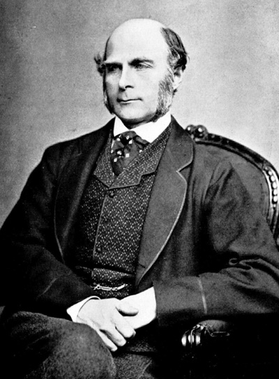

<style>
.title-slide {
  background-image: url("https://raw.githubusercontent.com/tcui001/tcui001.github.io/master/assets/img/fatherson.jpg");
  background-size: 100% 100%;
  opacity: 0.1;
}
body {
text-align: justify}
</style>

```{r Lec1, echo=FALSE, warning=FALSE, message=FALSE, cache=FALSE}
library(knitr)
opts_chunk$set(tidy = TRUE, cache = FALSE) 
library(knitr)
```

```{r child='UnitOverview.Rmd'}
```

```{r child='Module2.Rmd'}
```

## <span class="fa-stack fa"><i class="fa fa-circle fa-stack-2x"></i><i class="fa fa-map-marker-alt fa-stack-1x fa-inverse"></i></span> Scatter Plot & Correlation

<div class="thinkingbox"> 
### [Data Story | Can we predict a son's height from his father's height?](#5)
### [Bivariate Data & Scatter Plot](#10)
### [Correlation Coefficient](#13)
### [Properties](#23)
### [Important Warnings](#27)
### [Summary](#37)
</div>

# Data Story | Can we predict a son's height from his father's height?

## History

- Sir Francis Galton (England, 1822–1911) studied the degree to which children resemble their parents (and wrote [travel books on "wild countries"](http://galton.org/books/art-of-travel/galton-1855-art-travel-1up.pdf)!)
- Galton's work was continued by his student Karl Pearson (England, 1857–1936). Pearson measured the heights of 1,078 fathers and their sons at maturity.

<div align="center">


</div>

## Pearson's plot of heights

```{r, echo = F, messages=F,warning=F}

#install.packages("UsingR")  # Loads another collection of datasets
suppressMessages(library(UsingR))
library(UsingR)
data(father.son)  #This is Pearson's data.
data=father.son
x = data$fheight
y = data$sheight
```

```{r, echo=F,messages=F,warning=F}
plot(x, y,
     xlim = c(58, 80), ylim = c(58, 80),
     xaxt = "n", yaxt = "n", xaxs = "i", yaxs = "i",
     main = "Pearson's data",
     xlab = "Father height (inches)", ylab = "Son height (inches)")
axp = seq(58, 80, by = 2)
axis(1, at = axp, labels = axp)
axis(2, at = axp, labels = axp)
```

- Plotting the pairs of heights creates a cloud of points. 

- Generally, taller fathers tend to have taller sons. 

##

<div class="thinkingbox"> 
### <span class="fa-stack fa"><i class="fa fa-circle fa-stack-2x"></i><i class="fa fa-comment-alt fa-stack-1x fa-inverse"></i></span> Statistical Thinking

<!-- What do we notice about the heights? -->

<!-- - Plotting the pairs of heights creates a cloud of points.  -->

<!-- - Generally, taller fathers tend to have taller sons.  -->

Why do we care whether there is an associaton between two variables (here: height of father and son)? 

- The association is interesting on its own.

- Association between two variables can be used for prediction, i.e, use outcome in one variable to predict the outcome in another variable.

</div>


# Bivariate Data & Scatter Plots

## Bivariate Data 

<div class="thinkingbox"> 
### <span class="fa-stack fa"><i class="fa fa-circle fa-stack-2x"></i><i class="fa fa-book fa-stack-1x fa-inverse"></i></span> Bivariate data

Bivariate data involves a **pair** of variables. We are interested in the relationship between the two variables. Can one variable be used to predict the other?

- Formally, we have $(x_i,y_i)$ for  $i=1,2, \ldots, n$.

-  $X$ and $Y$ can have the same role 
- $X$ and $Y$ may have different roles: for example, $X$ can be an **independent** variable (or explanatory variable, predictor or regressor) which we use to explain or predict $Y$, the **dependent** variable (or response variable).

</div>


## Scatter Plot 

<div class="thinkingbox"> 
### <span class="fa-stack fa"><i class="fa fa-circle fa-stack-2x"></i><i class="fa fa-book fa-stack-1x fa-inverse"></i></span> Scatter Plot

A **scatter plot** is a graphical summary of two quantitative variables on the same 2D plane, resulting in a cloud of points.

</div>

<br>
<span class="fa-stack fa"><i class="fa fa-circle fa-stack-2x"></i><i class="fa fa-comment-alt fa-stack-1x fa-inverse"></i></span> But how do we quantify a possible association?


# Correlation Coefficient

## How can we summarise a scatter plot?

The scatter plot can be summarised by the following **five** numerical summaries:

- sample mean and sample SD of $X$   ($\bar{x}$, $\mbox{SD}_x$)
- sample mean and sample SD of $Y$   ($\bar{y}$, $\mbox{SD}_y$)
- correlation coefficient  ($r$).

<div align="left">

</div>


## Association between the two variables

<div align="center">

</div>

Source: Freedman et al, Statistics p125

- Both clouds have the **same centre and horizontal and vertical spread**. 
- However they have **different spread** around a line (linear association). How do we measure this?


## The correlation coefficient

<div class="thinkingbox"> 
### <span class="fa-stack fa"><i class="fa fa-circle fa-stack-2x"></i><i class="fa fa-book fa-stack-1x fa-inverse"></i></span> Correlation coefficient

- The (Pearson) **correlation coefficient** $r$ is a numerical summary which measures of how points are spread around the line.
- It indicates both the sign and strength of the **linear association**.
- The correlation coefficient is between -1 and 1.
 
    - If $r$ is positive: the cloud slopes up.
    - If $r$ is negative: the cloud slopes down.
    - As $r$ gets closer to $\pm 1$: the points cluster more tightly around the line.
    - $r=0$ implies no linear dependency between two variables. 
</div>


## Examples
```{r,echo = F, out.width = '90%', out.height = '70%', message = F, warning = F}
par(mfrow=c(2,3), mai=c(0.3,0.3,0.2,0.2))
x = rnorm(500,1)
z = rnorm(500,1)

y = z
plot(x,y,main=sprintf("corr coef = %0.3f", cor(x,y)))
abline(lm(y~x), col="red")

y = x*0.25 + z*0.6
plot(x,y,main=sprintf("corr coef = %0.3f", cor(x,y)))
abline(lm(y~x), col="red")

y = x*0.35 + z*0.5
plot(x,y,main=sprintf("corr coef = %0.3f", cor(x,y)))
abline(lm(y~x), col="red")

y = x + z*0.2
plot(x,y,main=sprintf("corr coef = %0.3f", cor(x,y)))
abline(lm(y~x), col="red")

y = - x + z*0.2
plot(x,y,main=sprintf("corr coef = %0.3f", cor(x,y)))
abline(lm(y~x), col="red")

y = - x*0.35 + z*0.5
plot(x,y,main=sprintf("corr coef = %0.3f", cor(x,y)))
abline(lm(y~x), col="red")
```


<!-- ## Examples -->

<!-- <div align="center"> -->
<!--  -->
<!-- </div> -->

<!-- Source: Freedman et al, Statistics p127 -->

## Calculating the correlation coefficient

<div class="thinkingbox"> 
### <span class="fa-stack fa"><i class="fa fa-circle fa-stack-2x"></i><i class="fa fa-book fa-stack-1x fa-inverse"></i></span> Correlation coefficient

The Correlation coefficient ($r$)  is the mean of the product of the variables in standard units.
</div>

<div align="left">

</div>

##

Here, for illustration, we round data to 1 decimal place to make calculations simpler.

|$x$ (father's heights)|$y$ (son's heights)|standard units|standard units|product|quadrant|
|---|---|---|---|---|---|
|||$\frac{x -67.7}{2.7}$|$\frac{y -68.7}{2.8}$|$(\frac{x -67.7}{2.7}) (\frac{y -68.7}{2.8})$||
|65.0|59.8|-0.96|-3.16|<span style="color:lightblue">3.04</span>|lower left|
|63.3|63.2|-1.62|-1.94|<span style="color:lightblue">3.14</span>|lower left|
|65.0|63.3|-1.00|-1.90|<span style="color:lightblue">1.89</span>|lower left|
|70.3|67.0|0.95|-0.59|<span style="color:lightgreen">-0.57</span>|lower right|
|$\vdots$||||||
|||||mean=+0.5|


## Why does $r$ measure association?
- It divides the scatter plot into 4 quadrants, at the point of averages (centre).

```{r, echo=F,messages=F,warning=F,out.width = '50%'}
data=father.son
x = data$fheight
y = data$sheight
num_prod = (x-mean(x))*(y-mean(y))
col = ifelse(num_prod >= 0, "lightblue", "lightgreen")
plot(x, y,
     xlim = c(58, 80), ylim = c(58, 80),
     xaxt = "n", yaxt = "n", xaxs = "i", yaxs = "i", col = col,
     main = "Pearson's data",
     xlab = "Father height (inches)", ylab = "Son height (inches)")
axp = seq(58, 80, by = 2)
axis(1, at = axp, labels = axp)
axis(2, at = axp, labels = axp)
points(mean(x),mean(y),col="indianred",pch=19,cex = 2)
points(65.0,59.8,col="lightblue",pch=19,cex = 2)
points(63.3,63.2,col="lightblue",pch=19,cex = 2)
points(65.0,63.3,col="lightblue",pch=19,cex = 2)
points(70.3,67.0,col="lightgreen",pch=19,cex = 2)
abline(v=mean(x), col="indianred")
abline(h=mean(y), col="indianred")
legend("topright",c("point of averages (centre)"),col="indianred",pch=19)
```


- A majority of points in the upper right (+) and lower left quadrants (+) will be indicated by a positive  $r$.
- A majority of points in the upper left (-) and lower right quadrants (-) will be indicated by a negative  $r$.


## Quick calculation in R

```{r,out.width = '70%', message = F, warning = F}
library(multicon)
SU_x=(data$fheight-mean(data$fheight))/popsd(data$fheight)
SU_y=(data$sheight-mean(data$sheight))/popsd(data$sheight)
mean(SU_x*SU_y)
```

<div align="left">

</div>

Note: we use the **population SD** here. You can either use the `multicon` package, or use `sd()` in R and make a correction. 

## Even quicker calculation in R

```{r}
cor(data$fheight,data$sheight)
```

Note: 

- In what follows, we'll simply use `cor()`.
 - Formally, $r = \frac1n  \sum_{i=1}^n \frac{(x_i - \bar{x})}{Popu. SD(X)} \frac{(y_i - \bar{y})}{Popu. SD (Y)} = \frac{\frac1n \sum_{i=1}^n (x_i - \bar{x})(y_i - \bar{y})}{\sqrt{\frac1n \sum_{i=1}^n (x_i-\bar{x})^2} \sqrt{\frac1n \sum_{i=1}^n (y_i - \bar{y})^2}}$, which simplifies to $r =  \frac{\sum_{i=1}^n (x_i - \bar{x})(y_i - \bar{y})}{\sqrt{\sum_{i=1}^n (x_i-\bar{x})^2} \sqrt{\sum_{i=1}^n (y_i - \bar{y})^2}}$

# Properties

##  Symmetry (commutative)

The correlation coefficient is not affected by interchanging the variables.

```{r}
cor(data$fheight,data$sheight)
cor(data$sheight,data$fheight)
```

## Scaling

The correlation coefficient is shift and scale invariant. Why? shifting and scaling do not change the standard unit.

```{r}
cor(data$fheight,data$sheight)
cor(0.2*data$fheight+3,3*data$sheight-1)
```


## 

```{r, echo = FALSE, fig.height = 4.5, out.width = '90%' }
data$fheight_new <- 0.5*data$fheight+3
data$sheight_new <- 2*data$sheight - 1

par(mfrow=c(1,2))
plot(data$fheight, data$sheight, asp = .7)
abline(lm(data$sheight~data$fheight),col = "blue", lwd = 1)

plot(data$fheight_new, data$sheight_new, asp = .7)
abline(lm(data$sheight_new~data$fheight_new),col = "blue", lwd = 1)
```

# Important Warnings

## Warning 1: The correlation coefficient is unitless

### Mistake:
$r = 0.8$ means that 80\% of the points are tightly closed around the line.
<br>

### Mistake:
$r =0.8$ means that the points are twice as tightly closed as $r=0.4$.

Note: $r =0.8$ suggests a stronger association between variables compared to the case $r =0.4$, BUT does not suggest the data points are twice as tight.

## Warning 2: Outliers can overly influence the correlation coefficient

Suppose there was an extra unusual reading of (100,50).

```{r}
f1 = c(data$fheight,100)  # Add an extra point to data
s1 = c(data$sheight,50)
```

```{r}
cor(data$fheight,data$sheight)
cor(f1,s1)
```

##
```{r}
par(mfrow=c(1,2))
plot(data$fheight,data$sheight)
plot(f1,s1)
points(100,50,col="lightgreen",pch=19,cex = 2)
```

## Warning 3: Nonlinear association can't be detected by the correlation coefficient

```{r}
x=c(1:20)
y=x^2
cor(x,y)
```

<span class="fa-stack fa"><i class="fa fa-circle fa-stack-2x"></i><i class="fa fa-comment-alt fa-stack-1x fa-inverse"></i></span> What interpretation mistake could be made here?

##
```{r, fig.height=3.5}
plot(x,y)
```

Woops - this data should be modelled by a quadratic or even exponential curve, not a line.

We should always use correlation coefficient together with the scatter plot. 

## Warning 4: The same correlation coefficient can arise from very different data 

The following 4 data sets ([Anscombes Quartet](https://en.wikipedia.org/wiki/Anscombe%27s_quartet)) have the **same** $\bar{x}, SD_x, \bar{y}, SD_y$, and also the **same** value of $r$.

```{r, echo = FALSE}
data(anscombe)
cat("x_mean:" , sapply(1:4, function(x) mean(anscombe[, x])))
cat("x_sd:" , sapply(1:4, function(x) sd(anscombe[, x])))
cat("y_mean:" , sapply(5:8, function(x) mean(anscombe[, x])))
cat("y_sd:" , sapply(5:8, function(x) sd(anscombe[, x])))
cat("r:" ,sapply(1:4, function(x) cor(anscombe[, x],anscombe[,x+4])))
```


## 

### But look at the scatter plots!

```{r, echo=F, message=F, fig.height=6}
par(mfrow=c(2,2))
plot(anscombe$x1, anscombe$y1, main = "Anscombe Set 1", xlab="", ylab="", asp=0.8)
abline(lm(anscombe$y1 ~ anscombe$x1), col = "blue", lwd = 1)

plot(anscombe$x2, anscombe$y2, main = "Anscombe Set 2", xlab="", ylab="")
abline(lm(anscombe$y2 ~ anscombe$x2), col = "blue", lwd = 1)

plot(anscombe$x3, anscombe$y3, main = "Anscombe Set 3", xlab="", ylab="")
abline(lm(anscombe$y3 ~ anscombe$x3), col = "blue", lwd = 1)

plot(anscombe$x4, anscombe$y4, main = "Anscombe Set 4", xlab="", ylab="")
abline(lm(anscombe$y4 ~ anscombe$x4), col = "blue", lwd = 1)
```

## Warning 5: Ecological correlation tend to inflate the correlation coefficient

- An **ecological correlation** is the correlation between two variables that are group means. 
- For example, if we recorded the heights of fathers and sons in many communities, and then calculated the average for each community.
- Correlations at the group level (ecological correlations) can be much higher than those at the individual level. 
- See Freedman et al, Statistics p148-149.

## 

### Example

```{r, echo=F, fig.height=3}
eco <- read.csv("data/eco_corre.csv", stringsAsFactors = FALSE)
par(mfrow = c(1,2))

## Left panel
r <- round(cor(eco$math, eco$verbal), 2)
plot(eco$math, eco$verbal, col = eco$group,
     xlim = c(400, 800), ylim = c(400, 800), main = paste0("r1= ", r))

## Right panel
byg <- with(eco, data.frame(math = tapply(math, group, mean),
                            verbal = tapply(verbal, group, mean)))
rg <- round(cor(byg$math, byg$verbal), 2)
plot(byg$math, byg$verbal, col = row.names(byg), pch = 19, cex = 2,
     xlim = c(400, 800), ylim = c(400, 800), main = paste0("r2= ", rg))

```

- The 1st plot has all 3 sets of data combined: correlation = 0.51 (not very strong).
- The 2nd plot has the averages of the 3 data sets: correlation = 0.94 (very strong).

## Warning 6: Association is not causation

- Correlation measures association.
- But as discussed before, association does not necessarily mean causation. 
- Both variables may be simultaneously influenced by a 3rd variable (confounder).

<span class="fa-stack fa"><i class="fa fa-circle fa-stack-2x"></i><i class="fa fa-comment-alt fa-stack-1x fa-inverse"></i></span> Invent your own example of a [Spurious Correlation](http://www.tylervigen.com/spurious-correlations).


<div align="center">

</div>
Source: [http://www.tylervigen.com/spurious-correlations](http://www.tylervigen.com/spurious-correlations)

## Summary

- The **scatter plot** is a cloud of points which represents bivariate quantitative data (a pair of variables). 
- Useful summaries are the two **averages**, the two **sample SDs** of the the variables and one **correlation coefficient**. 
- The **correlation coefficient** is the mean of the product of the variables in standard units and can be found using `cor()` in R.

### Key Words
bivariate data, scatter plot, linear association, correlation coefficient, horizontal spread, vertical spread,  quadrants, SD line

### Key R Functions
`cor`
