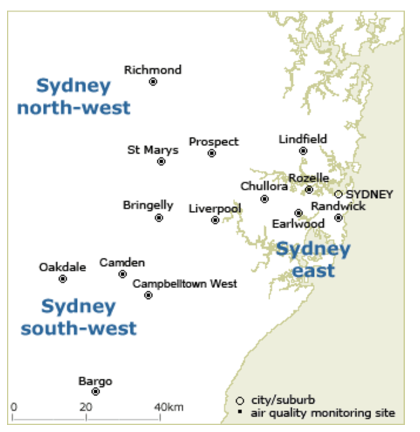
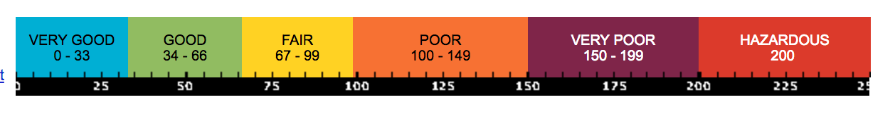
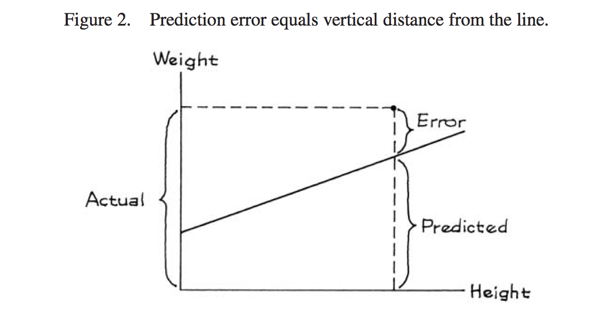

<style>
.title-slide {
  background-image: url("https://raw.githubusercontent.com/tcui001/tcui001.github.io/master/assets/img/airballoon.jpg");
  background-size: 100% 100%;
  opacity: 0.1;
}
body {
text-align: justify}
</style>

```{r Lec1, echo=FALSE, warning=FALSE, message=FALSE, cache=FALSE}
library(knitr)
opts_chunk$set(tidy = TRUE, cache = FALSE) 
library(knitr)
```

```{r child='UnitOverview.Rmd'}
```

```{r child='Module2.Rmd'}
```

## <span class="fa-stack fa"><i class="fa fa-circle fa-stack-2x"></i><i class="fa fa-map-marker-alt fa-stack-1x fa-inverse"></i></span> Regression Line

<div class="thinkingbox"> 
### [Data Story - Air Quality](#5)
### [Regression Line](#12)
### [Prediction](#22)
### [Residuals](#30)
### [Mistakes in Prediction](#39)
### [Summary](#42)
</div>

# Data Story | How is the air quality in North-West Sydney related to Central-East Sydney?

## Air quality index (AQI) data

- How do scientists monitor the air quality  of Sydney? 
- The [Office of Environment and Heritage](http://www.environment.nsw.gov.au/topics/air) (OEH)  has 14 active monitoring sites.

<div align="center">

</div>

## 

- At each site, data readings are taken for 6 variables:
    - Ozone ($O_3$)
    - Nitrogen dioxide ($NO_2$)
    - Visibility
    - Carbon monoxide ($CO$)
    - Sulfur dioxide ($SO_2$)
    - Particles ($PM_{2.5}$, $PM_{10}$, etc.)
- They are combined into a single air quality index (AQI).


  
<div align="center">

</div>


## 
<div class="thinkingbox"> 
### <span class="fa-stack fa"><i class="fa fa-circle fa-stack-2x"></i><i class="fa fa-comment-alt fa-stack-1x fa-inverse"></i></span> Statistical Thinking

Who is the AQI useful for?

- People with sensitive respiratory conditions (e.g. people with asthma, older adults and children) should consider either cutting back or rescheduling strenuous outdoor activities when air quality is 'poor' or worse.
- Environmental scientists studying changes in air quality.
- Potential renters and home-buyers.
</div>

<div align="left">

</div>

## 

- We will consider the [data](http://www.environment.nsw.gov.au/AQMS/search.htm) for July 2015 for two regions: 
    - Sydney’s central-east (CE)
    - Sydney’s north-west (NW) 
  
```{r, warning=F}
data = read.csv("data/AQI_July2015.csv")
```   

```{r}
head(data)
```

## Scatter plot

```{r, fig.height=4}
CE = data$SydneyCEAQI
NW = data$SydneyNWAQI
plot(CE, NW, xlab="CE AQI", ylab="NW AQI")
points(mean(CE),mean(NW), col = "indianred",pch=19,cex = 2)  # point of averages (centre)
legend("topright",c("point of averages (centre)"),col="indianred",pch=19)
```

## Correlation Coefficient

```{r}
cor(CE,NW)
```

<span class="fa-stack fa"><i class="fa fa-circle fa-stack-2x"></i><i class="fa fa-comment-alt fa-stack-1x fa-inverse"></i></span> What does the size of this correlation coefficient suggest about the data? 
Can we summarise the data with a line?
How do we find the **optimal** line?

# Regression Line

## 1st Option: SD Line (Not so good)

- The **SD line** might look like a good candidate as it connects the point of averages ($\bar{x}$, $\bar{y}$) to ($\bar{x} + \mbox{SD}_x$, $\bar{y} + \mbox{SD}_y)$ (for this data with positive correlation).

```{r, fig.height=4, echo=F}
CE = data$SydneyCEAQI
NW = data$SydneyNWAQI
plot(CE, NW, xlab="CE AQI (x)", ylab="NW AQI (y)")
points(mean(CE),mean(NW), col = "indianred", pch = 19, cex = 2)  # point of averages (centre)
points(mean(CE)+sd(CE),mean(NW)+sd(NW), col = "blue", pch = 19, cex = 2)
abline(a = mean(NW) - sd(NW)/sd(CE)*mean(CE),
       b = sd(NW)/sd(CE), col = "purple", lwd = 1)
legend("bottomright",c("point of averages (centre)","point of averages + 1 SD","SD line"),col=c("indianred","blue","purple"),pch=c(19,19,NA),lty = c(NA, NA, 1))
```

##

- Note how it underestimates (LHS) and overestimates (RHS) at the extremes.

```{r, fig.height=3.5, echo=F}
CE = data$SydneyCEAQI
NW = data$SydneyNWAQI
plot(CE, NW, xlab="CE AQI (x)", ylab="NW AQI (y)")
points(mean(CE),mean(NW), col = "indianred", pch = 19, cex = 2)  # point of averages (centre)
points(mean(CE)+sd(CE),mean(NW)+sd(NW), col = "blue", pch = 19, cex = 2)
abline(a = mean(NW) - sd(NW)/sd(CE)*mean(CE),
       b = sd(NW)/sd(CE), col = "purple", lwd = 1)
abline(v=c(30, 40), lty = 3)
with(subset(data, SydneyCEAQI >= 30 & SydneyCEAQI < 40),
     points(SydneyCEAQI, SydneyNWAQI, col="orange"))
abline(v=c(100, 110), lty = 3)
with(subset(data, SydneyCEAQI >= 100 & SydneyCEAQI < 110),
     points(SydneyCEAQI, SydneyNWAQI, col="orange"))
```

- Recall that $X,Y$ can have the same mean and SD but very different correlation coefficient. 
- The above model does not use the correlation coefficient, so it is insensitive to the amount of clustering around the line.

## Best Option: Regression Line

- To describe the scatter plot, we need to use **all five** summaries: $\bar{x}$, $\bar{y}$, $SD_{x}$, $SD_{y}$ **and** $r$.
- The **Regression line** connects $(\bar{x}, \bar{y})$ to
$(\bar{x} + \mbox{SD}_{x}, \bar{y} + r \mbox{SD}_{y})$

```{r, echo=F, fig.height=4.5}
CE = data$SydneyCEAQI
NW = data$SydneyNWAQI
plot(CE, NW, xlab="CE AQI (x)", ylab="NW AQI (y)")
points(mean(CE),mean(NW), col = "indianred", pch = 19, cex = 2)  # point of averages (centre)
points(mean(CE)+sd(CE),mean(NW)+cor(CE,NW)*sd(NW), col = "lightblue", pch = 19, cex = 2)
abline(a = mean(NW) - sd(NW)/sd(CE)*mean(CE),
       b = sd(NW)/sd(CE), col = "purple", lwd = 1, lty=3)
abline(a = mean(NW) - cor(CE,NW)*sd(NW)/sd(CE)*mean(CE),
       b = cor(CE,NW)*sd(NW)/sd(CE), col = "green", lwd = 1)
legend("bottomright",c("point of averages (centre)","point of averages + adjusted SD","Regression line", "SD line"),col=c("indianred","lightblue","green", "purple"),pch=c(19,19,NA,NA),lty = c(NA, NA, 1,2))
```


##

- Note the improvement at the extremes.

```{r, echo=F, fig.height=4}
plot(CE, NW, xlab="CE AQI (x)", ylab="NW AQI (y)")
points(mean(CE),mean(NW), col = "indianred", pch = 19, cex = 2)  # point of averages (centre)
points(mean(CE)+sd(CE),mean(NW)+cor(CE,NW)*sd(NW), col = "lightblue", pch = 19, cex = 2)
abline(a = mean(NW) - sd(NW)/sd(CE)*mean(CE),
       b = sd(NW)/sd(CE), col = "purple", lwd = 1, lty=3)
abline(a = mean(NW) - cor(CE,NW)*sd(NW)/sd(CE)*mean(CE),
       b = cor(CE,NW)*sd(NW)/sd(CE), col = "green", lwd = 1)
abline(v=c(30, 40), lty = 3)
with(subset(data, SydneyCEAQI >= 30 & SydneyCEAQI < 40),
     points(SydneyCEAQI, SydneyNWAQI, col="orange"))
abline(v=c(100, 110), lty = 3)
with(subset(data, SydneyCEAQI >= 100 & SydneyCEAQI < 110),
     points(SydneyCEAQI, SydneyNWAQI, col="orange"))
```


## In R

```{r}
lm(NW~CE)
```

```{r}
model= lm(NW~CE)
model$coeff
```

So for $x$ = CE and $y$ = NW, the regression line is
$$y = 19.8874 + 0.7138 x $$

##

```{r, fig.height=4}
plot(CE, NW, xlab="CE AQI (x)", ylab="NW AQI (y)")
abline(lm(NW ~ CE), col = "red")
```

## Summary Regression Line


|Feature |Regression Line $y \sim x$ ($y=a +bx$)|
|------|------------------|-------------|
|Connects |$(\bar{x}, \bar{y})$ to $(\bar{x} + \mbox{SD}_{x}, \bar{y} + r \mbox{SD}_{y})$|
|Slope (b)|$r \frac{\mbox{SD}_{y}}{\mbox{SD}_{x}}$|
|Intercept (a)|$\bar{y} - b \bar{x}$|
<br>

We can derive the (least-squares) regression line using calculus, by minimising the squared **residuals** (extension).


# Prediction

## Need for predictions

- On a particular morning, the CE AQI is recorded as $67$, but the NW AQI reading is missing. 
- How can we best predict the NW reading?

<span class="fa-stack fa"><i class="fa fa-circle fa-stack-2x"></i><i class="fa fa-comment-alt fa-stack-1x fa-inverse"></i></span> How might data become missing?

<br>

<div align="left">

</div>

## Method 1: Baseline prediction

- If you don't use $x$ as an information source at all, a basic prediction of $y$ would be the **average** of $y$ over **all** the $x$ values in the data.

- So for any CE reading, we could predict the NW air quality to be `r round(mean(NW),2)`. 

```{r}
mean(NW)
```

```{r, echo=F, fig.height=3}
x.0<-c(67,min(NW)-4)
plot(CE, NW, xlab="CE AQI (x)", ylab="NW AQI (y)")
abline(h=mean(NW),lty=2,col="blue")
points(x.0[1],x.0[2], col = "indianred", pch = "|", cex = 2)  # point of averages (centre)

points(67,mean(NW), col = "blue", pch = 19, cex = 2)  # point of averages (centre)
legend("topleft", legend=c("average all x", "prediction M1"), col=c("blue","blue"), pch=c(NA,19), lty=c(2,NA))
```

## Method 2: Prediction in a strip

- Given a certain value $x_0$, a more careful prediction of $y$ would be the average of all the $y$ values in the data corresponding to a neighbourhood of $x$ value around $x_0$.

```{r, echo=F, fig.height=3}
plot(CE, NW, xlab="CE AQI (x)", ylab="NW AQI (y)")

points(x.0[1],x.0[2], col = "indianred", pch = "|", cex = 2)  # point of averages (centre)


gav <- data[data$SydneyCEAQI<(67+5)&data$SydneyCEAQI>(67-5),2:3]
#gavnum <- with(data, tapply(SydneyNWAQI, round(SydneyCEAQI, 0), length))
points( gav, col = "orange", pch = 16)
#text(as.numeric(names(gav)), gav, gavnum, pos = 3)
avg.x <- mean(as.numeric(data[data$SydneyCEAQI<(67+5)&data$SydneyCEAQI>(67-5),3][[1]]))
abline(v=67+5,lty=2, col="indianred")
abline(v=67-5,lty=2,col="indianred")
abline(h=avg.x,lty=2,col="orange")
points(67,mean(NW), col = "blue", pch = 19, cex = 2)  # point of averages (centre)
points(67,avg.x, col = "orange", pch = 19, cex = 2)  # point of averages (centre)

legend("topleft", legend=c("average in strip", "prediction M2"), col=c("orange","orange"), pch=c(NA,19), lty=c(2,NA))
```

 When only considering a strip our prediction is higher. 
 
## Method 3: The Regression line

- The best prediction is based on the Regression line
- For AQI, we have $y=19.8874+0.7138x$.

```{r, echo=F, fig.height=4}
lm.fit <- lm(NW~CE)
plot(CE, NW, xlab="CE AQI (x)", ylab="NW AQI (y)")
abline(a = mean(NW) - cor(CE,NW)*sd(NW)/sd(CE)*mean(CE),
       b = cor(CE,NW)*sd(NW)/sd(CE), col = "green", lwd = 1)
#points(99, 91, col = "green", pch = 19, cex=1)
#points(36, 45.6, col = "green", pch = 19, cex=1)
#text(as.numeric(names(gav)), gav, gavnum, pos = 3)
points(67,mean(NW), col = "blue", pch = 19, cex = 2)  # point of averages (centre)
points(67,avg.x, col = "orange", pch = 19, cex = 2)  # point of averages (centre)
points(67, predict.lm(lm.fit,data.frame(CE=67)), col = "green", pch = 19, cex=2)


legend("topleft", legend=c("regression line", "prediction M3"), col=c("green","green"), pch=c(NA,19), lty=c(1,NA))
```

## Method 3: The Regression line

The linear regression line follows the equation $y=19.8874+0.7138x$

### Example1
For a CE reading of 99,  we would predict the NW air quality to be $y=19.8874+0.7138 \times 99 \approx 90.6$ (1dp).

### Example2
For a CE reading of 36,  we would predict the NW air quality to be $y=19.8874+0.7138 \times 36 \approx 45.6$ (1dp).

## Warning: can we also use Y to predict X?

- We can predict $Y$ from $X$ or $X$ from $Y$, depending on what fits the context.

```{r, fig.height=4.5, echo=F}
par(mfrow = c(1,2))
plot(CE, NW, xlab="CE AQI", ylab="NW AQI")
l1 = lm(NW~CE)
abline(l1, col="green")
legend("topright", legend=c("Reg Line: Y on X"), col=c("green"), lty=c(1), cex=0.8)
plot(NW, CE, xlab="NW AQI", ylab="CE AQI")
l2 = lm(CE~NW)
abline(l2, col="darkgreen")
legend("topright", legend=c("Reg Line: X on Y"), col=c("darkgreen"), lty=c(1), cex=0.8)
```

## Beware! 

- Can we just simply rearrange the equation? $(y=a +bx) \implies (x = - \frac{a}{b} + \frac1{b} y )$ 
- The answer is NO unless $r = \pm 1$ (data clustered along the line).
- We need to **refit** the model.

|Feature |Regression Line $y \sim x$ $(y=a +bx)$|Regression Line $x \sim y$ $(x= \tilde{a} + \tilde{b} y)$
|------|-----------|----------|
|Connects |$(\bar{x}, \bar{y})$ to $(\bar{x} + \mbox{SD}_{x}, \bar{y} + r \mbox{SD}_{y})$|$(\bar{y}, \bar{x})$ to $(\bar{y} + \mbox{SD}_{y}, \bar{x} + r \mbox{SD}_{x})$
|Slope |$b = r \frac{\mbox{SD}_{y}}{\mbox{SD}_{x}}$|$\tilde{b}=r \frac{\mbox{SD}_{x}}{\mbox{SD}_{y}}$
|Intercept|$a = \bar{y} - b \bar{x}$|$\tilde{a} = \bar{x} - \tilde{b} \bar{y}$
<br>


## Beware! 


```{r,out.width = '60%'}
lm(CE~NW)
```
```{r,out.width = '60%'}
lm(NW~CE)
```
<div align="left">

</div>

# Residuals

## Prediction error

```{r, fig.height=4, collapse=TRUE, echo=F}
plot(CE, NW, xlab="CE AQI", ylab="NW AQI")
points(mean(CE),mean(NW), col = "indianred",pch = 19, cex = 2)
abline(lm(NW~CE), col="green")
legend("topright", legend=c("Regression Line"), col=c("green"), lty=1, cex=0.8)
```

<span class="fa-stack fa"><i class="fa fa-circle fa-stack-2x"></i><i class="fa fa-comment-alt fa-stack-1x fa-inverse"></i></span> We can now make predictions using the regression line. But we have some prediction **error**.

## Residuals 

<div class="thinkingbox"> 
### <span class="fa-stack fa"><i class="fa fa-circle fa-stack-2x"></i><i class="fa fa-book fa-stack-1x fa-inverse"></i></span> Residual (Prediction error)

- A **residual** is the vertical distance (or 'gap') of a point above or below the regression line.
- A residual represents the error between the actual value and the prediction.
</div>

<div align="center">

</div>
Statistics, Freedman et al p182

##

```{r, echo = F, fig.height=4}
plot(CE, NW, xlab="CE AQI", ylab="NW AQI")
points(mean(CE),mean(NW), col = "red")
points(CE[10],NW[10], col="orange")
l=lm(NW~CE)
abline(l, col="blue")
segments(CE[10],NW[10],CE[10],l$fitted.values[10], col="orange")
points(CE[10],l$fitted.values[10], col="blue")
```

When the CE AQI is `r CE[10]`, the  <span style="color:orange">actual value</span> of the NW AQI is `r NW[10]` with <span style="color:blue">predicted value</span> `r round(l$fitted.values[10],1)`, so the residual is `r round(NW[10]-l$fitted.values[10],1)`.

##

More formally, a residual is $e_{i} = y_i - \hat{y}_i$, given
the actual value ($y_i$) and the prediction ($\hat{y}_i$).

```{r}
l=lm(NW~CE)
NW[10]-l$fitted.values[10]
# Or directly
l$residuals[10]
```

The regression line is the **best** (optimal) linear model in the sense that it minises the sum of squares of the residuals $(\sum_{i=1}^n e_i^2)$ (more in future studies)

## Residual Plot

<div class="thinkingbox"> 
### <span class="fa-stack fa"><i class="fa fa-circle fa-stack-2x"></i><i class="fa fa-book fa-stack-1x fa-inverse"></i></span> Residual plot 

- A residual plot graphs the residuals vs $x$.
- If the linear fit is appropriate for the data, it should show no pattern (random points around 0).
- By checking the patterns of the residuals, the residual plot is a diagnostic plot to check the appropriateness of a linear model.

</div>

##

```{r, dpi=70}
plot(CE,l$residuals, ylab="residuals")
abline(h=0)
```

<span class="fa-stack fa"><i class="fa fa-circle fa-stack-2x"></i><i class="fa fa-comment-alt fa-stack-1x fa-inverse"></i></span> Does this residual plot look random?

##  Homoscedasticity and Heteroscedasticity

<div class="thinkingbox"> 
### <span class="fa-stack fa"><i class="fa fa-circle fa-stack-2x"></i><i class="fa fa-book fa-stack-1x fa-inverse"></i></span> Vertical strips

In linear models and regression analysis generally, we need to check the homogeneity of the spread of the response variable (or the residuals). We can divide the scatter plot or the residual plot into vertical strips.

- If the vertical strips on the scatter plot show equal spread in the $y$ direction, then the data is **homoscedastic**.
    - The regression line could be used for predictions.
- If the vertical strips don't show equal spread in the $y$ direction, then the data is **heteroscedastic**.
    - The regression line should not be used for predictions.

</div>

##

```{r, fig.height=5, echo=F}
par(mfrow=c(2,1), mai=c(0.8,0.8,0.1,0.1))
plot(CE,NW)
abline(v=mean(CE)-1*sd(CE), col="blue")
abline(v=mean(CE)-1*sd(CE)+10, col="blue")
abline(v=mean(CE)-0.2*sd(CE), col="red")
abline(v=mean(CE)-0.2*sd(CE)+10, col="red")
abline(v=mean(CE)+1*sd(CE), col="purple")
abline(v=mean(CE)+1*sd(CE)+10, col="purple")
abline(l,col="blue")

plot(CE,l$residuals, ylab="residuals")
abline(v=mean(CE)-1*sd(CE), col="blue")
abline(v=mean(CE)-1*sd(CE)+10, col="blue")
abline(v=mean(CE)-0.2*sd(CE), col="red")
abline(v=mean(CE)-0.2*sd(CE)+10, col="red")
abline(v=mean(CE)+1*sd(CE), col="purple")
abline(v=mean(CE)+1*sd(CE)+10, col="purple")
```

<span class="fa-stack fa"><i class="fa fa-circle fa-stack-2x"></i><i class="fa fa-comment-alt fa-stack-1x fa-inverse"></i></span> Is the AQI data homoscedastic?

# Mistakes in Prediction

## 1. Extrapolating
    
If we make a prediction from an $x$ value that is not within the range of the data, then that prediction can be completely **unreliable**.

```{r, echo=F, fig.height=3.5}
par(mfrow=c(1,2))
x=c(1,2,3)
y=c(1.1,4.2,9)
plot(x,y, main="Fitting line for 1st 3 data points")
abline(lm(y~x),col="green")
legend("topleft",c("regression line"),col=c("green"),lty = c(1))
x1=c(1,2,3,9,10)
y1=c(1.1,4.2,9,82,100)
plot(x1,y1,main="Long-term trend not linear",xlab="x",ylab="y")
abline(lm(y~x),col="green")
points(9,30,pch=19,col="green")
abline(v=9,col="green",lty=2)
```

## 2. Not checking the scatter plot

- We can have a high correlation coefficient and then fit a regression line, but the data may not even be linear!
- So always check the scatter plot first! 

```{r, echo=F, fig.height=3}
x1=c(1,2,3,9,10)
y1=c(1.1,4.2,9,82,100)
plot(x1,y1,xlab="x",ylab="y")
curve(x^2,1,10,col="red",add=T,lty=2)
abline(lm(y1~x1),col="green")
legend("topleft", legend=c("regression line", "quadratic line"), col=c("green","red"), lty = c(1,2))
```

Note: Even though the correlation coefficient is high $r\approx `r round(cor(x1,y1),2)`$, a quadratic model is more appropriate than a linear model.

## 3. Not checking the residual plot

- You should also check the residual plot
- This detects any pattern that has not been captured by fitting a linear model. 
- If the linear model is appropriate, the residual plot should be a random scatter of points.

```{r, echo = F, fig.width = 10, fig.height = 3.6}
set.seed(1)
x = (1:100)/10
y1 = x + rnorm(100, 0, 1)
y2 = x + rnorm(100, 0, 1) * (1:100)/50
y3 = (x-5)^2/5 + rnorm(100, 0, 1)

l1 = lm(y1 ~ x)
l2 = lm(y2 ~ x)
l3 = lm(y3 ~ x)

par(mfrow = c(1,3))
plot(x,l1$residuals, ylab = "residuals", main = "No Pattern")
abline(h = 0, col = "red")
plot(x,l2$residuals, ylab = "residuals", main = "Fanning Pattern")
abline(h = 0, col = "red")
plot(x,l3$residuals, ylab = "residuals", main = "Quadratic Pattern")
abline(h = 0, col = "red")
```


## Summary
- For prediction, the regression line is better than the SD line as it uses all five numerical summaries for the scatter plot. 
- For a regression line, the **residuals** are the gaps between the **actual value** and the **prediction**. 
- The residual plot is a diagnostic for seeing whether a linear model is appropriate - if it is random, then a linear model seems appropriate.
- If the vertical strips on the scatter plot show **equal spread** in the y direction, then the data is **homoscedastic**, otherwise the data is **heteroscedastic**.

### Key Words
SD Line, Regression Line, prediction, residuals, residual plot, homoscedastic, heteroscedastic

### Key R Functions
`lm`, `abline`

<!--

### The regression fallacy assumes that points follow the SD line at the extremes

```{r, echo= F, fig.height=3}
plot(CE, NW, xlab="CE AQI", ylab="NW AQI")
points(mean(CE),mean(NW), col = "red")
#sd = mean(NW) -(sd(NW)/sd(CE))*mean(CE) +(sd(NW)/sd(CE)) *CE
abline(a=mean(NW) -(sd(NW)/sd(CE))*mean(CE),b=(sd(NW)/sd(CE)), col="green")
abline(v=mean(CE)-sd(CE), col="purple", lty=2)
legend("topright", legend=c("SD Line", "1 SD below the mean"), col=c("green", "purple"), lty=1:2, cex=0.8)
```

- The cloud is symmetric about the SD Line, but an individual strip is not.
- Points on the SD line under estimate at the extreme (purple dashed line), as you would expect for a football shaped cloud.

##

### Notice the regression to medicority around the regression line at the extremes

```{r, echo= F, fig.height=4}
plot(CE, NW, xlab="CE AQI", ylab="NW AQI")
points(mean(CE),mean(NW), col = "red")
l = lm(NW~CE)
abline(l, col="blue")
abline(a=mean(NW) -(sd(NW)/sd(CE))*mean(CE),b=(sd(NW)/sd(CE)), col="green")
abline(v=mean(CE)-sd(CE), col="purple", lty=2)
abline(h=mean(NW),col="orange")
legend("topright", legend=c("SD Line", "Regression Line", "1 SD below the mean"), col=c("green", "blue", "purple"), lty=c(1,1,2), cex=0.8)
```

- The regression line plots the averages.
- Notice how it rises less steeply than the SD line = regression effect.

##

### Chance variability


For a test-retest context, we would expect

\[ \mbox{observed test score} = \mbox{true score} + \mbox{chance error} \]

- So if someone scores above average on 1st test, then it is likely the chance error is positive.

- So the true score is lower than the observed law, which could be reflected in a lower re-tests score. 
-->


