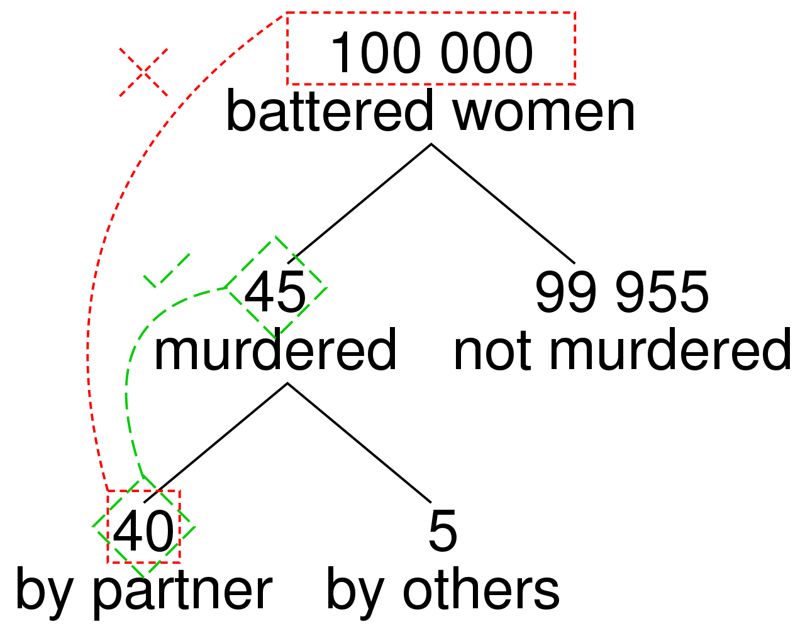

<style>
.column-left{
  float: left;
  width: 49%;
  text-align: left;
}
.column-right{
  float: right;
  width: 49%;
  text-align: right;
}
body {
text-align: justify}
</style>

<style>
.title-slide {
  background-image: url("https://raw.githubusercontent.com/tcui001/tcui001.github.io/master/assets/img/casino.jpg");
  background-size: 100% 100%;
  opacity: 0.1;
}
</style>

```{r Lec1, echo=FALSE, warning=FALSE, message=FALSE, cache=FALSE}
library(knitr)
opts_chunk$set(tidy = TRUE, cache = FALSE) 
library(knitr)
```

```{r child='UnitOverview.Rmd'}
```

```{r child='Module3.Rmd'}
```

## <span class="fa-stack fa"><i class="fa fa-circle fa-stack-2x"></i><i class="fa fa-map-marker fa-stack-1x fa-inverse"></i></span>Chance

<div class="thinkingbox"> 
### [Definitions](#6)
### [Multiplication and Addition Rule](#10)  
### [The prosecutor's fallacy](#15)  
### [Some Exercises](#27)  
### [Summary](#31)  
</div>


## Why study chance?

<div align="center">

</div>

<span class="fa-stack fa"><i class="fa fa-circle fa-stack-2x"></i><i class="fa fa-comment-alt fa-stack-1x fa-inverse"></i></span> 

- Why is understanding "chance" important?
- What are some examples of probability in everyday life?
- How can you define chance?

#  Definitions


## What is chance?

<div class="thinkingbox">
### <span class="fa-stack fa"><i class="fa fa-circle fa-stack-2x"></i><i class="fa fa-book fa-stack-1x fa-inverse"></i></span> Probability

The frequentist definition of **probability** (or chance) is the percentage of time a certain event is expected to happen, if the same process is repeated long-term (infinitely often).

This differs from the Bayesian definition of probability which relates to the degree of belief that an event will occur (extension).
</div>

## Basic properties of Probability

### 1. Probabilities are between 0 (impossible) and 1 (certain) (or, in terms of percentages, 0\% and 100\%).

$$ \mbox{P}(\mbox{Impossible event}) = 0 $$

$$ \mbox{P}(\mbox{Certain event}) = 1 $$

### 2. The probability of something equals 1 minus the probability of its opposite (**complement**).

$$ \mbox{P}(\mbox{Event}) = 1 - \mbox{P}(\mbox{Complement event})$$
For example, we randomly toss a coin (two possible events: Head or Tail), P(Head) - 1 - P(Tail). 

<!-- ## De Morgan's law

<div class="column-left">
For any two events A and B:

- The complement of their union is the intersection of their complements:
  - not (A or B) = (not A) and (not B) = "blue area"

<br>
<br>
<br>

- The complement of their intersection is the union of their complements:
  - not (A and B) = (not A) or (not B) = "any blue area"

</div>
<div class="column-right">
<div align="center">


</div>
</div>
-->


## Conditional probability

<div class="thinkingbox">
### <span class="fa-stack fa"><i class="fa fa-circle fa-stack-2x"></i><i class="fa fa-book fa-stack-1x fa-inverse"></i></span> Conditional probability

**Conditional probability** is the chance that a certain event (1) occurs, *given* another event (2) has occurred.

$$ \mbox{P}(\mbox{Event 1} | \mbox{Event 2}) $$

</div>

<br>


# Multiplication and Addition Rule


##

<div class="thinkingbox">
### <span class="fa-stack fa"><i class="fa fa-circle fa-stack-2x"></i><i class="fa fa-book fa-stack-1x fa-inverse"></i></span> Multiplication Rule

The probability that two events occur is the chance of the 1st event **multiplied** by the chance of the 2nd event, given the 1st has occurred. 

$$ \mbox{P(Event1 and Event2)} = \mbox{P(Event1)} \times \mbox{P(Event2 | Event1}) $$

</div>

<br>

<div class="thinkingbox">
### <span class="fa-stack fa"><i class="fa fa-circle fa-stack-2x"></i><i class="fa fa-book fa-stack-1x fa-inverse"></i></span>  Addition Rule

The probability at least one of two events occurs is the chance of the 1st event **plus** the chance of the 2nd event **minus** the probability that both events occur.

$$ \small{\mbox{P(Event1 or Event2)} = \mbox{P(Event1)} + \mbox{P(Event2)} - \mbox{P(Event1 and Event2) }}$$
</div>

##

<div class="thinkingbox">
### <span class="fa-stack fa"><i class="fa fa-circle fa-stack-2x"></i><i class="fa fa-book fa-stack-1x fa-inverse"></i></span>  Mutually exclusive

- Two events are **mutually exclusive** when the occurrence of one event prevents the occurence of the other. 

For example, when tossing a coin, the event of getting Head and the event of getting Tail are mutually exclusive. 
</div>
<br>
<div class="thinkingbox">
### <span class="fa-stack fa"><i class="fa fa-circle fa-stack-2x"></i><i class="fa fa-book fa-stack-1x fa-inverse"></i></span> Independence 

- Two events are **independent** if the chance of the 1st given the 2nd is the same as the 1st, ie.

$$ \mbox{P(Event 1 | Event 2}) = \mbox{P(Event 1)} $$


## A closer look

### What's the difference between mutually exclusive and independence?

|Term|Definition|
|---|---|
|Mutually exclusive| the occurrence of Event 2 prevents Event 1 occuring|
|Independence|the occurrence of Event 2 does not change the chance of Event 1|

<div align="left">

</div>

##

### Addition and Multiplication Rule

|What|When|Formula|Condition|
|---|-----|-----|---|
Addition Rule| P(At least 1 of 2 events occurs)| P(Event1) + P(Event2) - P(Both events occur) | always|
|||    P(Event1) + P(Event2)|   if mutually exclusive  |
Multiplication Rule| P(Both events occur)| P(Event1) x $P(\mbox{Event2|Event1})$| always|
||| P(Event1) x P(Event2)| if independent |


# The prosecutor's fallacy


##  Why is all this important: prosecutor's fallacy


<div align="center">
<iframe width="560" height="315" src="https://www.youtube.com/embed/V4cMWoGxEwo" frameborder="0" allow="autoplay; encrypted-media" allowfullscreen></iframe>
</div>


## The prosecutor's fallacy

<div class="thinkingbox"> 
### <span class="fa-stack fa"><i class="fa fa-circle fa-stack-2x"></i><i class="fa fa-book fa-stack-1x fa-inverse"></i></span> Prosecutor's fallacy

The **prosecutor's fallacy** is a mistake in statistical thinking, whereby it is assumed that the probability of a random match is equal to the probability that the defendant is innocent.  

- It has used by the prosecution to argue for the guilt of a defendant during famous criminal trials. 
- It can also be used by defense lawyers to argue for the innocence of their client.
</div>

<br>


## Example of prosecutor's fallacy

### Facts

- Suppose there are about 5 million people living in Sydney.
- A murder occurs with DNA left on the weapon.
- A person matching the DNA is arrested.

### Faulty argument
- The chance of a DNA match is 1 in 500,000 (very small).
- Hence, the chance that the arrested person is guilty is very high.

##

### Error in thinking 
- We fill out the following table:

||DNA Match|DNA doesn't match|
|-----|--------|---------|
|Guilty|<span style="color:lightblue">1</span>|<span style="color:purple">0</span>|
|Innocent|<span style="color:lightgreen">9</span>|<span style="color:blue">4,999,990</span>|

Note:

- Only <span style="color:lightblue">1</span> person is guilty and has a DNA match.
- No-one (<span style="color:purple">0</span>) is guilty and doesn't match DNA.
- If 1 in 500,000 people matches DNA, then for a city size about 5 million, we expect 10 people to match (which is <span style="color:lightblue">1</span> guilty person and <span style="color:lightgreen">9</span> innocent people).
- This leaves almost 5 million innocent people (<span style="color:blue">4,999,990</span>) that don't match.

##

Hence:

- The chance that DNA matches, given innocent person = tiny!
$$ \mbox{P}(\mbox{DNA Match} | \mbox{Innocent} ) = \frac{9}{4,999,999}    $$
- But the chance that the person is innocent, given a DNA match = 0.9 = high!
$$ \mbox{P}(\mbox{Innocent}| \mbox{DNA Match} ) = \frac{9}{10}    $$

- Note $\mbox{P}(\mbox{DNA Match} | \mbox{Innocent} ) \neq \mbox{P}(\mbox{Innocent} | \mbox{DNA Match} )$

- So for any person with DNA match, we can't say $\mbox{P}(\mbox{Guilty}| \mbox{DNA Match} )$ is high.
<font size="3">
$$\mbox{P}(\mbox{Guilty}| \mbox{DNA Match} )=1-\mbox{P}(\mbox{Innocent}| \mbox{DNA Match} ) \neq 1-\mbox{P}(\mbox{DNA Match} | \mbox{Innocent} )=1-\frac{9}{4,999,999}$$ 
</font>


## OJ Simpson (1994-2017, US)

<div align="center">

</div>


<i class="fa fa-link"></i>
[CBS News](https://www.cbsnews.com/pictures/the-o-j-simpson-murder-trial-20-years-later/)

##  Details of the case

- [Orenthal James Simpson ("OJ")](https://en.wikipedia.org/wiki/O._J._Simpson) (July 1947-present) was a  National Football League (NFL) player and actor. 

    - In 1994, OJ was tried for the murders of his former wife Nicole Brown Simpson and her friend Ron Goldman.

    - In 1995, he was **acquitted**.

    - In 1997, a civil court awarded a $33.5 million judgment **against** Simpson for the victims' wrongful deaths.

- In 2007, OJ was arrested for armed robbery and kidnapping, and subsequently sentenced to 33 years imprisonment. In 2017, he was granted parole.


## Mistake in the OJ case [(article)](https://opinionator.blogs.nytimes.com/2010/04/25/chances-are/?mcubz=0)

- **Fact**: The crime scene blood matched Simpson's blood, with characteristics shared by 1 in 400 people.
- **Mistake**: The prosecutor tried to imply that the probability that OJ was innocent given that the blood type matched was 1/400. But in LA there were more than 10,000 people whose blood type matched the one in the crime scene. 
- **Fact**: The prosecutor presented evidence that Simpson had been violent toward his wife. 
- **Mistake**: The defense argued that there was only 1 of 2500 of men who beat their domestic partners go to murder them, so that any history of Simpson being violent toward his wife was irrelevant. It was ignored that Simpson's wife had not only been subjected to domestic violence, but was also murdered</span>. 
    - **Defence lawyer:** $\mbox{P}(\mbox{murder}| \mbox{domestic violence})=\frac{1}{2500}$
    - **Prosecution:** $\mbox{P}(\mbox{murder}| \mbox{death & previous domestic violence })=\frac{8}{9}$
    
## Details of the [computation](https://en.wikipedia.org/wiki/Prosecutor%27s_fallacy)

<div align="center">

</div>

## Sally Clark (1998-2003, UK)

<div align="center">

</div>

<i class="fa fa-link"></i>
[Guardian](https://www.theguardian.com/society/2007/mar/17/childrensservices.uknews)

## Details of the case

- [Sally Clark](https://en.wikipedia.org/wiki/Sally_Clark) (August 1964 15 March 2007) was an English solicitor.

    - In December 1996, her 1st baby son Christopher died suddenly at home.
    - In January 1998, her 2nd son Harry died in a similar way.
    - In February 1998, Sally was arrested, and in November 1999 was **convicted** of both their murders.
    - Paediatrician Professor Sir Roy Meadow testified that the chance of two children from an affluent family suffering from sudden infant death syndrome (SIDS) was 1 in 73 million.

- In January 2003, a 2nd appeal was successful in **overturning** the conviction.
    - It was discovered that the prosecution forensic pathologist Dr Alan Williams, who had examined both of the babies, had incompetently failed to disclose microbiological reports that suggested the second of her sons had died of natural causes.


## Mistakes in the Sally Clark case

- **Mistake 1 (dependent probability)**: The chance of 2 SIDS deaths in an affluent family was claimed to be 1 in 73 million (tiny). This figure was improperly derived by ignoring the association between events. So The Royal Statistical Society in the UK issued a [public statement](http://www.inference.org.uk/sallyclark/RSS.html) pointing out the statistical invalidity of this number. 

<font size="3">
$$ \mbox{P(Two child deaths)} = \mbox{P(1st child death)} \times \mbox{P(2nd child death | 1st child death}) \neq \frac{1}{8500} \times \frac{1}{8500} \approx \frac{1}{73M} $$
</font>


- **Mistake 2 (Prosecutor's Fallacy)**: The chance Sally Clark was guilty was said to be very high.  

<font size="3">
$$ \mbox{P}(\mbox{Guilty|2 deaths})=1-\mbox{P}(\mbox{Innocent|2 deaths}) \neq 1-\mbox{P}(\mbox{2 deaths|Innocent})=1-\mbox{P}(\mbox{2 SIDS})=1-\frac{1}{73M} $$
</font>


# Some Exercises


## 
<div class="thinkingbox"> 
### <span class="fa-stack fa"><i class="fa fa-circle fa-stack-2x"></i><i class="fas fa-pencil-alt fa-stack-1x fa-inverse"></i></span> Example

A coin is tossed twice. If the coin lands heads on the 2nd toss, you win $1.

- If the 1st coin is a head, what is the chance of winning $1? 
- If the 1st coin is a tail, what is the chance of winning $1? 
- Are the tosses independent? 
- What is the chance of winning $1?
</div>
<br>

- Drawing randomly **with replacement** ensures independence.
- Drawing randomly **without replacement** implies dependence.

## 
<div class="thinkingbox"> 
### <span class="fa-stack fa"><i class="fa fa-circle fa-stack-2x"></i><i class="fas fa-pencil-alt fa-stack-1x fa-inverse"></i></span> Example

A coin is tossed twice. If the coin lands heads on the 2nd toss, you win $1.

- If the 1st coin is a head, what is the chance of winning $1? 
- If the 1st coin is a tail, what is the chance of winning $1? 
- Are the tosses independent? 
- What is the chance of winning $1?
</div>
<br>

1. Event HH out of {HH,HT}; P(2nd H| 1st H) = $\frac{1}{2}$.
2. Event TH out of {TH,TT}; P(2nd H| 1st T) = $\frac{1}{2}$. 
3. Yes. 
4. $\frac{1}{2}$ regardless of the first event.


## 
<div class="thinkingbox"> 
### <span class="fa-stack fa"><i class="fa fa-circle fa-stack-2x"></i><i class="fas fa-pencil-alt fa-stack-1x fa-inverse"></i></span> Example

A die is rolled twice.

What is chance that:

- both the 1st and 2nd rolls are 1s?
- the 1st roll is a 1 or the 2nd roll is a 1?
</div>
<br>

- Drawing randomly **with replacement** ensures independence.
- Drawing randomly **without replacement** implies dependence.

## 
<div class="thinkingbox"> 
### <span class="fa-stack fa"><i class="fa fa-circle fa-stack-2x"></i><i class="fas fa-pencil-alt fa-stack-1x fa-inverse"></i></span> Example

A die is rolled twice.

What is chance that:

- both the 1st and 2nd rolls are 1s?
- the 1st roll is a 1 or the 2nd roll is a 1?
</div>
<br>

1. P(1st roll is 1) $\times$ P(2nd roll is 1 | 1st roll is 1) = $\frac{1}{6} \times \frac{1}{6} = \frac{1}{36}$ 
2. P(1st roll is 1) + P(2nd roll is 1) - P(1st roll is 1 and 2nd roll is 1) = $\frac{1}{6} + \frac{1}{6} - \frac{1}{36} = \frac{11}{36}$

## 
<div class="thinkingbox"> 
### <span class="fa-stack fa"><i class="fa fa-circle fa-stack-2x"></i><i class="fas fa-pencil-alt fa-stack-1x fa-inverse"></i></span> Example

A deck of cards is shuffled.

What is chance that:

- both the top card and the bottom card are the ace of spades?
- the top card is the ace of spades or the bottom card is the ace of spades?
</div>
<br>

- Drawing randomly **with replacement** ensures independence.
- Drawing randomly **without replacement** implies dependence.

## 
<div class="thinkingbox"> 
### <span class="fa-stack fa"><i class="fa fa-circle fa-stack-2x"></i><i class="fas fa-pencil-alt fa-stack-1x fa-inverse"></i></span> Example

A deck of cards is shuffled.

What is chance that:

- both the top card and the bottom card are the ace of spades?
- the top card is the ace of spades or the bottom card is the ace of spades?
</div>
<br>

1. 0
2. P(top card is the ace of spades) + P(bottom card is the ace of spades) - P(top card and the bottom card are the ace of spades) 
= $\frac{1}{52} + \frac{1}{52} - 0 = \frac{2}{52} = \frac{1}{26}$

## 

<div class="thinkingbox"> 
### <span class="fa-stack fa"><i class="fa fa-circle fa-stack-2x"></i><i class="fas fa-pencil-alt fa-stack-1x fa-inverse"></i></span> Question

What is chance that when
tossing a die 4 times one gets at least one "1"?

We will investigate this question in the next lecture.
</div>


## Summary


**Addition Rule**

- Two events are mutually exclusive when the occurrence of one event prevents the other.
- If two events are mutually exclusive then the chance of **at least one event** occuring is the **sum** of the individual chances.

**Multiplication Rule**

- two events are independent if	the ocurrence of the first event does not change the chance of the second event.
- If two events are independent then the chance of **both** events occuring is the **multiplication** of the individual chances.

### Key Words
probability, chance, complement,  conditional probability, multiplication rule, addition Rule, independence, dependence, mutually exclusive, prosecutor's fallacy.


