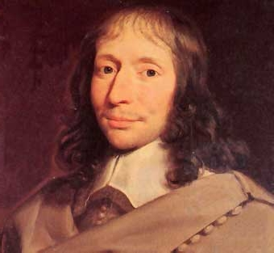
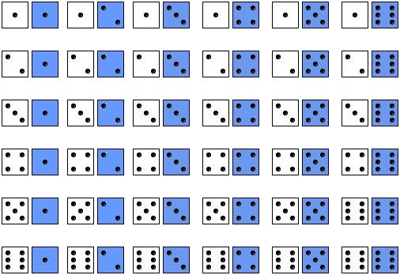
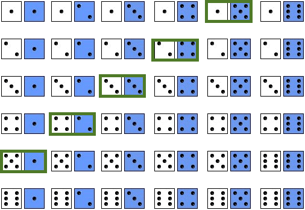
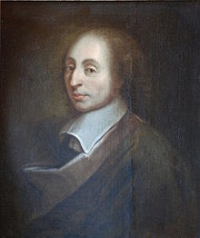

<style>
.column-left{
  float: left;
  width: 49%;
  text-align: left;
}
.column-right{
  float: right;
  width: 49%;
  text-align: right;
}
body {
text-align: justify}
</style>


<style>
.title-slide {
  background-image: url("https://raw.githubusercontent.com/tcui001/tcui001.github.io/master/assets/img/casino.jpg");
  background-size: 100% 100%;
  opacity: 0.1;
}
</style>

```{r Lec1, echo=FALSE, warning=FALSE, message=FALSE, cache=FALSE}
library(knitr)
opts_chunk$set(tidy = TRUE, cache = FALSE) 
library(knitr)
```

```{r child='UnitOverview.Rmd'}
```

```{r child='Module3.Rmd'}
```

## <span class="fa-stack fa"><i class="fa fa-circle fa-stack-2x"></i><i class="fa fa-map-marker fa-stack-1x fa-inverse"></i></span>Simulating Chance

<div class="thinkingbox"> 
### [Data Story | Why did the Chevalier de Mere lose money?](#5)
### [Counting and drawing trees (The old way)](#8)  
### [Running a simulation (The new way)](#13)  
### [How Chevalier de Mere stopped losing](#21)  
### [Summary](#27)  
</div>

# Data Story | Why did the Chevalier de Méré lose money?

## Why did the Chevalier de Méré lose money? 

<div align="center">

</div>

[Chevalier De Méré](https://www.cut-the-knot.org/Probability/ChevalierDeMere.shtml)

##

- The [Chevalier de Méré](https://en.wikipedia.org/wiki/Antoine_Gombaud) was a 17th century gambler, who played 2 games:

    - Game A: Roll a die 4 times. Win = at least 1 "ace". 
    - Game B: Roll a pair of dice 24 times: Win = at least 1 "double-ace".
    
    - Note: an "ace" means "1".

He reasoned:

|Game|1 roll| # rolls| Win|
|---|---|---|---|
|A|P(1 Ace) = 1/6|4|P(at least 1 Ace) = 4x1/6 = 2/3|
|B|P(1 Double-Ace) = 1/36|24|P(at least 1 Double-Ace) = 24*1/36 = 2/3|

<br>
<span class="fa-stack fa"><i class="fa fa-circle fa-stack-2x"></i><i class="fa fa-comment-alt fa-stack-1x fa-inverse"></i></span>
But he lost consistently in Game B. Why?


# Counting and drawing trees (The old way)
##  Counting and drawing trees (The old way)

- For simple chance problems, a good way to start is to enumerate all the possible outcomes using:

  - Method 1
    - Write a list of all outcomes  
    - Count which outcomes belong to the event of interest.

  - Method 2
    - Draw a tree 

<div class="thinkingbox"> 
### <span class="fa-stack fa"><i class="fa fa-circle fa-stack-2x"></i><i class="fas fa-pencil-alt fa-stack-1x fa-inverse"></i></span> Example

Two dice are thrown. What is the chance that their sum is 6?
</div>

##

### Method 1: Write a full list of outcomes and count the outcomes of interest.


<div class="column-left">



</div>

<div class="column-right">



</div>

So the chance is 5/36 (approx 0.14).


##
### Method 2: Summarise in a tree diagram

```{r, echo=F,warning =F,fig.height = 3}

library("DiagrammeR")

grViz(" 
  digraph CFA {

    # Top node
    node [shape = circle, color=Black]
    a [label = '@@1']; 

    # Multiple level nodes
    node [shape = circle, color=CornflowerBlue]
    b [label = '1']; 
    c [label = '2']; 
    d [label = '3'];
    e [label = '4'];
    f [label = '5'];
    g [label = '6'];
    {rank = same; b; g}

    # Terminal branch nodes
    node [shape = circle, color = Crimson] 
    h [label = '1'];
    i [label = '2'];
    j [label = '3'];
    k [label = '4'];
    l [label = '5'];
    m [label = '6'];
    {rank = same; h; i; j; k; l; m}

    # Connect nodes with edges and labels
    a -> b [label = '']
    a -> c [label = ''] 
    a -> d [label = ''] 
    a -> e [label = ''] 
    a -> f [label = ''] 
    a -> g [label = ''] 
    b -> h [label = '']
    b -> i [label = '']
    b -> j [label = '']
    b -> k [label = ''] 
    b -> l [label = ''] 
    b -> m [label = ''] 
  }

[1]: paste0('Start')  
#[2]: paste0('1st Draw\\n 1') 

")
```

- One path has probability 1/36, because independence of 1st draw and 2nd draw means probabilities of edges can be  multiplied: 1/6*1/6=1/36
- Probability of paths can be added because events are mutually exclusive (if you throw (1,5) you can't have thrown (2,4) at the same time)

- Possible paths are (1,5), (2,4), (3,3), (4,2), (5,1), hence probability of 6 spots is 1/36+1/36+1/36+1/36+1/36=5/36.


# Running a simulation (The new way)

##
### Method 3: Simulate (in R)

- Use R and simulate  throwing 2 dice $x$ times and record the findings.

<!--
### Size 100

```{r, fig.height=3}
set.seed(1)
totals=sample(1:6, 100, rep = T)+sample(1:6, 100, rep = T)
table(totals)
barplot(table(totals), main="100 rolls: sum of 2 dice")
```

## 
So the (simulated) chance of getting a total of 6 is
`r length(totals[totals=="6"])`/100 =  
`r length(totals[totals=="6"])/100`.
-->

<!-- ## -->

<!-- ###  Simulate in R -->

```{r, fig.height=3}
set.seed(23) # set the random seed
totals=sample(1:6, 1000, rep = T)+sample(1:6, 1000, rep = T)
table(totals)
```

- We set the random seed so this can be reproduced

- Sample from 1,2,3,4,5,6 (a die)

- Sample 1000 times

- Sample with replacement (independent experiments)


##
### Method 3: Simulate (in R)

```{r, fig.height=4}
barplot(table(totals), main="1000 rolls: sum of 2 dice")
```

So the (simulated) chance of getting a total of 6 is
`r length(totals[totals=="6"])`/1000 =  `r length(totals[totals=="6"])/1000`, which is very close to
the exact answer of 5/36 = 0.139.


<!--
## 
### More advanced code

```{r, fig.height=3}
set.seed(1)
Roll1Die = function(n) sample(1:6, n, rep = T) #Creates a function to roll die
roll1 = NULL  #Initialise variable.
roll2 = NULL
for (i in 1:100) {
    roll1[i] = Roll1Die(1)
    roll2[i] = Roll1Die(1)}
barplot(table(roll1 + roll2), main="100 rolls: sum of 2 dice") 
```

##

### More advanced code [simulating totals directly]

```{r fig.height=3}
set.seed(1)
s1=sample(2:12,size = 100,replace = TRUE, prob = table(outer(1:6,1:6,"+")) / 36)
table(s1)
barplot(table(s1))
```
-->

## 
<div class="thinkingbox"> 
### <span class="fa-stack fa"><i class="fa fa-circle fa-stack-2x"></i><i class="fas fa-pencil-alt fa-stack-1x fa-inverse"></i></span> Example (a bit more complex)

Three dice are thrown. What is the chance of getting a total equal to 6?
</div>

### Method 1: Write a list manually
- Total number of outcomes are 6x6x6 = 216
- The outcomes where the total is equal to 6 are: (1,1,4) (1,2,3) (1,3,2) (1,4,1) (2,1,3) (2,2,2) (2,3,1) (3,1,2) (3,2,1), (4,1,1)
- So exact chance of getting total of 6 is 10/216 (approx 0.046).

##
### Method 2: Summarise in a tree diagram

```{r, echo=F}
library("DiagrammeR")

grViz(" 
  digraph CFA {

    # Top node
    node [shape = circle, color=Black]
    a [label = '@@1']; 

    # Multiple level nodes
    node [shape = circle, color=CornflowerBlue]
    b [label = '1']; 
    c [label = '2']; 
    d [label = '3'];
    e [label = '4'];
    f [label = '5'];
    g [label = '6'];
    {rank = same; b; g}

    # Terminal branch nodes
    node [shape = circle, color = Crimson] 
    h [label = '1'];
    i [label = '2'];
    j [label = '3'];
    k [label = '4'];
    l [label = '5'];
    m [label = '6'];
  {rank = same; h; i; j; k; l; m}

# Terminal branch nodes
    node [shape = circle, color = Purple] 
    n [label = '1'];
    o [label = '2'];
    p [label = '3'];
    q [label = '4'];
    r [label = '5'];
    s [label = '6'];
    {rank = same; n; o; p; q; r; s}

    # Connect nodes with edges and labels
    a -> b [label = '']
    a -> c [label = ''] 
    a -> d [label = ''] 
    a -> e [label = ''] 
    a -> f [label = ''] 
    a -> g [label = ''] 
    b -> h [label = '']
    b -> i [label = '']
    b -> j [label = '']
    b -> k [label = ''] 
    b -> l [label = ''] 
    b -> m [label = ''] 
    h -> n [label = ''] 
    h -> o [label = ''] 
    h -> p [label = ''] 
    h -> q [label = ''] 
    h -> r [label = ''] 
    h -> s [label = ''] 
  }

[1]: paste0('Start')  
#[2]: paste0('1st Draw\\n 1') 

")
```


##

### Method 3: Simulate in R

```{r, fig.height=3}
set.seed(23)
totals=sample(1:6, 1000, rep = T)+sample(1:6, 1000, rep = T)+sample(1:6, 1000, rep = T)
table(totals)/1000
barplot(table(totals), main="1000 rolls: sum of 3 dice")
```


# How did the Chevalier de Méré lose?


##

<div class="thinkingbox"> 
### <span class="fa-stack fa"><i class="fa fa-circle fa-stack-2x"></i><i class="fas fa-pencil-alt fa-stack-1x fa-inverse"></i></span> Statistical Thinking
- Which game has a better chance of winning?
  - Game A: Roll a die 4 times. Win = at least 1 "ace". 
  - Game B: Roll a pair of dice 24 times: Win = at least 1 "double-ace".
  - Note: an "ace" means "1".
  
- **Problem**: Writing a list of all possible outcomes ($6^4= 1296$ (Game A) and $2^{24}=16,777,216$ (Game B)) or drawing a tree quickly becomes tedious.

- **Two solutions**:
  - [De Morgan's law](https://www.cuemath.com/data/de-morgans-law/) (Used by Chevalier de Méré) 
  - Simulate (That's what we do)
</div>


## How the Chevalier de Méré stopped losing

- Chevalier de Méré got advice from the philosopher Blaise Pascal, who got advice from his friend Pierre de Fermat.

<div align="center">


</div>

##

They reasoned:

|Game|1 roll| # rolls|P(no Win)|P(Win)|
|---|---|---|---|---|
|A|P(not Ace) = 5/6|4|P(no Aces) = (5/6)^4 |1-(5/6)^4 = 0.518|
|B|P(not Double-Ace) = 35/36|24|P(no Double-Aces) = (35/36)^24|1-(35/36)^24=0.49|

<br>

- Not having an "ace" in each roll is independent, applying the multiplication rule to work out the chance of lossing.

- Considering the **complement** event, makes each of the complements **mutually exclusive**, so the solution follows easily.

- So it's slightly better to play Game A.

## 

### Using simulation

```{r, fig.height=3}
gameA <- function(){
  rolls <- sample(1:6, size = 4, replace = TRUE)
  condition <- sum(rolls == 1) > 0
  return(condition)
}
simsA <- replicate(100000, gameA())
sum(simsA)/length(simsA)
```

```{r, fig.height=3}
gameB <- function(){
  first.die <- sample(1:6, size = 24, replace = TRUE)
  second.die <- sample(1:6, size = 24, replace = TRUE)
  condition <- sum((first.die == second.die) & (first.die == 1)) > 0
  return(condition)
}
simsB <- replicate(100000, gameB())
sum(simsB)/length(simsB)
```


## 

<div class="thinkingbox"> 
### <span class="fa-stack fa"><i class="fa fa-circle fa-stack-2x"></i><i class="fas fa-pencil-alt fa-stack-1x fa-inverse"></i></span> Exercise

- A company has  10,000 male employees and 11,000 female employess. A representative committee is created by  randomly picking 10 employees.

- What is chance that  more than 75% in the committee are male?


</div>

<br>

```{r}
set.seed(1)
committee <- function(){
  committee <- sample(c(rep(1, 10000), rep(0, 11000)), size = 10, replace = FALSE)
  condition <-  mean(committee) > 0.75
  return(condition)
}
sim <- replicate(10000, committee())
mean(sim)
```


## Summary
Counting outcomes or drawing a  tree to derive probabilities of outcomes can quickly become tedious. One solution is to use simulations!


### Key Words
Counting outcomes, drawing a tree, simulation

### Key R Functions
`set.seed`, `sample`, `function()`, `replicate`