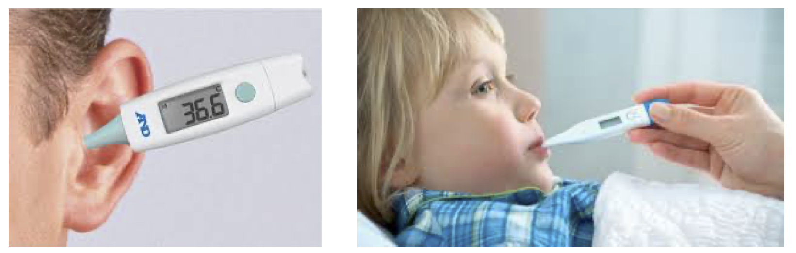
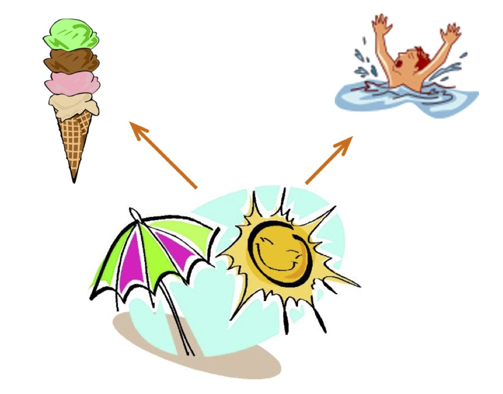
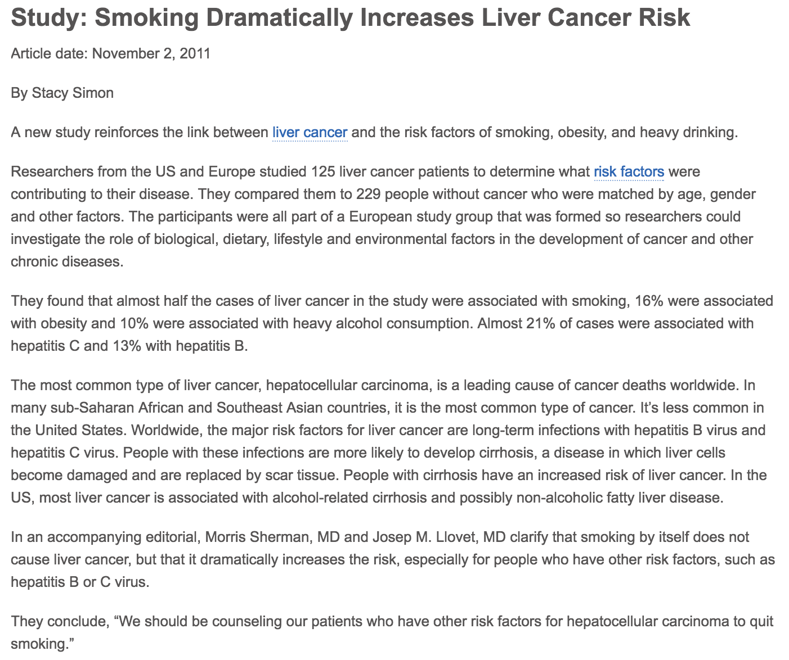
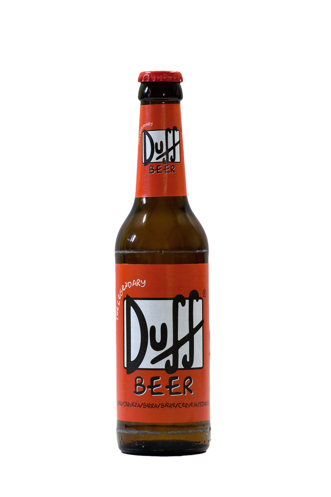

```{=html}
<style>
.title-slide {
  background-image: url("https://raw.githubusercontent.com/tcui001/tcui001.github.io/master/assets/img/smoking.jpg");
  background-size: 100% 100%;
  opacity: 0.1;
}
body {
text-align: justify}
</style>
```
```{r Lec1, echo=FALSE, warning=FALSE, message=FALSE, cache=FALSE}
library(knitr)
opts_chunk$set(tidy = TRUE, cache = FALSE) 
library(knitr)
```

## What is a statistician?

- A primary objective of the statistician is to answer a research question. Most of the time, the research question concerns with activities/behaviours/phenomena in a targeted **population**.

<div style="margin-top: -10px">
</div>

- Measurements with respect to the population is always very difficult to obtain, so statisticians aim to answer the research question using a **sample**.

- A majority of the statistics literature looks at how to ‘best’ infer population characteristics from a sample.

::: thinkingbox
<div style="margin-top: -10px">
</div>

Example: what is the proportion of Australians who are taller than 180 cm?

<div style="margin-top: -10px">
</div>

- **Solution 1:** Survey all Australians (the population) and calculate the proportion.

<div style="margin-top: -10px">
</div>

- **Solution 2:** Measure the heights of a subset of the population. Build a model based on the observed heights and then answer the question using the model. 

<div style="margin-top: -35px">
</div>
:::

## Course overview

<div style="margin-top: -95px">
</div>

```{r, out.width = '65%', echo=F, warning = F}
library("DiagrammeR")

DiagrammeR::grViz(" 
digraph rmarkdown {

graph [fontsize = 16, fontname = Arial, nodesep = .1, ranksep = .8]
node [fontsize = 16, fontname = Arial, fontcolor = White]
edge [fontsize = 12, fontname = Arial, width = 2]

Population [shape=box,style=filled, color=SteelBlue4,width=2.5]

Sample [shape=oval, style=filled, color=SteelBlue3, label='Sample']

EmptyBox1 [style=filled, color=White, fontname = 'Arial', fontcolor = Black, fontsize=12, label='1 Exploring Data']

EmptyBox2 [style=filled, color=White,fontname = Arial, fontcolor = Black, fontsize=12,label='2 Modelling Data']
{rank = same; Sample; EmptyBox1; EmptyBox2}

Population -> Sample [label = '  3 Sampling Data    ']

Sample -> Population [label='  4 Decisions with Data']

Sample -> EmptyBox2 [style='invisible', arrowhead=none, arrowtail = none, colour= White]

EmptyBox2 -> Sample [arrowtail = none, style='invisible', arrowhead=none, colour=White]

EmptyBox1 -> Sample [arrowtail = none, style='invisible', arrowhead=none, colour=White]

EmptyBox1 -> Sample [arrowtail = none, style='invisible', arrowhead=none, colour=White]

}
")
detach(package:DiagrammeR)
```
<div style="margin-top: -75px">
</div>

- Fundamental statistical concepts.
- A number of useful statistical models.
- Probability and sampling.
- Decision with data. 
- The R computing language -- for all computational aspects and report written in the course.

## Plan for lectures 1 -- 4

<br>

- Critical thinking with data 
- Initial data analysis
- Graphical summaries
- Numerical summaries

## Population and sample

- The target population comprises all relevant subjects of interest.

- The sample is a manageable subset, selected to make the study feasible.

<div style="margin-top: -60px; text-align: center;">
</div>

```{r, fig.align='center', out.width = '50%', echo=F}
library("DiagrammeR")

DiagrammeR::grViz(" 
digraph rmarkdown {

graph [fontsize=3, layout=neato, size=\"1,0.6!\"]
node [fontsize=3, fontname = Arial, fontcolor = White]

Population [shape=ellipse,style=filled, color=SteelBlue4,pos=\"0,0!\",width=1, height=0.6, label='Population                                       ', fontsize=3] ;

Sample [shape=ellipse, style=filled, color=Orange, label='Sample', pos=\".1,.1!\", width=0.3, height=0.1, fontsize=3];

Population -> Sample [style=invis];

}
")
detach(package:DiagrammeR)
```


## Population and sample

- A sample is a subset of the population.
- It should be representative of the target population (not **biased**).
- Large enough to give accurate information about the population.
- Ideally, the observations should be independent of each other.

<div style="margin-top: -60px; text-align: center;">
</div>

```{r, fig.align='center', out.width = '50%', echo=F}
library("DiagrammeR")

DiagrammeR::grViz(" 
digraph rmarkdown {

graph [fontsize=3, layout=neato, size=\"1,0.6!\"]
node [fontsize=3, fontname = Arial, fontcolor = White]

Population [shape=ellipse,style=filled, color=SteelBlue4,pos=\"0,0!\",width=1, height=0.6, label='Population                                       ', fontsize=3] ;

Sample [shape=ellipse, style=filled, color=Orange, label='Sample', pos=\".1,.1!\", width=0.3, height=0.1, fontsize=3];

Population -> Sample [style=invis];

}
")
detach(package:DiagrammeR)
```

## Sources of bias

Bias may be defined as any systematic error (ie. not occurring randomly) which results in incorrect conclusions about the target population.
Some types of bias include 

- Selection bias
- Measurement bias
- Response bias
- Confounding

## Selection bias

Selection bias refers to any systematic differences occurring in the way that subjects are selected for a study.

<div style="text-align: center;">

</div>

E.g. In a height study, we accidentally selected a group of basketball players.

## Measurement bias

Measurement bias refers to systematic differences in the measurement of variables.

<div style="text-align: center;">

</div>

E.g. In a human body temperature study, an in-ear thermometer is consistently higher than that of an oral thermometer.

## Response bias

- Response bias can occur when the response rate to a survey is too low.

- This is because those who respond to a survey often have different characteristics or attitudes than those who don’t respond.

- This is most common when sensitive issues are involved. 

## Confounding

Confounding occurs when the effect of one variable (X) on another variable (Y) is clouded by the influence of another variable (Z).


<div style="text-align: center;">

</div>

E.g., X: increase in ice cream sales, Y: increase in drowning incidents; Z: sunny and warm weather

<!---
Confounders can be hard to find, and can mislead about a cause and effect relationship.
--->

## Study design

There are two main types of study designs

An **observational study** is one in which there is no treatment imposed by the investigator.

- We simply observe.

- Data are observed and recorded based on responses from
subjects.

An **experimental study** is one in which the investigator has some control over the subjects by giving some kind of treatment.

- Explanatory variable (determinant) is perturbed, behaviour of dependant variable (response) is noted.

- Data are observed and recorded based on responses from subjects.


## Study design
Conclusions of a study depends on the design. Roughly speaking:

**Observational studies** allow us to infer **association**.

- We should be very careful about the implications: **association** is not **causation**

- Confounding variables are always a possible cause of ridiculous conclusions.

<!---
  - E.g. 3 glasses of water can cure flu. Problem: I take my flu medicine with a glass of water, 3 times day.
--->

**Experimental studies** allow us to infer causation.

- Usually more informative on the underlying mechanisms, since the researchers can eliminate external factors in their experiments.

See the next example 

<!---
- One must be very familiar with experimental designs and take into account of all sources of variations.

- E.g. Crops growth is better in soil with high nitrogen and locations with good sunlight. If an experiment only contains high nitrogen soil and good sunlight, then it is not possible to separate out these two effects.
---> 

## Example: does smoking cause liver cancer?

A study finds that smokers tend to have higher rates of liver cancer. Does smoking cause liver cancer?

<div style="margin-top: -30px;">
</div>

::: {align="center"}

:::

<!---
<i class="fa fa-link"></i> [Cancer
Council](http://www.cancer.org/cancer/news/study-smoking-dramatically-increases-liver-cancer-risk)
---> 

## Association and causation 

It is rather easy to establish association (that one thing is linked to another).

  - Association may **suggest** causation. But association does not **prove** causation.
  - We need to take **confounding** variables into account. They can mislead about a cause and effect relationship.

What could explain the fact that smokers have a higher rate of liver cancer?

- Smokers tend to drink more alcohol than non-smokers, and excessive
    alcohol consumption causes liver cancer.
- So the effect of smoking is confounded (mixed-up) with the effect of alcohol consumption.
- Here alcohol consumption is a confounding factor.


## Strategy for establishing causation

-   If a confounder is known, we can potentially add it as an additional
    variable. For example, if alcohol consumption is a potential confounding factor for smoking's effect on liver cancer, we can add an variable "drinking" with possible values: 
    - "heavy drinker", "medium drinker", "light drinker", "lifetime abstainer"

::: {align="center"}

:::

-  In some scenarios, for example, in clinical trials, it is possible to design [**controlled experimental studies**]{.pwd} by manipulating variables to test their effects.


