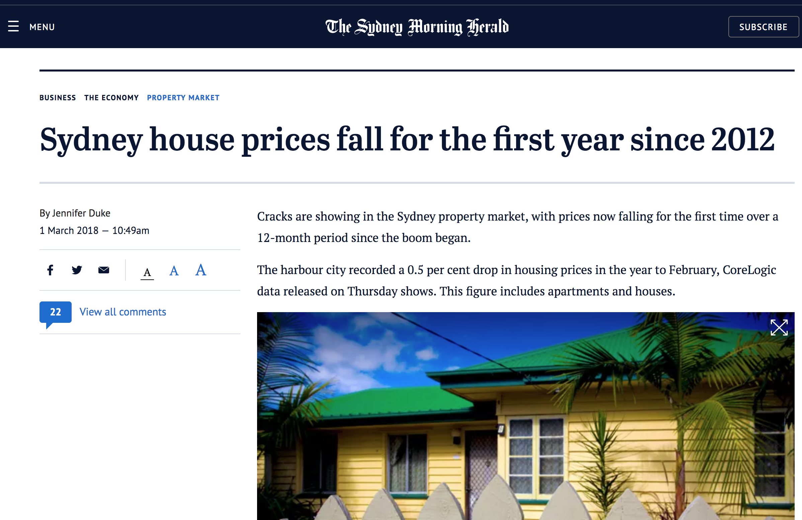

<style>
.title-slide {
  background-image:
  url("https://raw.githubusercontent.com/tcui001/tcui001.github.io/master/assets/img/home1.jpg");
  background-size: 100% 100%;
  opacity: 0.1;
}
body {
text-align: justify;
}
ul, ol {
  margin-top: 0px;
  margin-bottom: 0px;
  padding-left: 10px; /* Adjust padding for nested lists */
}
li {
  margin-bottom: 0px; /* Adjust space between list items */
}
h1 {
  font-size: 40px; /* Adjust font size for the main title */
}
h1.title {
  font-size: 40px; /* Adjust font size for the main title */
}
h2 {
  font-size: 40px; /* Adjust font size for level 2 headings */
}
</style>

```{r Lec1, echo=FALSE, warning=FALSE, message=FALSE, cache=FALSE}
library(knitr)
opts_chunk$set(tidy = TRUE, cache = FALSE) 
library(knitr)
```

```{r child='Module1.Rmd'}
```

## Outline

<div class="thinkingbox"> 
### Centre

- [Sample mean](#12) 
- [Sample median](#19) 
- [Robustness and comparisons](#28) 

### Spread

- [Standard deviation](#35) 
- [Interquartile range](#50) 

### [Write functions in R](#59)

### [Summary](#62)

</div>

# Data story | How much does a property in Newtown cost?

## 
<div align="center">

</div>

<!-- ## -->

<!-- <div align="center"> -->
<!--  -->
<!-- </div> -->

<!-- <i class="fa fa-link"></i> -->
<!-- [SMH](https://www.smh.com.au/business/the-economy/sydney-house-prices-fall-for-the-first-year-since-2012-20180301-p4z294.html) -->


## Data on Newtown property sales 

- Data is taken from [domain.com.au](https://www.domain.com.au):
    - All properties sold in Newtown (NSW 2042) between April-June 2017.
    - The variable `Sold` has price in $1000s.

<br>
```{r}
data <- read.csv("data/NewtownJune2017.csv",header=T)
head(data, n=2)
```

##
```{r}
dim(data)
str(data)
```


# Numerical summaries

## Recap: graphical summaries 

For the Newtown property data  we could produce a histogram or boxplot.

```{r, fig.height=3}
par(mfrow=c(1,2))
hist(data$Sold, freq = F)
boxplot(data$Sold,horizontal=T)
```

<i class="fa fa-comment-alt"></i></span> What do they reveal about Newtown house prices?


## Advantages of numerical summaries
- A numerical summary reduces all the data to one simple number ("statistic"). 
    - This loses a lot of information.
    - However it allows easy communication and comparisons. 
- Major features that we can summarise numerically are:
    - <span class="kwd">Maximum</span> 
    - <span class="kwd">Minimum</span>  
    - <span class="kwd">Centre</span>  [sample mean, median]
    - <span class="kwd">Spread</span>  [standard deviation, range, interquartile range]
    
<i class="fa fa-comment-alt"></i></span> Which summaries might be useful for talking about Newtown house prices?

- It depends!
- Reporting the centre without the spread can be misleading!

## Useful notation for data

- Observations of a single variable of size $n$ can be represented by
$$ x_{1}, x_{2}, \ldots, x_{n} $$

- The ranked observations (ordered from smallest to largest) are
$$ x_{(1)}, x_{(2)}, \ldots, x_{(n)} $$ 
such that \(x_{(1)} \leq x_{(2)} \leq \ldots \leq x_{(n)}\)

- The sum of the observations are 
$$ \sum_{i=1}^{n} x_{i} $$


# Sample mean 


## Sample mean

<div class="thinkingbox"> 
### <span class="fa-stack fa"><i class="fa fa-circle fa-stack-2x"></i><i class="fa fa-book fa-stack-1x fa-inverse"></i></span> Sample mean

The sample mean is the <span class="kwd">average</span> of the data.

$$
\mbox{sample mean} = \frac{\mbox{sum of data}}{\mbox{size of data}}
$$
or
$$
\bar{x} = \frac{\sum_{i=1}^{n} x_{i}}{n}
$$
</div>

<br>

Note that the sample mean involves **all** of the data.

##

- The sample mean of all the properties sold in Newtown is:

```{r}
mean(data$Sold)
```

<br>

- Focusing specifically on houses with 4 bedrooms (large), the sample mean is:

```{r}
mean(data$Sold[data$Type=="House" & data$Bedrooms=="4"])
```


## Deviation from the mean

Given a data point \(x_i\), its deviation from the sample mean \(\bar{x}\) is 
\[
D_i = x_i - \bar{x}
\]
For example,

- 19 Watkin St sold for	$1950 (thousands). 
    - This gives a gap of ($1950-$1407.143) = $542.857 (thousands)
    - $542.857 (thousands) **above** the sample mean
- 30 Pearl St	sold for $1250 (thousands).
    - This gives a gap of ($1250-$1407.143) = -$157.143 (thousands)
    - $157.143 (thousands) **below** the sample mean

## Sample mean as a balancing point

The sample mean is the point at which the data is **balanced** in the sense the sum of the **absolute deviations** for values to the left of the mean is the same as the sum of absolute deviations to the right of the mean.

\[
\sum_{x_i < \bar{x}} |x_i - \bar{x}| = \sum_{x_i > \bar{x}} |x_i - \bar{x}|
\]

## Sample mean on the histogram 

```{r, echo=F}
millions = round(mean(data$Sold)/1000,digits=1)
```

However, sample mean may **not** be balancing point of a histogram, the area to the left of the mean may not be the same as the area to the right of the mean. 

```{r, fig.height=4}
hist(data$Sold, main="Newtown properties", xlab="Price (in 1000s)")
abline(v=mean(data$Sold),col="green")
```

##

When the data is skewed, this effect is more significant. 

```{r, fig.height=4}
hist(data$Sold[data$Type=="House" & data$Bedrooms=="4"], main="Newtown 4 Bedrooms", xlab="Price (in 1000s)")
abline(v=mean(data$Sold[data$Type=="House" & data$Bedrooms=="4"]),col="green")
```

# Sample median


## Sample median 

<div class="thinkingbox"> 
### <span class="fa-stack fa"><i class="fa fa-circle fa-stack-2x"></i><i class="fa fa-book fa-stack-1x fa-inverse"></i></span> Sample Median

The sample median \(\tilde{x}\) is the <span class="kwd">middle data point</span>, when the observations are ordered from smallest to largest.

- For an odd sized number of observations:
$$
\mbox{sample median = the unique middle point} = x_{\left(\frac{n+1}{2}\right)}
$$

- For an even sized number of observations:
$$
\mbox{sample median = average of the 2 middle points} = \frac{x_{\left(\frac{n}{2}\right)} + x_{\left(\frac{n}{2}+1\right)}}{2}
$$

## Ordering observations 

The ranked observations are:

```{r}
sort(data$Sold)
length(data$Sold)
```

<br>

As we have n = 56 observations (even), the sample median is found between the \((\frac{n}2)\) = 28th and \((\frac{n}2+1)\) = 29th prices, or $\frac{1375+ 1400}{2} = 1387.5$.

##

- The sample median of all the properties sold in Newtown is:

```{r}
median(data$Sold)
```

<br>

- Focusing specifically on houses with 4 bedrooms (large), the sample median is:

```{r}
median(data$Sold[data$Type=="House" & data$Bedrooms=="4"])
```


## Sample median on the histogram

```{r, echo=F}
medianmillions = round(median(data$Sold)/1000,digits=1)
```

- The sample median is the **half way point** on the histogram - i.e., 50% of the houses sold are below and above $1.3875 million.


```{r, fig.height=3.5}
hist(data$Sold)
abline(v=mean(data$Sold),col="green")
abline(v=median(data$Sold),col="purple")
```

##

```{r, fig.height=4}
hist(data$Sold[data$Type=="House" & data$Bedrooms=="4"], main="Newtown 4 Bedrooms", xlab="Price (in 1000s)")
abline(v=mean(data$Sold[data$Type=="House" & data$Bedrooms=="4"]),col="green")
abline(v=median(data$Sold[data$Type=="House" & data$Bedrooms=="4"]),col="purple")
```

<i class="fa fa-comment-alt"></i></span> What does this suggest?

##
<div class="thinkingbox"> 
### <span class="fa-stack fa"><i class="fa fa-circle fa-stack-2x"></i><i class="fa fa-comment-alt fa-stack-1x fa-inverse"></i></span> Statistical Thinking

If you had to choose between reporting the sample mean or sample median for Newtown properties, which would you choose and why?

- For the full property portfolio, the sample mean and the sample median are fairly similar.
- For the 4 bedroom houses, the sample mean is higher than the sample median because it is being "pulled up" by some very expensive houses. 
- For the average buyer, the sample median would be more useful as an indication of the sort of price needed to get into the market. 
- For any agent selling houses in the area, the sample mean might be more useful in order to predict their average commissions!
- In practise, we can report both!

</div>

## Sample mean and median on the boxplot

- The sample median is the centre line on the boxplot.
  
```{r, fig.height=4}
boxplot(data$Sold, main = "Newtown properties")
abline(h=mean(data$Sold),col="green")
abline(h=median(data$Sold),col="purple")
```

##

```{r, fig.height=4}
boxplot(data$Sold[data$Type=="House" & data$Bedrooms=="4"], main = "Newtown 4B Properties")
abline(h=mean(data$Sold[data$Type=="House" & data$Bedrooms=="4"]),col="green")
abline(h=median(data$Sold[data$Type=="House" & data$Bedrooms=="4"]),col="purple")
```


# Robustness and comparisons

## Robustness 

<div class="thinkingbox"> 
### <span class="fa-stack fa"><i class="fa fa-circle fa-stack-2x"></i><i class="fa fa-book fa-stack-1x fa-inverse"></i></span> Robustness

The sample median is said to be
<span class="kwd">robust</span> 
and is a good summary for skewed data as it is not affected by **outliers** (extreme data values).
</div>

<!---
## Example 1

The prices of all the properties are as follows:

```{r}
sort(data$Sold)
mean(data$Sold)
median(data$Sold)
```

##

Suppose there was a data entry mistake, and the lowest property recorded as 370 was in fact the highest sold at 37000. 

<span class="fa-stack fa"><i class="fa fa-circle fa-stack-2x"></i><i class="fa fa-comment-alt fa-stack-1x fa-inverse"></i></span> How would the sample mean change?

<span class="fa-stack fa"><i class="fa fa-circle fa-stack-2x"></i><i class="fa fa-comment-alt fa-stack-1x fa-inverse"></i></span> How would the sample median change?

##

Suppose there was a data entry mistake, and the lowest property recorded as 370 was in fact the highest sold at 37000. 

<span class="fa-stack fa"><i class="fa fa-circle fa-stack-2x"></i><i class="fa fa-comment-alt fa-stack-1x fa-inverse"></i></span> How would the sample mean change?

- The sample mean would be higher, as we have replaced the smallest reading by now the maximum.

<span class="fa-stack fa"><i class="fa fa-circle fa-stack-2x"></i><i class="fa fa-comment-alt fa-stack-1x fa-inverse"></i></span> How would the sample median change?

- The sample median would shift up, from the average of $x_{(28)}$ and $x_{(29)}$ to the average of $x_{(29)}$ and $x_{(30)}$.

##

```{r}
data1 = c(sort(data$Sold)[2:56],37000)
data1
mean(data1)
median(data1)
```
--->

## Example 

Recently a heritage building was sold for 13 million in Newtown.

<div align="center">

</div>

<span class="fa-stack fa"><i class="fa fa-circle fa-stack-2x"></i><i class="fa fa-comment-alt fa-stack-1x fa-inverse"></i></span> How would the sample mean and sample median change if it was added to the data?

- The sample mean would be a lot higher.

- The sample median would be a bit higher: it moves from the average of the 28th and 29th points to the 29th point.

##

```{r}
data2 = c(data$Sold,13000)
sort(data2)
mean(data2)
median(data2)
```

### Summary of changes

|Change in data| sample mean | sample median|
|------|-----|--------|
|Original data|1407.143|1387.5|
|Extra property of 13000|1610.526|1400|


## Comparing the sample mean and the median

The difference between the sample mean and the sample median can be an indication of the **shape** of the data.

- For symmetric data, the sample mean and sample median are the same: $\bar{x} = \tilde{x}$. 
- For left skewed data (the most frequent data are concentrated on the right, with a left tail), the sample mean is smaller than the sample median: $\bar{x} < \tilde{x}$ .
- For right skewed data (the most frequent data are concentrated on the left, with a right tail), the sample mean is larger than the sample median: $\bar{x} > \tilde{x}$.

```{r,echo=F, fig.height=2}
x1=c(1,2,3,4,5,6,7,8)
x2=c(1,5,7,8,9,10)
x3=c(1,2,3,5,9)
par(mfrow = c(1, 3))
boxplot(x1,main="Symmetric",horizontal=T)
boxplot(x2,main="Left skewed",horizontal=T)
boxplot(x3,main="Right skewed",horizontal=T)
```

## Which is optimal for describing centre?

- Both have strengths and weaknesses depending on the nature of the data.
- Sometimes neither gives a sensible sense of location, for example if the data is **bimodal**.
- As the **sample median is robust**, it is preferable for data which is skewed or has many outliers, like Sydney house prices.
- The **sample mean** is helpful for data which is **basically symmetric**, with not too many outliers, and for theoretical analysis.

## Limitations of both?

- Both the sample mean and sample median allow easy comparisons.
- However, they need to be paired with a measure of **spread**.
- In the following example, the sample means are the same, but the data are very different. Or, consider two data sets $\{-1,0,1\}$ and $\{-100, 0, 100\}$.

```{r, echo=F, warning =F, fig.height=3}
set.seed(1)
par(mfrow=c(1,2))
data1=rnorm(500,10,10)
data2=rnorm(500,10,1)
hist(data1)
hist(data2)
c(mean(data1),mean(data2))
```

# Standard deviation

## How to measure spread? 

For each property sold, we could calculate the **deviation** (or the gap) from the sample mean, $D_i = x_i - \bar{x}$, between the house and the sample mean $1407 (thousands).

|Property|Sold|Gap|Conclusion|
|---|---|---|---|
|19 Watkin Street|$1950 (thousands)|1950-1407=543|More than half a  million dollars more expensive than the average house price|
|30 Pearl St|$1250 (thousands)|1250-1407=-157|Cheaper than the average house price|

##

```{r}
gaps = data$Sold - mean(data$Sold)
gaps
max(gaps)
```
<div style="margin-top: 20px"></div>

<span class="fa-stack fa"><i class="fa fa-circle fa-stack-2x"></i><i class="fa fa-comment-alt fa-stack-1x fa-inverse"></i></span> What are the biggest and smallest deviations?

How do we **summarise** all the deviations into **1 number** ("spread")?

## 1st attempt: The mean gap 

We could calculate the **average** of the deviations.

<div class="thinkingbox"> 
### <span class="fa-stack fa"><i class="fa fa-circle fa-stack-2x"></i><i class="fa fa-book fa-stack-1x fa-inverse"></i></span> Mean gap
$$
\mbox{mean deviation} = \mbox{sample mean(data - sample mean(data))}
$$
</div>

<br>

```{r}
round(mean(gaps))
```

<br>

<span class="fa-stack fa"><i class="fa fa-circle fa-stack-2x"></i><i class="fa fa-comment-alt fa-stack-1x fa-inverse"></i></span> What's the problem?

##

Note: It will always be 0.

- From the definition, the mean deviation must be 0, as the mean is the **balancing point** of the deviations.

- The mean deviation is 
\[
\frac{\sum_{i=1}^n D_i}{n}  = \frac{ \sum_{i=1}^{n} (x_{i} - \bar{x})}{n} = \frac{ \sum_{i=1}^{n} x_{i}}{n} - \frac{n \bar{x}}{n} = 0.
\]

## Better option: Standard deviation

<br>
First define the **root mean square** (RMS). 

<div class="thinkingbox"> 
### <span class="fa-stack fa"><i class="fa fa-circle fa-stack-2x"></i><i class="fa fa-book fa-stack-1x fa-inverse"></i></span> Root mean square

- The RMS measures the **average** of a set of numbers, regardless of the signs.
- The steps are: *Square* the numbers, then *Mean* the result, then *Root* the result. 
$$ \mbox{RMS(numbers)} = \sqrt{\mbox{sample mean}\left(\mbox{numbers}^2\right)}$$
- So effectively, the *Square* and *Root* operations "reverse" each other.

- RMS retain the same unit as the unit of the sample mean. 
</div>


##

- Applying RMS to the deviations, we get
$$ \mbox{RMS of deviations} = \sqrt{\mbox{sample mean}\left(\mbox{deviations}^2\right)}=\sqrt{\frac{\sum_{i=1}^{n}D_i^2}{n}}$$

- To avoid the cancellation of the deviations, another possible method is to consider the average of the absolute values of the deviations: 
\[
\text{mean absolute deviation (MAD)} = \frac{\sum_{i=1}^{n}|D_i|}{n}.
\]
However, MAD is much harder to analyse.


<!--
- The RMS measures the **average** of the data, regardless of the signs.
- The steps are: *Square* the data, then *Mean* the result, then *Root* the result.
$$
\mbox{RMS} = \sqrt{\mbox{Mean of squared data}}
\approx \mbox{Mean of absolute data}
$$
- Formally, $\mbox{RMS} = \sqrt{\frac{\sum_{i=1}^{n}x_i^2}{n}} \approx \frac{\sum_{i=1}^{n}|x_i|}{n}$
</div>

##

```{r}
# RMS
sqrt(mean(data$Sold^2))
# RMS approximation
mean(abs(data$Sold))
```

-->


## Standard deviation in terms of RMS

<div class="thinkingbox"> 
### <span class="fa-stack fa"><i class="fa fa-circle fa-stack-2x"></i><i class="fa fa-book fa-stack-1x fa-inverse"></i></span> Population Standard deviation

- The standard deviation measures the **spread** of the data.

$$ \mbox{SD}_{pop} = \mbox{RMS of (deviations from the mean)}$$

- Formally, $\mbox{SD}_{pop} = \sqrt{\mbox{Mean of (deviations from the mean)}^{2}} = \sqrt{\frac{\sum_{i=1}^{n}(x_i - \overline{x})^2}{n}}$

</div>

<br>

```{r}
sqrt(mean(gaps^2))
```

<!--
## 

<div class="thinkingbox"> 

An equivalent calculation is:
$$
\mbox{s} = \sqrt{ \mbox{Mean of squared data} - \mbox{Mean of data}^2 }
$$
or
$$ s = \sqrt{ \frac{ \sum_{i=1}^{n} x_{i}^2 }{n} - \bar{x}^2 } $$
</div>

<br>

```{r}
sqrt(mean(data$Sold^2)-mean(data$Sold)^2)
```
-->

## Standard deviation in R?

It is easy to calculate in R.

```{r}
sd(data$Sold)
```

<br>

<span class="fa-stack fa"><i class="fa fa-circle fa-stack-2x"></i><i class="fa fa-comment-alt fa-stack-1x fa-inverse"></i></span> But why is this slightly different?

## Adjusting the standard deviation

- There are **two** different formulas for the standard deviation, depending on whether the data is the **population** or a **sample**.
- The `sd` command in R always gives the **sample** version, as we most commonly have samples.
- Formally, $\mbox{SD}_{pop} = \sqrt{ \frac{1}{n} \sum_{i=1}^{n} D_i^2}$ and $\mbox{SD}_{sample} = \sqrt{ \frac{1}{n-1} \sum_{i=1}^{n} D_i^2}$, where $D_i = x_i - \bar{x}$ is the deviation.


```{r,message=F, warning=F}
sd(data$Sold)*sqrt(55/56) # adjust by sqrt((n-1)/n), it calculates the population SD.
gaps = data$Sold - mean(data$Sold) # calculate the gaps
sqrt(mean(gaps^2)) # calculates the population SD.
```

## 

Why does the sample SD use the adjustment $\sqrt{(n-1)/n}$?

- It is an **unbiased estimator** of the standard deviation (beyond the scope of this unit, will be covered in Year 2)

- Estimating the sample mean uses all of the $n$ data points. The sum (or the mean) of $n$ deviations is zero
\[
\sum_{i = 1}^n D_i = \sum_{i = 1}^n ( x_i - \bar{x}) = 0.
\]
This means, given the first $n-1$ deviations, we know the $n$-th deviation, because
\[
\left(\sum_{i = 1}^{n-1} D_i \right)+ D_{n} = 0 \quad \implies \quad D_n = - \sum_{i = 1}^{n-1} D_i.
\]
Hence, there are only $n-1$ effective pieces of information in the deviations.


## Summary: population and sample

|Summary|Formula|In R|
|---------|------|-----|
|**Population** or **Sample** mean| Sample Mean (Average)|`mean(data)`|
|**Population** standard deviation $\mbox{SD}_{pop}$|RMS of gaps from the sample mean |`sd(data)*sqrt((n-1)/n)`|
|**Sample** standard deviation $\mbox{SD}_{sample}$|Adjusted RMS of gaps from the sample mean <br> |`sd(data)`|


<br>

- The population standard deviation is always smaller than a sample standard deviation, \(\mbox{SD}_{pop} \leq \mbox{SD}_{sample}\), why? Extra variability due to sampling.  
- Note for large sample sizes, the difference becomes negligible. 

## How to tell the difference?

- It can be tricky to work out whether your data is a population or sample!
- Look at the information about the data story and the research questions.
    - If we are just interested in the Newtown property prices during April-June 2017, then the `data` is the whole **population**.
     - If we are studying the property prices during April-June 2017 as a window into more general property prices (for the rest of the year or for the Inner West area) , then the `data` could be considered a **sample**.

- Population SD and sample SD get closer with increasing sample size $n$.


## Variance

The squared standard deviation is called the **variance**. Similar to the sample SD and the population SD, there are two versions of the variance

\[
\mbox{Var}_{sample} = \mbox{SD}_{sample}^2 \quad \text{and} \quad \mbox{Var}_{pop} = \mbox{SD}_{pop}^2.
\]

- For summarising spread, we often prefer SD, as it has the same unit as the data points and the mean.
- In some situations, e.g., dealing with random variables (Part III) and understanding the property of sample mean, using the variance can be much simpler.     

<!--
## Overall Summary: Population vs sample

|Type of data|Formula|In R|
|-------|--------|-----|-----|
|**Population** mean|Average $\mu =\frac{1}{n} \sum_{i=1}^{n} x_{i}$|`mean(data)`|
|**Sample** mean|Average $\overline(x) =\frac{1}{n} \sum_{i=1}^{n} x_{i}$|`mean(data)`|
|**Population** standard deviation|RMS of gaps from the mean $\sigma = \sqrt{ \frac{1}{n} \sum_{i=1}^{n} (gaps)^2}$|`sd(data)*sqrt((n-1)/n))`|
|**Sample** standard deviation|Adjusted RMS of gaps from the mean <br> $\mbox{s} = \sqrt{ \frac{1}{n-1} \sum_{i=1}^{n} (gaps)^2}$|`sd(data)`|

<br>

Note: The squared standard deviation is called the **variance**: $\sigma^2$ or $s^2$.
-->

<!---
## Standard deviation on the histogram

```{r, echo=F}
sd = round(sd(data$Sold),digits=1)
```

```{r, fig.height=3}
hist(data$Sold, main="Newtown properties", xlab="Price (in 1000s)")
abline(v=mean(data$Sold),col="green")
abline(v=mean(data$Sold)-sd,col="blue")
abline(v=mean(data$Sold)+sd,col="blue")
abline(v=mean(data$Sold)-2*sd,col="purple")
abline(v=mean(data$Sold)+2*sd,col="purple")
abline(v=mean(data$Sold)-3*sd,col="brown")
abline(v=mean(data$Sold)+3*sd,col="brown")
```
--->

## Standard units
<div class="thinkingbox"> 
### <span class="fa-stack fa"><i class="fa fa-circle fa-stack-2x"></i><i class="fa fa-book fa-stack-1x fa-inverse"></i></span> Standard units ("Z score")

Standard units of a data point = how many standard deviations is it below or above the mean

$$ \mbox{standard units} = \frac{\mbox{data point - mean}}{\mbox{SD}} $$

This means that
$$ \mbox{ data point = mean + SD} \times \mbox{standard units}$$

It gives the relative location of a data point in the data set. It also have other benefits in data modelling (see later lectures). 

</div>

## Comparing 2 data points

To compare 2 data points, we can compare the standard units.

|Property|Sold|Standard units|Conclusion|
|---|---|---|---|
|19 Watkin Street|\$1950 (thousands)|$\frac{1950-1407}{599}=0.91$|Almost 1 SD higher than the average house price|
|30 Pearl St|\$1250 (thousands)|$\frac{1250-1407}{599}=-0.26$|0.26 SDs cheaper than the average house price|

<br>

So 19 Watkin is a more unusual purchase than 30 Pearl St, relative to the mean.

# Interquartile range

## Interquartile range (IQR) 

The IQR is another measure of spread by the **ordering**

<div class="thinkingbox"> 
### <span class="fa-stack fa"><i class="fa fa-circle fa-stack-2x"></i><i class="fa fa-book fa-stack-1x fa-inverse"></i></span> Interquartile Range (IQR)

$$
\mbox{IQR} = \mbox{range of the middle 50% of the data}
$$

More formally,  $\mbox{IQR}= Q_{3} - Q_{1}$, where

- $Q_{1}$ is the 25% percentile (1st quartile) and $Q_{3}$ is the 75% percentile (3rd quartile).
- The median is the 50% percentile, or 2nd quartile $\tilde{x} =  Q_{2}$.
- p% percentile: there are p% of **ordered** data below the value of p% percentile.
</div>

##  Quantile, quartile, percentile

The set of **$q$-quantiles** divides the **ordered** data into $q$ equal size sets (in terms of percentage of data).

<i class="fa fa-book fa-stack-1x fa-inverse"></i> **Percentile** is 100-quantile.

The set of **quartiles** divides the data into four quarters.

```{r}
summary(data$Sold)
summary(data$Sold)[5] - summary(data$Sold)[2] # one way to calculate IQR
IQR(data$Sold) # use the built-in function
```

So the range of the middle 50% of properties sold is almost a million dollars!


## Reporting 

- Like the median, the IQR is **robust**, so it's suitable as a summary of spread for skewed data.
- We report in pairs: (mean,SD) or (median,IQR).


## IQR on the boxplot and outliers

- The IQR is the length of the box in the boxplot. It represents the span of the middle 50% of the houses sold.

- The **lower** and **upper thresholds** (expected minimum and maximum) are a distance of 1.5IQR from the 1st and 3rd quartiles (by [Tukey](https://en.wikipedia.org/wiki/John_Tukey)'s convention).

$$ LT = Q_{1} - 1.5IQR $$ and $$ UT = Q_{3} + 1.5IQR $$

- Data outside these thresholds is considered an **outlier** ("extreme reading").

##

```{r, fig.height=3}
boxplot(data$Sold, horizontal=T)
iqr=quantile(data$Sold)[4] - quantile(data$Sold)[2]
abline(v=median(data$Sold),col="green")
abline(v=quantile(data$Sold)[2],col="red")
abline(v=quantile(data$Sold)[4],col="red")
abline(v=quantile(data$Sold)[2]- 1.5*iqr,col="purple")
abline(v=quantile(data$Sold)[4]+ 1.5*iqr,col="purple")
```

Note the lower threshold is not shown...why?


##

```{r, fig.height=3}
boxplot(data$Sold, horizontal=T)
abline(v=median(data$Sold),col="green")
abline(v=quantile(data$Sold)[2],col="red")
abline(v=quantile(data$Sold)[4],col="red")
abline(v=max(min(data$Sold), quantile(data$Sold)[2]- 1.5*iqr),col="purple")
abline(v=min(max(data$Sold), quantile(data$Sold)[4]+ 1.5*iqr),col="purple")
```

<div style="margin-top: -55px"></div>

To make the LT and UT staying within the range of data, R uses the convention

<div style="margin-top: -10px"></div>

$$ LT = max( min(x), Q_{1} - 1.5IQR) $$ 

<div style="margin-top: -15px"></div>

and 

<div style="margin-top: -15px"></div>

$$ UT = min( max(x), Q_{3} + 1.5IQR )$$

## Dealing with outliers (not for examination)

Sometimes outliers indicate that a better model is needed. We may remove outliers by transform the data. For example, a right skewed data set with outliers can be transformed into the logarithmic scale.

```{r, fig.width=8, fig.height=3}
w=c(1,2,3,4,10,30,60,120,180,300)
w1=log(w,10)
par(mfrow = c(1, 2))
boxplot(w, main ="Data", horizontal=T)
boxplot(w1, main="Log of Data", horizontal=T)
```

<!---
## Coefficient of variation (not examinable)

- The **Coefficient of Variation (CV)** combines the mean and standard deviation into one summary: 

$$ \mbox{CV} = \frac{\mbox{SD}}{\mbox{mean}}$$
- It is the standard deviation relative to the mean (which measures the relative spread)
- The CV is used in:
    - analytical chemistry to express the precision and repeatability of an [assay](https://www.ncbi.nlm.nih.gov/pmc/articles/PMC2556577/);
    -  engineering and physics for [quality assurance studies](https://books.google.com.au/books?id=Gi5HDgAAQBAJ&pg=PA89&lpg=PA89&dq=quality+assuraNCE+ENGINEERING+CV+COEFFICIENT&source=bl&ots=51yNwiaf0d&sig=YGIveZ8Mo1lWotFnYXj6_UEsUDw&hl=en&sa=X&ved=0ahUKEwi-76SUrMzZAhWBPZQKHcDfCH4Q6AEIUTAL#v=onepage&q=quality%20assuraNCE%20ENGINEERING%20CV%20COEFFICIENT&f=false);
    - economics for determining the [volatility of a security](https://www.investopedia.com/ask/answers/031715/what-can-coefficient-variation-cov-tell-investors-about-investments-volatility.asp).
--->


<!-- # Population vs Sample (Ext) -->

<!-- ##  -->

<!-- ```{r, out.width = '85%', echo=F, warning = F} -->
<!-- library("DiagrammeR") -->

<!-- DiagrammeR::grViz("  -->
<!-- digraph rmarkdown { -->

<!-- graph [fontsize = 16, fontname = Arial, nodesep = .1, ranksep = .8] -->
<!-- node [fontsize = 16, fontname = Arial, fontcolor = White] -->
<!-- edge [fontsize = 12, fontname = Arial, width = 2] -->

<!-- Population [shape=box,style=filled, color=SteelBlue4,width=2.5, label='Population standard deviation'] -->

<!-- Sample [shape=oval, style=filled, color=SteelBlue3, label='Sample standard deviation'] -->

<!-- Population -> Sample [label = ''] -->
<!-- } -->
<!-- ") -->
<!-- detach(package:DiagrammeR) -->
<!-- ``` -->


<!-- ## Estimation Theory  -->

<!-- - Applying the **population** standard deviation formula to the **sample**, **underestimates** the **true** population standard deviation. -->
<!-- - Hence, we need an adjusted formula for the sample standard deviation where we divide by $\frac{1}{n-1}$ rather then $\frac{1}{n}$. -->
<!-- - This will be covered in 2nd year courses on estimation theory. -->
<!-- - Here, we simply illustrate by example. -->

<!-- ## Example -->

<!-- Suppose we want to know the average property price in Newtown between April-June 2017. -->
<!-- (Note: The use of the Simulation-code is very extension!) -->

<!-- ## -->

<!-- ### Use the full data (assume it's a population). -->
<!-- ```{r} -->
<!-- # all properties -->
<!-- n = length(data$Sold) -->
<!-- mean(data$Sold)   # this is the true mean -->
<!-- sd(data$Sold)*sqrt((n-1)/n)  # this is the true population sd -->
<!-- ``` -->


<!-- ## -->

<!-- ### Simulation: Simulate 1000 samples of size 10, and average the results. -->

<!-- ```{r, warning = F} -->
<!-- set.seed(1)   # Ensures we run same simulation each time -->
<!-- means=rep(NA,1000)   # Empty vectors for the "for" loop -->
<!-- sdpop=rep(NA,1000) -->
<!-- sdsample=rep(NA,1000) -->
<!-- for (i in 1:1000)  # Simulate the samples 50 times -->
<!-- { -->
<!-- sample =sample(data$Sold,10)   # Select a sample of 10 readings -->
<!-- means[i]=mean(sample)  # Calculate the mean of sample, and store in means -->
<!-- sdpop[i]=sd(sample)*sqrt(9/10) # Calculate the population sd of sample, and store in sdpop -->
<!-- sdsample[i]=sd(sample)  # Calculate the sample sd of sample, and store in sdsample -->
<!-- } -->
<!-- mean(means)  # average of means -->
<!-- mean(sdpop)  # average of population sds -->
<!-- mean(sdsample)   # average of sample sds -->
<!-- ``` -->

<!-- ## Summary of results -->

<!-- |Data|Size|Mean|Population SD formula|(Adjusted) Sample SD formula| -->
<!-- |----------|-------|---------|----------------|----------| -->
<!-- |Full population|56|1407.143 (true)|**593.7166 (true)**|| -->
<!-- |Average of simulations|10|1407.204|560.5123|**590.8318**| -->

<!-- <br> -->
<!-- Notice for the simulations, that the sample SD is closer to the true population SD. -->


# Write a function R

## How to write a function in R

A function in R is one of the most used objects. For example, `mean`, `median`, `sd` are all R functions. It is very important to understand the purpose and syntax of R functions and knowing how to create or use them. 

To declare a user-defined function in R, we use the keyword function. 

```{r}
function_name <- function(parameter1, parameter2){
  # function body
  c = parameter1 + parameter2
  # return the outputs
  return(c)
}
```

<div style="margin-top: 20px"></div>

Here we declared a function with name `function_name`, the function takes inputs `parameter1`, `parameter2` and returns an output `c`. It can take any number of inputs but **only one** outputs.

## Example

Here we want to write a function in R that calculates the sample mean and sample standard deviation

```{r}
my_summary <- function(X){
  # Write operations within the curly brackets
  m = sum(X) / length(X)
  s = sqrt( sum((X-m)^2) / (length(X)-1) )
  # put mean and sd in a vector, then return the vector as a single output
  return(c(m, s)) 
}
```

<div style="margin-top: 20px"></div>

Then we can reuse all the operations defined in the function.

```{r}
w = c(1, 2, 3, 4, 10, 30, 60, 120, 180, 300) # a data vector
my_summary(w) # our function
c(mean(w), sd(w)) # R built-in function
```

<!---
## Using R to simulate random experiments

We can use R to simulate random games (more detailed treatment in later lectures).

- Suppose we have three dice, rolling each one has equally likely outcomes from $\{1,2,3,4,5,6\}$. 
- One wins \$10 if the total outcome of rolling these three dice is more than $9$ (excluding $9$), The cost per game is \$5.
- What is the profit after 1000 games? 

Here is an R function that simulate each game

```{r}
my_game = function(){
  rolls = sample(c(1,2,3,4,5,6), 3, replace=T)
  winning = sum(rolls) > 9 # True (or 1) if winning, otherwise 0 
  profit = winning * 10 - 5
  return(profit)
}

my_game() # play the game once
```

##

Now let's repeat the game 1000 times and calculate the total profit.

```{r}
outcomes = replicate(1e+03, my_game())
sum(outcomes)
```

<div style="margin-top: 20px"></div>

What are `sample` and `replace=T`? 

- the function `sample(x, size, replace = ?)` draws an element "randomly" (with equal chance) from the vector `x` each time, repeats the process `size` number of times.

- `replace = TURE` means **sample with replacement** - the drawing process is reset each time.

- `replace = FALSE` means **sample without replacement** - the drawing process is NOT reset each time. That is, if an element is taken out of the vector `x`, it will not be placed back. 

##

Here are some examples

- Sample with replacement 10 times, repeated outcomes
```{r}
sample(c(1,2,3,4,5,6), 10, replace=T)
```

<div style="margin-top: 20px"></div>

- Sample without replacement 5 times, non repeated outcomes.
```{r}
sample(c(1,2,3,4,5,6), 5, replace=F)
```

<div style="margin-top: 20px"></div>

- Sample without replacement 10 times. The following code will give an error, as there are only 6 elements in the vector 
```{r error=TRUE}
sample(c(1,2,3,4,5,6), 10, replace=F)
```

---> 

## Summary

### Centre

- [Sample mean](#12) 
- [Sample median](#19) 
- [Robustness and comparisons](#28) 

### Spread

- [Standard deviation](#35) 
  - [Population standard deviation and sample standard deviation](#43)
   
- [Interquartile range](#50) 

### [Write functions in R](#59)

### Some R Functions
`length`, `mean`, `median`, `sd`, `IQR`, `summary`, `boxplot`


