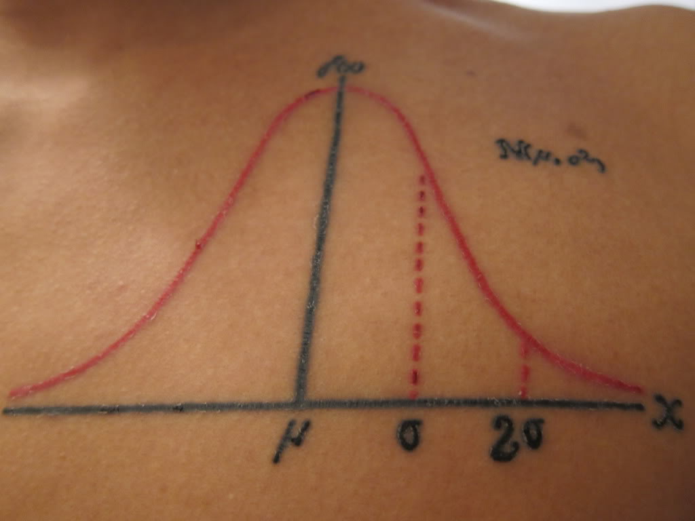
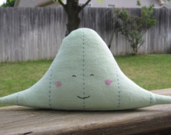
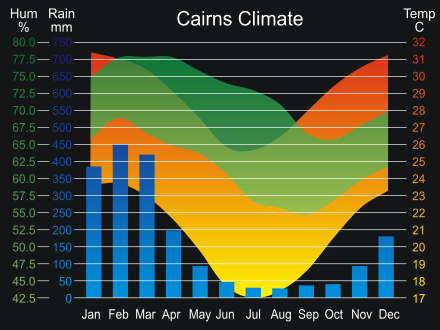
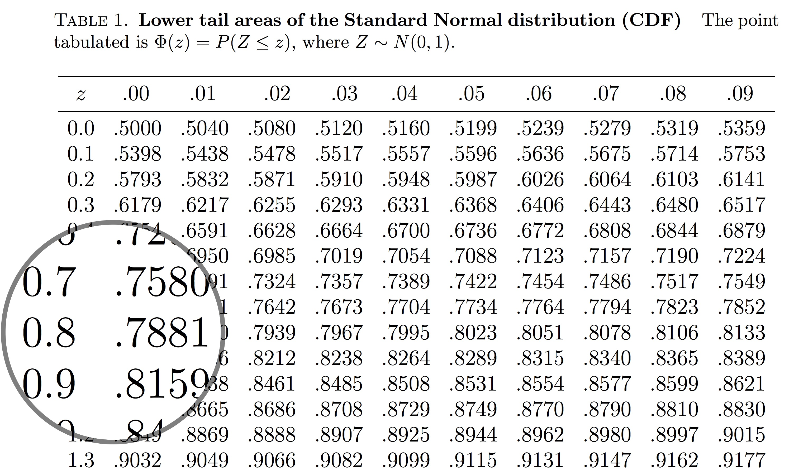

<style>
.title-slide {
  background-image: url("https://raw.githubusercontent.com/tcui001/tcui001.github.io/master/assets/img/hoop.jpg");
  background-size: 100% 100%;
  opacity: 0.1;
}
body {
text-align: justify;
}
ul, ol {
  margin-top: 0px;
  margin-bottom: 0px;
  padding-left: 10px; /* Adjust padding for nested lists */
}
li {
  margin-bottom: 0px; /* Adjust space between list items */
}
h1 {
  font-size: 40px; /* Adjust font size for the main title */
}
h1.title {
  font-size: 40px; /* Adjust font size for the main title */
}
h2 {
  font-size: 40px; /* Adjust font size for level 2 headings */
}
</style>

```{r Lec1, echo=FALSE, warning=FALSE, message=FALSE, cache=FALSE}
library(knitr)
opts_chunk$set(tidy = TRUE, cache = FALSE) 
library(knitr)
```

## Course Overview


<div style="margin-top: -35px">
</div>

<center> 

```{r, out.width = '80%', echo=F, warning = F}
library("DiagrammeR")

DiagrammeR::grViz(" 
digraph rmarkdown {

graph [fontsize = 16, fontname = Arial, nodesep = .1, ranksep = .8]
node [fontsize = 16, fontname = Arial, fontcolor = White]
edge [fontsize = 12, fontname = Arial, width = 2]

Population [shape=box,style=filled, color=SteelBlue4,width=2.5]

Sample [shape=oval, style=filled, color=SteelBlue3, label='Sample']

EmptyBox1 [style=filled, color=White, fontname = 'Arial', fontcolor = Black, fontsize=12, label='1 Exploring Data']

EmptyBox2 [style=filled, color=White,fontname = Arial, fontcolor = Black, fontsize=12,label='2 Modelling Data']
{rank = same; Sample; EmptyBox1; EmptyBox2}

Population -> Sample [label = '  3 Sampling Data    ']

Sample -> Population [label='  4 Decisions with Data']

Sample -> EmptyBox2 [style='invisible', arrowhead=none, arrowtail = none, colour= White]

EmptyBox2 -> Sample [arrowtail = none, style='invisible', arrowhead=none, colour=White]

EmptyBox1 -> Sample [arrowtail = none, style='invisible', arrowhead=none, colour=White]

EmptyBox1 -> Sample [arrowtail = none, style='invisible', arrowhead=none, colour=White]

}
")
detach(package:DiagrammeR)
```

</center>

<div style="margin-top: -75px">
</div>


```{r child='Module2.Rmd'}
```

## <span class="fa-stack fa"><i class="fa fa-circle fa-stack-2x"></i><i class="fa fa-map-marker-alt fa-stack-1x fa-inverse"></i></span> Normal Curve

<div style="margin-top: 10px"></div>

<div class="thinkingbox"> 

<div style="margin-top: -30px"></div>

### [Data story](#5)
### [The normal curve](#11)
### [Area under normal curves](#16)
### [Special properties](#27)
  
  - [68/95/99.7% rule](#29)
  - [rescaling](#30)
  - [symmetric about the mean](#36)
  
### [Qantiles](#38) 
### [Summary](#40)

<div style="margin-top: -30px"></div>

</div>

# Data story | How likely is it to find an elite netball goal player in Australia?

## 
<div align="center">

</div>

<i class="fa fa-link"></i>
[ABC News](http://www.abc.net.au/news/2015-06-14/tall-athletes-get-support-at-ais-to-stand-as-proud-netballers/6544642)

##

"A total of 10 goal players (goal shooters, goal keepers, goal attacks and goal defenders) ... were **all over 189cm** in height". 
<!--
``` {r, echo=FALSE, fig.height=3}
curve(dnorm(x, mean = 161.8, sd = 6), xlim = c(188.5, 191),xlab="Height of Australian women in cms (x)", ylab="",axes=FALSE)
abline(h = 0)
sequence <- seq(189, 191, 0.1)
polygon(x = c(sequence,191,189),
        y = c(dnorm(c(sequence),161.8,6),0,0),
        col = "indianred")
axis(1, at=c(189), pos=0)
```
-->

<div class="thinkingbox"> 
### <span class="fa-stack fa"><i class="fa fa-circle fa-stack-2x"></i><i class="fa fa-comment-alt fa-stack-1x fa-inverse"></i></span> Statistical Thinking

How could you investigate the proportion of Australian women who are over 189cm in height (potential elite goal players)?

- Collect the heights of Female students in the unit. For example, we have the data collected from "Statistical Thinking with Data" (MATH1005) in 2022 S2

Then we have two options:

- Use the data to represent the population
- Use the data to create a model for the population

## Investigation: Data from MATH1005, 2022 S2

``` {r fig.height = 3.5}
math1005 = read.csv("data/math1005_cleaned.csv",header=T)
FemaleHeights = math1005$Height[math1005$Gender == "Female"]
FemaleHeights = na.omit(FemaleHeights)
length(FemaleHeights) # There were 109 female students 
hist(FemaleHeights, main="Histogram of Female students", xlab="Heights (cm)",freq=F)
```

##

``` {r fig.height = 2.5}
mean(FemaleHeights)
sd(FemaleHeights)
sum(FemaleHeights > 189)/length(FemaleHeights) # sum(...) counts the number of FemaleHeights > 189
```

<br>

<span class="fa-stack fa"><i class="fa fa-circle fa-stack-2x"></i><i class="fa fa-comment-alt fa-stack-1x fa-inverse"></i></span> How many students could be elite goal players?

- In this sample, none! But we know there are women in Australia taller than 189cm...

##

``` {r fig.height = 4, echo=F}
hist(FemaleHeights, main="Histogram of Female students", xlab="Heights (cm)", freq = F)
m=mean(FemaleHeights)
sd=sd(FemaleHeights)
curve(dnorm(x, mean=m, sd=sd), 
col="darkblue", lwd=2, add=TRUE)
```

<div style="margin-top: -30px"></div>

We can draw a smooth curve to approximate the **density-scale** histogram. This curve may extend beyond the range of observed data in the sample to allow us to answer the reseach question. 

How would you describe it's shape?

- Fairly symmetric and bell-shaped. Is there something special about this curve?


# Normal curve

## Origins

The Normal curve was defined around 1720 by [Abraham de Moivre](https://en.wikipedia.org/wiki/Abraham_de_Moivre), also famous for the beautiful [de Moivre's formula](https://en.wikipedia.org/wiki/De_Moivre%27s_formula).

<br>
<div align="center">

</div>

## Why is the normal curve famous? 

<div align="center">



</div>

- The Normal curve approximates many **natural phenomena**.
    
- The Normal curve can model data caused by combining a **large number of independent observations**.
(Coming up in a future lecture after introducing probability)

- Many of its properties can be obtained using elementary single variable calculus.

## General & Standard Normal curves

- The **General** Normal Curve ($X$) has any mean and SD.
Caution: It is denoted by $N$(mean, **Variance**), where **Variance = SD$^2$**.

- The **Standard** Normal Curve ($Z$) has mean 0 and SD 1. Short: $N(0,1)$


```{r, echo= F, fig.height=4}
curve(dnorm(x),-4,4, main="Standard Normal Curve",xlab="z", ylab="")
```


## The Normal curve formula

The **general normal curve** can be described by the formula  
$$ f(x)  =  \frac{1}{  \sqrt{2 \pi \sigma^2}}  e^{   -\frac{ (x-\mu)^2 }{2 \sigma^2  } } \;\;\;\;\; \mbox{for }  x \in (- \infty, \infty) $$
where we can control the shape by $(\mu, \sigma)$:

<div style="margin-top: -15px"></div>

- $\mu$ is the mean, or the centre of the curve
- $\sigma$ is the standard deviation, or the spread of the curve.

<div style="margin-top: -70px"></div>

```{r, echo=FALSE, fig.height=3.5}
curve(dnorm(x, -3, 0.5), xlim = c(-5, 5),xlab="x",ylab="", col = "red")
curve(dnorm(x, 0, 2), xlim = c(-5, 5),xlab="x",ylab="", add = TRUE, col = "blue")
curve(dnorm(x, 2, 1), xlim = c(-5, 5),xlab="x",ylab="", add = TRUE, col = "green")
```


# Area under normal curves

## Area under a normal curve

<div style="margin-top: 15px"></div>

The area under any general normal curve $N(\mu,\sigma^2)$, bounded by some interval $(a,b)$, is given by  
\[
P (a < X < b) = \int_a^b  \frac{1}{  \sqrt{2 \pi \sigma^2}}  e^{   -\frac{ (x-\mu)^2 }{2 \sigma^2 } } dx
\]

- The total area under the normal curve (between $a = -\infty$ and $b=\infty$) is 1.
- $X$ denotes data following a general normal curve with mean $\mu$ and SD $\sigma$.
- $P (a < X < b)$ denotes the proportion of data falling into the interval $(a,b)$.
- We will later use this notation also for probability and random variables.

## Simplification: area under the standard normal curve

We start with a data $Z$ modeled by the standard normal curve $N(0,1)$. As $\mu = 0$ and $\sigma = 1$, the proportion of data falling into the interval $(a,b)$ is
\[
P (a < Z < b) = \int_a^b  \frac{1}{  \sqrt{2 \pi}}  e^{   -\frac{ z^2 }{2 } } dz.
\]
 For example, the proportion of data is 0.7 or lower is given by the area up to 0.7.

<div style="margin-top: -30px"></div>

```{r, echo=FALSE, fig.height=3}
curve(dnorm(x), xlim = c(-3, 3),xlab="z",ylab="",axes=FALSE)
abline(h = 0)
sequence <- seq(-3, 0.7, 0.1)
polygon(x = c(sequence,0.7,-3),
        y = c(dnorm(c(sequence)),0,0),
        col = "indianred")
axis(1, at=c(-3,-2,-1,0,0.7,1,2,3), pos=0)
```

<div style="margin-top: -40px"></div>

But how to calculate this?

## Method 1: Integration

<div style="margin-top: 15px"></div>

By its definition, we could use integration:

$$ P (Z < 0.7) = \int_{-\infty}^{0.7} \frac{1}{  \sqrt{2 \pi}}  e^{   -\frac{ z^2 }{2 } } dz $$

But this does not have a closed form.


## Method 2: Normal tables (not for assessment)

<div style="margin-top: 15px"></div>

This is the old way. We table the values of the integral. 

<div align="center">

</div>

## Method 3: Use R

<div style="margin-top: 15px"></div>

- The `pnorm(x)` command works out the **lower tail** area, it gives
\[
P (Z < x) = \int_{-\infty}^x \frac{1}{  \sqrt{2 \pi}}  e^{   -\frac{ z^2 }{2 } } dz
\]
- The `pnorm(x,lower.tail=F)` works out the **upper tail** area, it gives
\[
P (Z > x) = \int_x^{\infty} \frac{1}{  \sqrt{2 \pi}}  e^{   -\frac{ z^2 }{2 } } dz
\]

- We also have
\[
P(Z > x) = 1 - P(Z < x) \quad \text{or} \quad \text{upper tail area} = 1 - \text{lower tail area}
\]
- It is useful to sketch the normal curve and the relevant area ... and then use R.


## 

### Lower tail

What proportion of data is 0.7 or lower?

$$ P (Z < 0.7) \approx 0.76 $$

<div style="margin-top: -60px"></div>

```{r, echo=FALSE, fig.height=4}
curve(dnorm(x), xlim = c(-3, 3),ylab="", xlab='z', axes=FALSE)
abline(h = 0)
sequence <- seq(-3, 0.7, 0.1)
polygon(x = c(sequence,0.7,-3),
        y = c(dnorm(c(sequence)),0,0),
        col = "indianred")
axis(1, at=c(-2,-1,0,0.7,1,2), pos=0)
```

<div style="margin-top: -40px"></div>

```{r, fig.height=2}
pnorm(0.7)
```

##

### Upper tail

What proportion of data is 0.7 or higher?

$$ P (Z > 0.7)  \approx 0.24  $$

<div style="margin-top: -60px"></div>

```{r, echo=FALSE, fig.height=4}
curve(dnorm(x), xlim = c(-3, 3),ylab="", xlab='z',axes=FALSE)
abline(h = 0)
sequence <- seq(0.7, 3, 0.1)
polygon(x = c(sequence,3,0.7),
        y = c(dnorm(c(sequence)),0,0),
        col = "indianred")
axis(1, at=c(-2,-1,0,0.7,1,2), pos=0)
```


<div style="margin-top: -40px"></div>

```{r, fig.height=2}
pnorm(0.7,lower.tail=F)
1 - pnorm(0.7) # alternative way
```

##

### Interval 

What proportion of data is between -0.3 and 0.7?

$$ P( -0.3 < Z < 0.7) = \underbrace{P(Z < 0.7)}_{\int_{-\infty}^{0.7} f(z) dz} - \underbrace{P(Z < -0.3)}_{\int_{-\infty}^{-0.3} f(z) dz} \approx 0.38 $$

<div style="margin-top: -70px"></div>

```{r, echo=FALSE, fig.height=4}
curve(dnorm(x), xlim = c(-3, 3),ylab="",axes=FALSE,xlab="z")
abline(h = 0)
sequence <- seq(-0.3, 0.7, 0.1)
polygon(x = c(sequence,0.7,-0.3),
        y = c(dnorm(c(sequence)),0,0),
        col = "indianred")
axis(1, at=c(-2,-1,0,-0.3,0.7,1,2), pos=0)
```

<div style="margin-top: -40px"></div>

```{r, fig.height=2}
pnorm(0.7)-pnorm(-0.3)
```

## Area under general normal curves

### Heights of female students in MATH1005

``` {r fig.height = 4}
mean(FemaleHeights)
sd(FemaleHeights)
```

<div style="margin-top: 20px"></div>


- The heights of female students in MATH1005 has a mean of `r round(mean(FemaleHeights),1)`cm and a standard deviation of `r round(sd(FemaleHeights),2)`cm.

- Now we can model the heights of all Australian women with a normal curve with mean `r round(mean(FemaleHeights),1)`cm and standard deviation of `r round(sd(FemaleHeights),1)`cm.

##
### Lower tail 

Suppose the heights of Australian women follow a normal distribution with mean `r round(mean(FemaleHeights),1)`cm and sd `r round(sd(FemaleHeights),1)`cm. What proportion of women will have height less than 170cm?

<div style="margin-top: -20px"></div>

```{r, echo=FALSE, fig.height=3.5}
x <- seq(130, 190, 0.1)
m = round(mean(FemaleHeights),1)
s = round(sd(FemaleHeights),1)
curve(dnorm(x, mean = m, sd = s), xlim = c(130, 190),xlab="Height of Australian women in cms (x)", ylab="",axes=FALSE)
abline(h = 0)
sequence <- seq(130, 170, 0.1)
polygon(x = c(sequence,170,130),
        y = c(dnorm(c(sequence),m,s),0,0),
        col = "indianred")
axis(1, at=c(m,170), pos=0)
```


<div style="margin-top: -40px"></div>

```{r, fig.height=2}
m = mean(FemaleHeights)
s = sd(FemaleHeights)
pnorm(170, m, s)   #pnorm(x,mean,sd)
```

##
### Upper tail 

What proportion of women will have height greater than 189cm? How likely is to find an elite netball goal player in Australia?

<div style="margin-top: -30px"></div>

```{r, echo=FALSE, fig.height=3.5}
x <- seq(130, 190, 0.1)
m = round(mean(FemaleHeights),1)
s = round(sd(FemaleHeights),1)
curve(dnorm(x, mean =m, sd = s), xlim = c(130, 190),xlab="Height of Australian women in cms (x)", ylab="",axes=FALSE)
abline(h = 0)
sequence <- seq(189, 190, 0.1)
polygon(x = c(sequence,189,190),
        y = c(dnorm(c(sequence),m,s),0,0),
        col = "indianred")
axis(1, at=c(m,189), pos=0)
```

<div style="margin-top: -40px"></div>

```{r, fig.height=2}
m = mean(FemaleHeights); s = sd(FemaleHeights)
pnorm(189, m, s, lower.tail = FALSE)   #upper tail, pnorm(x,mean,sd)
1 - pnorm(189, m, s) # 1 - lower tail
```

# Properties of the normal curve

## 1. "68\%-95\%-99.7\% Rule" 

All normal curves satisfy the "68\%-95\%-99.7\% rule":

- The area **1** SD out from the mean in both directions is **0.68** (68%).
- The area **2** SDs out from the mean in both directions is **0.95** (95%).
- The area **3** SDs out from the mean in both directions is **0.997** (99.7%).

<!-- Number of sds $\sigma$ from the mean $\mu$ | \% of Probability 
---|-----
1 | 68\%  
2 | 95\% 
3 | 99.7\%
-->

```{r, echo=FALSE, fig.height=3, fig.width = 9.5}
par(mfrow=c(1,3))
curve(dnorm(x), xlim = c(-3, 3),, xlab='z',ylab="",axes=FALSE)
abline(h = 0)
sequence <- seq(-1, 1, 0.1)
polygon(x = c(sequence,1,-1),
        y = c(dnorm(c(sequence)),0,0),
        col = "indianred1")
axis(1, at=seq(-3, 3, 1), pos=0)
curve(dnorm(x), xlim = c(-3, 3),ylab="", xlab='z',axes=FALSE)
abline(h = 0)
sequence <- seq(-2, 2, 0.1)
polygon(x = c(sequence,2,-2),
        y = c(dnorm(c(sequence)),0,0),
        col = "indianred1")
axis(1, at=seq(-3, 3, 1), pos=0)
curve(dnorm(x), xlim = c(-3, 3),ylab="", xlab='z',axes=FALSE)
abline(h = 0)
sequence <- seq(-3, 3, 0.1)
polygon(x = c(sequence,3,-3),
        y = c(dnorm(c(sequence)),0,0),
        col = "indianred1")
axis(1, at=seq(-3, 3, 1), pos=0)
par(oma=c(0,0,2,0))
title(main="1,2 and 3 SDs from mean: N(0,1)",outer=T)
```

<div style="margin-top: -40px"></div>

Under a normal curve, it has a low chance (0.3%) to have data points that fall more than 3 SD away from the mean.  

## 2. Rescaling 

<div style="margin-top: 15px"></div>

<div class="thinkingbox"> 
**Any general normal curve can be rescaled into the standard normal curve.** 

<div style="margin-top: -30px"></div>

</div>

<div style="margin-top: 20px"></div>

Consider data $X$ following a general normal curve $N(\mu,\sigma^2)$. For any point on this normal curve, recall that the standard unit (or $z$ score) is how many standard deviations that point is above (+) or below (-) the mean.

\[ 
\mbox{standard unit} = \frac{\mbox{data point - sample mean}}{\mbox{sample SD}} \quad \text{or} \quad z = \frac{x - \mu}{\sigma}
\]

- The standard units give the relative location of a data point on the standard normal curve. 
- The proportion under a general normal curve $P(X<a)$ is equivalent to the proportion under the standard normal curve $P(Z<\frac{a - \mu}{\sigma})$

##

<div style="margin-top: -10px"></div>

The proportion of data modelled by $N(\mu,\sigma^2)$ falling below $a$ is 

<div style="margin-top: -10px"></div>

\[
P(X < a) = \int_{-\infty}^a  \frac{1}{  \sqrt{2 \pi \sigma^2}}  e^{   -\frac{1}{2}\left(\frac{ x-\mu}{\sigma }\right)^2 } dx.
\]

<div style="margin-top: -10px"></div>

Apply the change of variable (standardisation) $z = \frac{x - \mu}{\sigma}$ 

<div style="margin-top: -10px"></div>

\[
\int_{-\infty}^a  \frac{1}{  \sqrt{2 \pi \sigma^2}}  e^{   -\frac{1}{2}\left(\frac{ x-\mu}{\sigma }\right)^2  } dx = \int_{-\infty}^{\frac{a-\mu}{\sigma}}  \frac{1}{  \sqrt{2 \pi \sigma^2}}  e^{ -\frac{1}{2} z^2  } \frac{dx}{dz} dz
\]

<div style="margin-top: -15px"></div>

where 

<div style="margin-top: -20px"></div>
\[
z = \frac{x - \mu}{\sigma} \quad \implies \quad x = \sigma z + \mu \quad \implies \quad \frac{dx}{dz} = \sigma
\]

<div style="margin-top: -10px"></div>

so the proportion simplifies to 

<div style="margin-top: -10px"></div>

\[
P(X < a) = \int_{-\infty}^{\frac{a-\mu}{\sigma}}  \frac{1}{  \sqrt{2 \pi}}  e^{ -\frac{1}{2} z^2  }  dz = P\left(Z < \frac{a-\mu}{\sigma}\right)
\]

<div style="margin-top: -10px"></div>

which is the proportion of data modelled by $N(0,1)$ falling below $\frac{a-\mu}{\sigma}$. 

## 

### Example 1

``` {r, echo = F, fig.height= 4}
m=5
s=3
threshold = 8
curve(dnorm(x, mean=m, sd=s), -4,14, col="indianred", lwd=2, xlab="", ylab="", main ="General Normal", axes=F)
sequence <- seq(-4, threshold, 0.1)
polygon(x = c(sequence,threshold),
        y = c(dnorm(c(sequence),m,s),0),
        col = "indianred")
axis(1,-4:14,line=1,col="black",col.ticks="black",col.axis="black")
mtext("N(5,9)",1,line=1,at=-5,col="black")
axis(1,-4:14,labels=(c(-4:14)-m)/s,line=3.3,col="indianred1",col.ticks="indianred1",col.axis="indianred1")
mtext("Z score",1,line=3.3,at=-5,col="indianred1")
```

- Consider the point = 8.
- So the $z$ score of the point is $\frac{8-5}{3} = 1$.


##

The following 2 areas are of the same size.

<div style="margin-top: -20px"></div>

``` {r, echo = F, fig.height= 4 }
par(mfrow=c(1,2))
m=5
s=3
threshold = 8
curve(dnorm(x, mean=m, sd=s), -4,14, col="indianred", lwd=2, xlab="N(5, 9)", ylab="", main ="General Normal: area from 8 down")
sequence <- seq(-4, 8, 0.1)
polygon(x = c(sequence,8),
        y = c(dnorm(c(sequence),5,3),0),
        col = "indianred")

curve(dnorm(x, mean=0, sd=1),-3,3, 
col="indianred", lwd=2, xlab="N(0, 1)", ylab="", main ="Standard Normal: area from 1 down")
sequence <- seq(-3, 1, 0.1)
polygon(x = c(sequence,1,-3),
        y = c(dnorm(c(sequence),0,1),0,0),
        col = "indianred1")
```

<div style="margin-top: -40px"></div>

```{r}
pnorm(8, 5, 3)
pnorm(1)
```

##

### Example 2

``` {r, echo = F, fig.height= 4}
m=10
s=2
threshold1 = 10
threshold2 = 14
curve(dnorm(x, mean=m, sd=s), 4,16, col="indianred", lwd=2, xlab="", ylab="", main ="General Normal: interval", axes=F)
sequence <- seq(threshold1, threshold2, 0.1)
polygon(x = c(sequence,threshold2,threshold1),
        y = c(dnorm(c(sequence),m,s),0,0),
        col = "indianred")
#axis(2,0:0.5,las=1)   Y axis
axis(1,-2:18,line=1,col="black",col.ticks="black",col.axis="black")
mtext("N(10,4)",1,line=1,at=3,col="black")
axis(1,4:16,labels=(c(4:16)-m)/s,line=3.3,col="indianred1",col.ticks="indianred1",col.axis="indianred1")
mtext("Z score",1,line=3.3,at=3,col="indianred1")
```

- Here the lower point is 10 and the upper point is 14.
- So the $z$ scores are $z_{1}=\frac{10-10}{2} = 0$ and $z_{2}=\frac{14-10}{2} = 2$.


##

The following 2 areas are of the same size.

<div style="margin-top: -20px"></div>

``` {r, echo = F, fig.height= 4 }
par(mfrow=c(1,2))
m=10
s=2
threshold1 = 10
threshold2 = 14
curve(dnorm(x, mean=m, sd=s), 4,16, col="indianred", lwd=2, xlab="N(10, 4)", ylab="", main ="General Normal: between 10 and 14")
sequence <- seq(threshold1, threshold2, 0.1)
polygon(x = c(sequence,threshold2,threshold1),
        y = c(dnorm(c(sequence),m,s),0,0),
        col = "indianred")

curve(dnorm(x, mean=0, sd=1),-3,3, 
col="indianred", lwd=2, xlab="N(0, 1)", ylab="", main ="Standard Normal: between 0 and 2")
sequence <- seq(0, 2, 0.1)
polygon(x = c(sequence,2,0),
        y = c(dnorm(c(sequence),0,1),0,0),
        col = "indianred1")
```


<div style="margin-top: -40px"></div>

```{r}
pnorm(14, 10, 2) - pnorm(10, 10, 2) 
pnorm(2) - pnorm(0)
```

## 3. The normal curve is symmetric about the mean

<div style="margin-top: 15px"></div>

If $Z$ follows the standard normal curve $N(0, 1)$, then
    
  \[
  P(Z < -a) = P(Z > a)
  \]

The red areas below are of the same size (where $a = 0.5$).

<div style="margin-top: -30px"></div>

```{r, echo=FALSE, fig.height=4}
par(mfrow=c(1,2))
curve(dnorm(x), xlim = c(-3, 3),ylab="", xlab='z')
sequence <- seq(-3, -0.5, 0.1)
polygon(x = c(sequence,-0.5,-3),
        y = c(dnorm(c(sequence)),0,0),
        col = "indianred1")
curve(dnorm(x), xlim = c(-3, 3),ylab="", xlab='z')
sequence <- seq(0.5, 3, 0.1)
polygon(x = c(sequence,3,0.5),
        y = c(dnorm(c(sequence)),0,0),
        col = "indianred1")
```

##

More generally, if $X$ follows a general normal curve $N(\mu, \sigma^2)$, then

\[P(X< \mu - a) = P(X> \mu + a)\]


```{r}
mu = 10
sigma = 2
a = 2
pnorm(mu-a, mu, sigma)  # lower tail
pnorm(mu+a, mu, sigma, lower.tail = F) # upper tail 
```

# Quantiles

## Calculate the quantiles of normal curves using R

The function `pnorm()` finds "the proportion of data $X$ following a normal curve falling below the value $a$", we are also interested in 

- What is the quantile $Q$ such that p% of the data $X$ falling below the value $Q$? 

Similar to the proportion, there is no close-form solution for the quantiles of normal curves. We can calculate the quantiles using `qnorm(x, mu, sigma)` in R. 


```{r}
mu = 10
sigma = 2
qnorm(0.7, mu, sigma)  # 70-percentile of N(10, 4)
qnorm(0.5, mu, sigma)  # 50-percentile (or the median) of N(10, 4)
###
qnorm(0.7)  # 70-percentile of the standard normal N(0, 1)
qnorm(0.5)  # 50-percentile (or the median) of N(0, 1)
```


## Summary

<div style="margin-top: 15px"></div>

- The Normal curve naturally describes many histograms, and so can be used in modelling data. 
- [It can be described by the mean and the variance (SD$^2$)](#14).
- [Area under normal curves](#16) and `pnorm`.
- It has many useful properties, including the [68/95/99.7% rule](#29). 
- [Any general normal can be rescaled into a standard normal](#30).
- The normal curve is [symmetric about the mean](#36).
- [Qantiles](#38) and `qnorm`.

