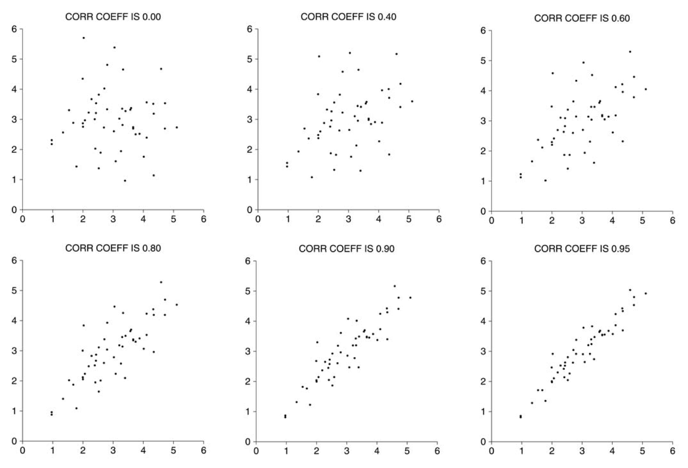

<style>
.title-slide {
  background-image: url("https://raw.githubusercontent.com/tcui001/tcui001.github.io/master/assets/img/fatherson.jpg");
  background-size: 100% 100%;
  opacity: 0.1;
}
body {
text-align: justify}
</style>

```{r Lec1, echo=FALSE, warning=FALSE, message=FALSE, cache=FALSE}
library(knitr)
opts_chunk$set(tidy = TRUE, cache = FALSE) 
library(knitr)
```


```{r child='Module2.Rmd'}
```

## <span class="fa-stack fa"><i class="fa fa-circle fa-stack-2x"></i><i class="fa fa-map-marker-alt fa-stack-1x fa-inverse"></i></span> Scatter plot & correlation

<div style="margin-top: 15px"></div>

<div class="thinkingbox"> 

<div style="margin-top: -15px"></div>

### [Correlation](#9)

- [Bivariate data & scatter plot](#9)
- [Correlation coefficient](#13)
- [Properties and warnings](#18)

<div style="margin-top: -25px"></div>

### [Linear model](#30)

- [Regression Line](#30)
- [Prediction](#40)
- [Residuals and properties](#46)
- [Coefficient of determination](#57)
- [Diagnostics of model fit](#64)

<div style="margin-top: -25px"></div>

### [Summary](#72)

<div style="margin-top: -25px"></div>

</div>

# Scatter plots

## History

<div style="margin-top: 15px"></div>

- Sir Francis Galton (England, 1822–1911) studied the degree to which children resemble their parents (and wrote [travel books on "wild countries"](http://galton.org/books/art-of-travel/galton-1855-art-travel-1up.pdf)!)
- Galton's work was continued by his student Karl Pearson (England, 1857–1936). Pearson measured the heights of 1,078 fathers and their sons at maturity.

<div align="center">


</div>

## Pearson's plot of heights (scatter plot)

<div style="margin-top: -5px"></div>

```{r, echo=F, messages=F,warning=F}
#install.packages("UsingR")  
suppressMessages(library(UsingR))
library(UsingR) # Loads another collection of datasets
data(father.son) # This is Pearson's data.
data = father.son
x = data$fheight # fathers' heights
y = data$sheight # sons' heights
#
plot(x, y,
     xlim = c(58, 80), ylim = c(58, 80),
     xaxt = "n", yaxt = "n", xaxs = "i", yaxs = "i",
     main = "Pearson's data",
     xlab = "Father height (inches)", ylab = "Son height (inches)")
axp = seq(58, 80, by = 2)
axis(1, at = axp, labels = axp)
axis(2, at = axp, labels = axp)
```

<div style="margin-top: -25px"></div>

- Plotting the pairs of heights creates a cloud of points. 

- Generally, taller fathers tend to have taller sons. 

## 

Code for plotting Pearson's data

<div style="margin-top: -15px"></div>

```{r, messages=F, warning=F, echo=T, results='hide', fig.show = 'hide'}
#install.packages("UsingR")  
suppressMessages(library(UsingR))
library(UsingR) # Loads another collection of datasets
data(father.son) # This is Pearson's data.
data = father.son
x = data$fheight # fathers' heights
y = data$sheight # sons' heights
# scatter plot
plot(x, y,
     xlim = c(58, 80), ylim = c(58, 80),
     xaxt = "n", yaxt = "n", xaxs = "i", yaxs = "i",
     main = "Pearson's data",
     xlab = "Father height (inches)", ylab = "Son height (inches)")
# Adjust the gap between label and plot
axp = seq(58, 80, by = 2)
axis(1, at = axp, labels = axp)
axis(2, at = axp, labels = axp)
```


##

<div class="thinkingbox"> 
### <span class="fa-stack fa"><i class="fa fa-circle fa-stack-2x"></i><i class="fa fa-comment-alt fa-stack-1x fa-inverse"></i></span> Statistical Thinking

<div style="margin-top: 15px"></div>

<!-- What do we notice about the heights? -->

<!-- - Plotting the pairs of heights creates a cloud of points.  -->

<!-- - Generally, taller fathers tend to have taller sons.  -->

Why do we care whether there is an associaton between two variables (here: height of father and son)? 

- The association is interesting on its own.

- Association between two variables can be used for prediction, i.e, use outcome in one variable to predict the outcome in another variable.

- How can we quantify a possible association?

</div>

<!---
<div class="thinkingbox"> 
### <span class="fa-stack fa"><i class="fa fa-circle fa-stack-2x"></i><i class="fa fa-book fa-stack-1x fa-inverse"></i></span> Scatter Plot

A **scatter plot** is a graphical summary of two quantitative variables on the same 2D plane, resulting in a cloud of points.

</div>
--->

# Correlation coefficient

## Bivariate data 

<div style="margin-top: 15px"></div>

<div class="thinkingbox"> 
### <span class="fa-stack fa"><i class="fa fa-circle fa-stack-2x"></i><i class="fa fa-book fa-stack-1x fa-inverse"></i></span> Bivariate data

<div style="margin-top: 15px"></div>

Bivariate data involves a **pair** of variables. We are interested in the relationship between the two variables. Can one variable be used to predict the other?

- Formally, we have $(x_i,y_i)$ for  $i=1,2, \ldots, n$.

- $X$ and $Y$ can have the same role 
- $X$ and $Y$ may have different roles: for example, $X$ can be an **independent** variable (or explanatory variable, predictor or regressor) which we use to explain or predict $Y$, the **dependent** variable (or response variable).

</div>

## How can we summarise bivariate data?

<div style="margin-top: 15px"></div>

Bivariate data (or a scatter plot) can be summarised by the following **five** numerical summaries:

- sample mean and sample SD of $X$   ($\bar{x}$, $\mbox{SD}_x$)
- sample mean and sample SD of $Y$   ($\bar{y}$, $\mbox{SD}_y$)
- correlation coefficient  ($r$).


## Association between the two variables

```{r, echo = F, fig.height=4, fig.width=10.5}
par(mfrow=c(1,3), mai=c(0.5,0.5,0.5,0.5))
xx = rnorm(500,1)
zz = rnorm(500,1)

yy = zz*0.1 + xx*sqrt(1-0.01)
plot(xx,yy,main="correlation near 1, tight clustering")
abline(lm(yy~xx), col="red")

yy = zz*sqrt(1-0.01) + xx*0.1
plot(xx,yy,main="correlation near 0, loose clustering")
abline(lm(yy~xx), col="red")

yy = zz*0.2 - xx*sqrt(1-0.04)
plot(xx,yy,main="negative correlation")
abline(lm(yy~xx), col="red")
```

- All clouds have the **same centre and horizontal and vertical spread**. 
- However they have **different spread** around a line (linear association). How do we measure this?

<!---
## The correlation coefficient

<div class="thinkingbox"> 
### <span class="fa-stack fa"><i class="fa fa-circle fa-stack-2x"></i><i class="fa fa-book fa-stack-1x fa-inverse"></i></span> Correlation coefficient

- The (Pearson) **correlation coefficient** $r$ is a numerical summary which measures of how points are spread around the line.
- It indicates both the sign and strength of the **linear association**.
- The correlation coefficient is between -1 and 1.
 
    - If $r$ is positive: the cloud slopes up.
    - If $r$ is negative: the cloud slopes down.
    - As $r$ gets closer to $\pm 1$: the points cluster more tightly around the line.
    - $r=0$ implies no linear dependency between two variables. 
</div>

--->


<!-- ## Examples -->

<!-- <div align="center"> -->
<!--  -->
<!-- </div> -->

<!-- Source: Freedman et al, Statistics p127 -->

## The correlation coefficient

<div class="thinkingbox"> 

<div style="margin-top: -10px"></div>

### <span class="fa-stack fa"><i class="fa fa-circle fa-stack-2x"></i><i class="fa fa-book fa-stack-1x fa-inverse"></i></span> The (Pearson) **correlation coefficient** (r)

- A numerical summary measures of how points are spread around the line.

<div style="margin-top: -20px"></div>

- It indicates both the sign and strength of the **linear association**.

<div style="margin-top: -20px"></div>

- It is defined as the mean of the product of the variables in **standard units**.

<div style="margin-top: -38px"></div>

</div>

<div style="margin-top: 15px"></div>

Recall that

<div style="margin-top: -55px"></div>
\[
\text{standard unit} = \frac{\text{data point} - \text{mean} }{SD}
\]


Using sample SD, we divide by $n-1$ in the average:


\[
r = \textstyle \frac1{n-1}  \sum_{i=1}^{n} \frac{(x_i - \bar{x})}{SD_{sample}(X)} \frac{(y_i - \bar{y})}{SD_{sample} (Y)} = \frac{\frac1{n-1} \sum_{i=1}^{n} (x_i - \bar{x})(y_i - \bar{y})}{\sqrt{\frac1{n-1} \sum_{i=1}^n (x_i-\bar{x})^2} \sqrt{\frac1{n-1} \sum_{i=1}^n (y_i - \bar{y})^2}}
\]


which simplifies to $r =  \frac{\sum_{i=1}^n (x_i - \bar{x})(y_i - \bar{y})}{\sqrt{\sum_{i=1}^n (x_i-\bar{x})^2} \sqrt{\sum_{i=1}^n (y_i - \bar{y})^2}}$.

##

The same correlation coefficient $r$ can be obtained using the population SD as well (dividing by $n$ in the average). 

\[
r = \textstyle \frac1{n}  \sum_{i=1}^{n} \frac{(x_i - \bar{x})}{SD_{pop}(X)} \frac{(y_i - \bar{y})}{SD_{pop} (Y)} = \frac{\frac1n \sum_{i=1}^n (x_i - \bar{x})(y_i - \bar{y})}{\sqrt{\frac1n \sum_{i=1}^n (x_i-\bar{x})^2} \sqrt{\frac1n \sum_{i=1}^n (y_i - \bar{y})^2}}
\]

which also simplifies to $r =  \frac{\sum_{i=1}^n (x_i - \bar{x})(y_i - \bar{y})}{\sqrt{\sum_{i=1}^n (x_i-\bar{x})^2} \sqrt{\sum_{i=1}^n (y_i - \bar{y})^2}}$.


<div style="margin-top: 55px"></div>

**Quick calculation in R** using `cor()`.

```{r}
cor(x, y)
```

## Why does $r$ measure association?

<div style="margin-top: 15px"></div>

Here, for illustration, we round data to 1 decimal place to make calculations simpler.

|$x$ (father's heights)|$y$ (son's heights)|standard units|standard units|product|quadrant|
|---|---|---|---|---|---|
|||$\frac{x -67.7}{2.7}$|$\frac{y -68.7}{2.8}$|$(\frac{x -67.7}{2.7}) (\frac{y -68.7}{2.8})$||
|65.0|59.8|-0.96|-3.16|<span style="color:lightblue">3.04</span>|lower left|
|63.3|63.2|-1.62|-1.94|<span style="color:lightblue">3.14</span>|lower left|
|65.0|63.3|-1.00|-1.90|<span style="color:lightblue">1.89</span>|lower left|
|70.3|67.0|0.95|-0.59|<span style="color:lightgreen">-0.57</span>|lower right|
|$\vdots$||||||
|||||mean=+0.5|


## 
<div style="margin-top: -5px"></div>

We divide the scatter plot into 4 quadrants, at the point of averages (centre).

- In the upper right and lower left quadrants, products of standard units are (+)
- In the upper left and lower right quadrants, products of standard units are (-)

<div style="margin-top: -19px"></div>

```{r, echo=F,messages=F,warning=F,out.width = '50%'}
x = data$fheight
y = data$sheight
num_prod = (x-mean(x))*(y-mean(y))
col = ifelse(num_prod >= 0, "lightblue", "lightgreen")
plot(x, y,
     xlim = c(58, 80), ylim = c(58, 80),
     xaxt = "n", yaxt = "n", xaxs = "i", yaxs = "i", col = col,
     main = "Pearson's data",
     xlab = "Father height (inches)", ylab = "Son height (inches)")
axp = seq(58, 80, by = 2)
axis(1, at = axp, labels = axp)
axis(2, at = axp, labels = axp)
points(mean(x),mean(y),col="indianred",pch=19,cex = 2)
points(65.0,59.8,col="lightblue",pch=19,cex = 2)
points(63.3,63.2,col="lightblue",pch=19,cex = 2)
points(65.0,63.3,col="lightblue",pch=19,cex = 2)
points(70.3,67.0,col="lightgreen",pch=19,cex = 2)
abline(v=mean(x), col="indianred")
abline(h=mean(y), col="indianred")
legend("topright",c("point of averages (centre)"),col="indianred",pch=19)
```

<div style="margin-top: -30px"></div>

- A majority of points in the upper right (+) and lower left quadrants (+) will be indicated by a positive  $r$
- A majority of points in the upper left (-) and lower right quadrants (-) will be indicated by a negative  $r$


## More examples
```{r,echo = F, out.width = '90%', out.height = '70%', message = F, warning = F}
par(mfrow=c(2,3), mai=c(0.3,0.3,0.2,0.2))
xx = rnorm(500,1)
zz = rnorm(500,1)

yy = zz
plot(xx,yy,main=sprintf("corr coef = %0.3f", cor(xx,yy)))
abline(lm(yy~xx), col="red")

yy = xx*0.25 + zz*0.6
plot(xx,yy,main=sprintf("corr coef = %0.3f", cor(xx,yy)))
abline(lm(yy~xx), col="red")

yy = xx*0.35 + zz*0.5
plot(xx,yy,main=sprintf("corr coef = %0.3f", cor(xx,yy)))
abline(lm(yy~xx), col="red")

yy = xx + zz*0.2
plot(xx,yy,main=sprintf("corr coef = %0.3f", cor(xx,yy)))
abline(lm(yy~xx), col="red")

yy = - xx + zz*0.2
plot(xx,yy,main=sprintf("corr coef = %0.3f", cor(xx,yy)))
abline(lm(yy~xx), col="red")

yy = - xx*0.35 + zz*0.5
plot(xx,yy,main=sprintf("corr coef = %0.3f", cor(xx,yy)))
abline(lm(yy~xx), col="red")
```

# Properties and warnings

## Interpretations of r values

<div style="margin-top: 15px"></div>

- The correlation coefficient $r$ always takes values between -1 and 1 (inclusive).
  - This can be shown using the definition of $r$ and the Cauchy-Schwarz inequality (only for your information).
- If $r$ is positive: the cloud slopes up.
- If $r$ is negative: the cloud slopes down.
- $r=0$ implies no linear dependency between two variables. 
- As $r$ gets closer to $\pm 1$: the points cluster more tightly around the line.

## Invariant properties

### Shift and scale invariant

The correlation coefficient is shift and scale invariant. Why? **shifting and scaling do not change the standard unit.**

```{r}
cor(x, y)
cor(0.2*x+3,3*y-1)
```

<div style="margin-top: 10px"></div>

### Symmetry (commutative)

The correlation coefficient is not affected by interchanging the variables.

```{r}
cor(x, y)
cor(y, x)
```

<!---
## 

```{r, echo = FALSE, fig.height = 4.5, out.width = '90%' }
data = father.son
data$fheight_new <- 0.5*data$fheight+3
data$sheight_new <- 2*data$sheight - 1

par(mfrow=c(1,2))
plot(data$fheight, data$sheight, asp = .7)
abline(lm(data$sheight~data$fheight),col = "blue", lwd = 1)

plot(data$fheight_new, data$sheight_new, asp = .7)
abline(lm(data$sheight_new~data$fheight_new),col = "blue", lwd = 1)
```
--->

## Warning 1: 

### Wrong interpretations of correlation coefficient 

### Mistake:
$r = 0.8$ means that 80\% of the points are tightly closed around the line.
<br>

### Mistake:
$r =0.8$ means that the points are twice as tightly closed as $r=0.4$.

Note 1: $r =0.8$ suggests a stronger association between variables compared to the case $r =0.4$, BUT does not suggest the data points are twice as tight.


## Warning 2: 

### Outliers can overly influence the correlation coefficient

Suppose there was an extra unusual reading of (100,50).

```{r}
f1 = c(data$fheight,100)  # Add an extra point to data
s1 = c(data$sheight,50)
```

```{r}
cor(data$fheight,data$sheight)
cor(f1,s1)
```

##
```{r}
par(mfrow=c(1,2))
plot(data$fheight,data$sheight)
plot(f1,s1)
points(100,50,col="lightgreen",pch=19,cex = 2)
```

## Warning 3: 

### Nonlinear association can't be detected by the correlation coefficient

What interpretation mistake could be made in the following data set?

```{r fig.height=3.5}
x=c(1:20)
y=x^2
cor(x,y)
```

<div style="margin-top: 30px"></div>

Based on the correlation coefficient, the points should cluster very tightly around the line sloping up.

##
### But look at the scatter plots.

```{r, fig.height=4}
plot(x,y)
```

This data should be modelled by a quadratic curve, not a line.

**We should always use correlation coefficient together with the scatter plot.**

## Warning 4: 

### The same correlation coefficient can arise from very different data 

The following 4 data sets ([Anscombes Quartet](https://en.wikipedia.org/wiki/Anscombe%27s_quartet)) have the **same** $\bar{x}, SD_x, \bar{y}, SD_y$, and also the **same** value of $r$.

```{r, echo = FALSE}
data(anscombe)
cat("x_mean:" , sapply(1:4, function(x) mean(anscombe[, x])))
cat("x_sd:" , sapply(1:4, function(x) sd(anscombe[, x])))
cat("y_mean:" , sapply(5:8, function(x) mean(anscombe[, x])))
cat("y_sd:" , sapply(5:8, function(x) sd(anscombe[, x])))
cat("r:" ,sapply(1:4, function(x) cor(anscombe[, x],anscombe[,x+4])))
```


## 

### But look at the scatter plots.

```{r, echo=F, message=F, fig.height=6}
par(mfrow=c(2,2), mai=c(0.5,0.5,0.5,0.5))
plot(anscombe$x1, anscombe$y1, main = "Anscombe Set 1", xlab="", ylab="", asp=0.8)
abline(lm(anscombe$y1 ~ anscombe$x1), col = "blue", lwd = 1)

plot(anscombe$x2, anscombe$y2, main = "Anscombe Set 2", xlab="", ylab="")
abline(lm(anscombe$y2 ~ anscombe$x2), col = "blue", lwd = 1)

plot(anscombe$x3, anscombe$y3, main = "Anscombe Set 3", xlab="", ylab="")
abline(lm(anscombe$y3 ~ anscombe$x3), col = "blue", lwd = 1)

plot(anscombe$x4, anscombe$y4, main = "Anscombe Set 4", xlab="", ylab="")
abline(lm(anscombe$y4 ~ anscombe$x4), col = "blue", lwd = 1)
```

## Warning 5 (not for assessment) 

### Ecological correlation tend to inflate the correlation coefficient

- An **ecological correlation** is the correlation between two variables that are group means. 
- For example, if we recorded the heights of fathers and sons in many communities, and then calculated the average for each community.
- Correlations at the group level (ecological correlations) can be much higher than those at the individual level. 
- See Freedman et al, Statistics p148-149.

## 

### Example

```{r, echo=F, fig.height=3}
eco <- read.csv("data/eco_corre.csv", stringsAsFactors = FALSE)
par(mfrow = c(1,2))

## Left panel
r <- round(cor(eco$math, eco$verbal), 2)
plot(eco$math, eco$verbal, col = eco$group,
     xlim = c(400, 800), ylim = c(400, 800), main = paste0("r1= ", r))

## Right panel
byg <- with(eco, data.frame(math = tapply(math, group, mean),
                            verbal = tapply(verbal, group, mean)))
rg <- round(cor(byg$math, byg$verbal), 2)
plot(byg$math, byg$verbal, col = row.names(byg), pch = 19, cex = 2,
     xlim = c(400, 800), ylim = c(400, 800), main = paste0("r2= ", rg))

```

- The 1st plot has all 3 sets of data combined: correlation = 0.51 (not very strong).
- The 2nd plot has the averages of the 3 data sets: correlation = 0.94 (very strong).

# Regression line

## Pearson's plot of heights

<div style="margin-top: -10px"></div>

```{r, echo=F, messages=F,warning=F,fig.height=5}
#install.packages("UsingR")  
suppressMessages(library(UsingR))
library(UsingR) # Loads another collection of datasets
data(father.son) # This is Pearson's data.
data = father.son
x = data$fheight # fathers' heights
y = data$sheight # sons' heights
#
plot(x, y,
     xlim = c(58, 80), ylim = c(58, 80),
     xaxt = "n", yaxt = "n", xaxs = "i", yaxs = "i",
     main = "Pearson's data",
     xlab = "Father height (inches)", ylab = "Son height (inches)")
axp = seq(58, 80, by = 2)
axis(1, at = axp, labels = axp)
axis(2, at = axp, labels = axp)
```

<div style="margin-top: -35px"></div>

- How can we summarise the data with a line?
- How do we find the **optimal** line?

## 1st option: SD line (not so good)

- The **SD line** might look like a good candidate as it connects the point of averages $(\bar{x}, \bar{y})$ to $(\bar{x} + \mbox{SD}_x, \bar{y} + \mbox{SD}_y)$ (for this data with positive correlation).

<div style="margin-top: -75px"></div>

```{r, fig.height=5, echo=F}
plot(x, y, xlab="Father height (inches)", ylab="Son height (inches)", col=adjustcolor("black", alpha.f = 0.35))
points(mean(x),mean(y), col = "indianred", pch = 19, cex = 2)  # point of averages (centre)
points(mean(x)+sd(x),mean(y)+sd(y), col = "blue", pch = 19, cex = 2)
abline(a = mean(y) - sd(y)/sd(x)*mean(x),
       b = sd(y)/sd(x), col = "purple", lwd = 1)
legend("bottomright",c("point of averages (centre)","point of averages + 1 SD","SD line"),col=c("indianred","blue","purple"),pch=c(19,19,NA),lty = c(NA, NA, 1))
```

##

- Note how it underestimates (LHS) and overestimates (RHS) at the extremes.

<div style="margin-top: -75px"></div>

```{r, fig.height=5, echo=F}
plot(x, y, xlab="Father height (inches)", ylab="Son height (inches)", col=adjustcolor("black", alpha.f = 0.35))
points(mean(x),mean(y), col = "indianred", pch = 19, cex = 2)  # point of averages (centre)
points(mean(x)+sd(x),mean(y)+sd(y), col = "blue", pch = 19, cex = 2)
abline(a = mean(y) - sd(y)/sd(x)*mean(x),
       b = sd(y)/sd(x), col = "purple", lwd = 1)
abline(v=63, lty = 3)
with(subset(data, fheight < 63),
     points(fheight, sheight, col="orange"))
abline(v=72, lty = 3)
with(subset(data, fheight > 72),
     points(fheight, sheight, col="orange"))
```

<div style="margin-top: -35px"></div>

- Recall that $X,Y$ can have the same mean and SD but very different correlation coefficient. 
- The above model does not use the correlation coefficient, so it is insensitive to the amount of clustering around the line.

##


```{r,echo = F, fig.width = 10.5, fig.height = 3.5, message = F, warning = F}
par(mfrow=c(1,3), mai=c(0.3,0.3,0.2,0.2))
xx = rnorm(500,1)
zz = rnorm(500,1)

yy = zz
plot(xx,yy,main=sprintf("corr coef = %0.3f", cor(xx,yy)), col=adjustcolor("black", alpha.f = 0.35))
points(mean(xx),mean(yy), col = "indianred", pch = 19, cex = 2)  # point of averages (centre)
points(mean(xx)+sd(xx),mean(yy)+sd(yy), col = "blue", pch = 19, cex = 2)
abline(a = mean(yy) - sd(yy)/sd(xx)*mean(xx),
       b = sd(yy)/sd(xx), col = "purple", lwd = 1)

yy = xx*0.3 + zz*sqrt(1-0.09)
plot(xx,yy,main=sprintf("corr coef = %0.3f", cor(xx,yy)), col=adjustcolor("black", alpha.f = 0.35))
points(mean(xx),mean(yy), col = "indianred", pch = 19, cex = 2)  # point of averages (centre)
points(mean(xx)+sd(xx),mean(yy)+sd(yy), col = "blue", pch = 19, cex = 2)
abline(a = mean(yy) - sd(yy)/sd(xx)*mean(xx),
       b = sd(yy)/sd(xx), col = "purple", lwd = 1)

yy = xx*sqrt(1-0.01) + zz*0.1
plot(xx,yy,main=sprintf("corr coef = %0.3f", cor(xx,yy)), col=adjustcolor("black", alpha.f = 0.35))
points(mean(xx),mean(yy), col = "indianred", pch = 19, cex = 2)  # point of averages (centre)
points(mean(xx)+sd(xx),mean(yy)+sd(yy), col = "blue", pch = 19, cex = 2)
abline(a = mean(yy) - sd(yy)/sd(xx)*mean(xx),
       b = sd(yy)/sd(xx), col = "purple", lwd = 1)

```


- These data have the same mean and same SDs, and hence then same SD line.

- But they have different correlation coefficient, how to take this into account? 

- How to quantify the quality of the fitted line, so we can define the **optimal** line?

## Best option: regression line

- To describe the scatter plot, we need to use **all five** summaries: $\bar{x}$, $\bar{y}$, $SD_{x}$, $SD_{y}$ **and** $r$.
- The **regression line** connects $(\bar{x}, \bar{y})$ to $(\bar{x} + \mbox{SD}_{x}, \bar{y} + r \mbox{SD}_{y})$

<div style="margin-top: -75px"></div>

```{r, echo=F, fig.height=5}
plot(x, y, xlab="Father height (inches)", ylab="Son height (inches)", col=adjustcolor("black", alpha.f = 0.35))
points(mean(x),mean(y), col = "indianred", pch = 19, cex = 2)  # point of averages (centre)
points(mean(x)+sd(x),mean(y)+cor(x,y)*sd(y), col = "steelblue4", pch = 19, cex = 2)
abline(a = mean(y) - sd(y)/sd(x)*mean(x),
       b = sd(y)/sd(x), col = "purple", lwd = 1, lty=3)
abline(a = mean(y) - cor(x,y)*sd(y)/sd(x)*mean(x),
       b = cor(x,y)*sd(y)/sd(x), col = "red", lwd = 1)
legend("bottomright",c("point of averages (centre)","point of averages + adjusted SD","Regression line", "SD line"),col=c("indianred","steelblue4","red", "purple"),pch=c(19,19,NA,NA),lty = c(NA, NA, 1,2))
```


##

- Note the improvement at the extremes.

<div style="margin-top: -75px"></div>

```{r, echo=F, fig.height=5}
plot(x, y, xlab="Father height (inches)", ylab="Son height (inches)", col=adjustcolor("black", alpha.f = 0.35))
points(mean(x),mean(y), col = "indianred", pch = 19, cex = 2)  # point of averages (centre)
points(mean(x)+sd(x),mean(y)+cor(x,y)*sd(y), col = "steelblue4", pch = 19, cex = 2)
abline(a = mean(y) - sd(y)/sd(x)*mean(x),
       b = sd(y)/sd(x), col = "purple", lwd = 1, lty=3)
abline(a = mean(y) - cor(x,y)*sd(y)/sd(x)*mean(x),
       b = cor(x,y)*sd(y)/sd(x), col = "red", lwd = 1)
abline(v=63, lty = 3)
with(subset(data, fheight < 63),
     points(fheight, sheight, col="orange"))
abline(v=72, lty = 3)
with(subset(data, fheight > 72),
     points(fheight, sheight, col="orange"))
```


## Summary of regression line

<div style="margin-top: 15px"></div>

|Feature |Regression Line $y \sim x$ ($y=a +bx$)|
|------|------------------|-------------|
|Connects |$(\bar{x}, \bar{y})$ to $(\bar{x} + \mbox{SD}_{x}, \bar{y} + r \mbox{SD}_{y})$|
|Slope (b)|$r \frac{\mbox{SD}_{y}}{\mbox{SD}_{x}}$|
|Intercept (a)|$\bar{y} - b \bar{x}$|
<br>

**Optimality:** We can derive the regression line using calculus, by minimising the **sum of squares** of the **residuals**.

## In R

<div style="margin-top: 15px"></div>

```{r}
lm(y~x)
```

```{r}
model= lm(y~x)
model$coeff
```

<div style="margin-top: 35px"></div>

So for $x$ = father height and $y$ = son height, the regression line is
$$y = 33.886604 + 0.514093 x $$

##

```{r, fig.height=5}
plot(x, y, xlab="Father height (inches)", ylab="Son height (inches)", col=adjustcolor("black", alpha.f = 0.35))
abline(lm(y ~ x), col = "red")
```


# Prediction

## Baseline prediction

- For new born (son), the father is 75 inches tall, how can we predict the son's height?

<div style="margin-top: -10px"></div>

- If you don't use the information of the independent variable $x$ at all, a basic prediction of $y$ would be the **average** of $y$ for **all** the $x$ values in the data.

<div style="margin-top: -10px"></div>

- So for any father's height, we could predict the son's height to be `r round(mean(y),2)`. 

```{r}
mean(y)
```

<div style="margin-top: -45px"></div>

```{r, echo=F, fig.height=4}
x.0<-c(75,min(y)-4)
plot(x, y, xlab="Father height (inches)", ylab="Son height (inches)", col=adjustcolor("black", alpha.f = 0.35))
abline(h=mean(y),lty=2,col="blue", lwd = 1)
points(x.0[1],x.0[2], col = "indianred", pch = "|", cex = 2)  # point of averages (centre)

points(75,mean(y), col = "blue", pch = 19, cex = 2)  # point of averages (centre)
legend("topleft", legend=c("average all x", "prediction M1"), col=c("blue","blue"), pch=c(NA,19), lty=c(2,NA))
```


## The Regression line

- A better prediction is based on the regression line $y = \text{slope} \times x + \text{intercept}$

<div style="margin-top: -10px"></div>

- For the height data: $y = 33.886604 + 0.514093 x$

<div style="margin-top: -10px"></div>

- So for any father's height 75, we could predict the son's height to be `r round(33.886604 + 0.514093*75,2)`. 

<div style="margin-top: -45px"></div>

```{r, echo=F, fig.height=4}
lm.fit <- lm(y~x)
plot(x, y, xlab="Father height (inches)", ylab="Son height (inches)", col=adjustcolor("black", alpha.f = 0.35))
abline(lm(y~x), col = "red", lwd = 1)
points(75,mean(y), col = "blue", pch = 19, cex = 2)  # point of averages (centre)
points(75, predict.lm(lm.fit,data.frame(x=75)), col = "green", pch = 19, cex=2)

legend("topleft", legend=c("regression line", "prediction M3"), col=c("green","green"), pch=c(NA,19), lty=c(1,NA))
```


## Can we also use Y to predict X?

<div style="margin-top: 15px"></div>

We can predict $Y$ from $X$ or $X$ from $Y$, depending on what fits the context.

<div style="margin-top: -25px"></div>

```{r, fig.height=4, echo=F}
par(mfrow = c(1,2), mai=c(0.9,0.9,0.2,0.2))
plot(x, y, xlab="Father height (inches)", ylab="Son height (inches)", col=adjustcolor("black", alpha.f = 0.35))
l1 = lm(y~x)
abline(l1, col="green")
legend("topright", legend=c("Reg Line: Y on X"), col=c("green"), lty=c(1), cex=0.8)
plot(y, x, ylab="Father height (inches)", xlab="Son height (inches)", col=adjustcolor("black", alpha.f = 0.35))
l2 = lm(x~y)
abline(l2, col="darkgreen")
legend("topright", legend=c("Reg Line: X on Y"), col=c("darkgreen"), lty=c(1), cex=0.8)
```

## Beware!

<div style="margin-top: 15px"></div>

- Can we just simply rearrange the equation? $(y=a +bx) \implies (x = - \frac{a}{b} + \frac1{b} y )$ 

<div style="margin-top: -10px"></div>

- The answer is NO unless $r = \pm 1$ (data clustered along the line).

<div style="margin-top: -10px"></div>

- We need to **refit** the model.

<div style="margin-top: 15px"></div>

|Feature |Regression Line $y \sim x$ $(y=a +bx)$|Regression Line $x \sim y$ $(x= \tilde{a} + \tilde{b} y)$
|------|-----------|----------|
|Connects |$(\bar{x}, \bar{y})$ to $(\bar{x} + \mbox{SD}_{x}, \bar{y} + r \mbox{SD}_{y})$|$(\bar{y}, \bar{x})$ to $(\bar{y} + \mbox{SD}_{y}, \bar{x} + r \mbox{SD}_{x})$
|Slope |$b = r \frac{\mbox{SD}_{y}}{\mbox{SD}_{x}}$|$\tilde{b}=r \frac{\mbox{SD}_{x}}{\mbox{SD}_{y}}$
|Intercept|$a = \bar{y} - b \bar{x}$|$\tilde{a} = \bar{x} - \tilde{b} \bar{y}$
<br>

##

```{r,out.width = '60%'}
lm(y~x) 
```

<div style="margin-top: 25px"></div>

```{r,out.width = '60%'}
lm(x~y)
```


# Residuals and properties

## Residuals

<div style="margin-top: 15px"></div>

We can now make predictions using the regression line. But we have some prediction **error**.

<!---
<div style="margin-top: -35px"></div>

```{r, fig.height=4, collapse=TRUE, echo=F, include=F}
plot(x, y, xlab="Father height (inches)", ylab="Son height (inches)", col=adjustcolor("black", alpha.f = 0.35))
points(mean(x),mean(y), col = "indianred", pch = 19, cex = 2)
abline(lm(y~x), col="green")
legend("topright", legend=c("Regression Line"), col=c("green"), lty=1, cex=0.8)
```
<div style="margin-top: -40px"></div>
--->

<div class="thinkingbox"> 

<div style="margin-top: -10px"></div>

### <span class="fa-stack fa"><i class="fa fa-circle fa-stack-2x"></i><i class="fa fa-book fa-stack-1x fa-inverse"></i></span> Residual (prediction error)

<div style="margin-top: 10px"></div>

- A **residual** is the vertical distance of a point above or below the regression line.

<div style="margin-top: 0px"></div>

- A residual represents the error between the actual value and the prediction.

<div style="margin-top: -20px"></div>
</div>

## 

<div style="margin-top: -35px"></div>

```{r, echo = F, fig.height=5}
plot(x, y, xlab="Father height (inches)", ylab="Son height (inches)", col=adjustcolor("black", alpha.f = 0.35))
points(mean(x),mean(y), col = "indianred", pch = 19, cex = 2)
points(x[39],y[39], col="orange", pch = 19, cex = 2)
l=lm(y~x)
abline(l, col="blue")
segments(x[39],y[39],x[39],l$fitted.values[39], col="orange")
points(x[39],l$fitted.values[39], col="blue", pch = 19, cex = 2)
```

When the father's height is `r round(x[39],2)`, the  <span style="color:orange">actual value</span> of the son's height is `r round(y[39],2)` with <span style="color:blue">predicted value</span> `r round(l$fitted.values[39],2)`, so the residual is `r round(y[39]-l$fitted.values[39],2)`.


##

Formally, given the actual value ($y_i$) and the prediction ($\hat{y}_i$), a residual is 
\[
e_{i}(a,b) = y_i - \hat{y}_i = y_i - (\underbrace{a}_{\text{intercept}} + \underbrace{b}_{\text{slope}}  x_i).
\]


```{r}
l=lm(y~x)
y[39]-l$fitted.values[39]
# Or directly
l$residuals[39]
```

<div style="margin-top: 15px"></div>

The regression line is the **best** (optimal) linear model - it provides the best fit to the data as the sum of the squared residuals $\sum_{i=1}^n e_i(a,b)^2$ is as small as it can be.


## Optimality of regression line

<div style="margin-top: 15px"></div>

- We first consider a general line $y = \alpha + \beta x$ with intercept $\alpha$ and slope $\beta$. 

- Given the data set $\{x_i, y_i\}, i = 1, \ldots, n$, a pair of variables $(\alpha, \beta)$ for defining a line, the residual is
\[
e_i(\alpha, \beta) = y_i - (\alpha + \beta x_i).
\]
so that the sum of squared residuals becomes
\[
f(\alpha, \beta) = \sum_{i = 1}^n e_i(\alpha, \beta)^2 = \sum_{i = 1}^n (y_i - \alpha - \beta x_i)^2.
\]


##

```{r, echo = F, fig.width=10.5, fig.height=3.5}
par(mfrow=c(1,3), mai=c(0.6,0.3,0.3,0.2))

res = y-mean(y)
sos = round(sum(res^2),0)
plot(x, y, xlab="Baseline", col=adjustcolor("black", alpha.f = 0.35), main=paste0("Sum of squared residual = ",sos) )
points(mean(x),mean(y), col = "indianred", pch = 19, cex = 2)  # point of averages (centre)
points(mean(x)+sd(x),mean(y)+sd(y), col = "blue", pch = 19, cex = 2)
abline(h = mean(y), col = "blue", lwd = 1)

beta = sd(y)/sd(x)
alpha = mean(y) - beta*mean(x)
res = y - (alpha + beta*x)
sos = round(sum(res^2),0)
plot(x, y, xlab="SD line", col=adjustcolor("black", alpha.f = 0.35), main=paste0("Sum of squared residual = ",sos) )
points(mean(x),mean(y), col = "indianred", pch = 19, cex = 2)  # point of averages (centre)
points(mean(x)+sd(x),mean(y)+sd(y), col = "blue", pch = 19, cex = 2)
abline(a = mean(y) - sd(y)/sd(x)*mean(x),
       b = sd(y)/sd(x), col = "purple", lwd = 1)

l=lm(y~x)
sos = round(sum(l$residuals^2),0)
plot(x, y, xlab="regression line", col=adjustcolor("black", alpha.f = 0.35), main=paste0("Sum of squared residual = ", sos) )
points(mean(x),mean(y), col = "indianred", pch = 19, cex = 2)  # point of averages (centre)
points(mean(x)+sd(x),mean(y)+sd(y), col = "blue", pch = 19, cex = 2)
abline(l, col = "red", lwd = 1)

```

- Our goal is to find the intercept $a$ and the slope $b$ that minimise $f(\alpha, \beta)$:
\[
f(a,b) \leq f(\alpha, \beta) \quad \text{for all} \quad \alpha, \beta
\]

- **The following derivation of optimality is not for examination**

##
<!---
We can also denote this by 
\[
(a,b) = \text{argmin}_{\alpha, \beta} f(\alpha, \beta).
\]
--->
How to find such a minimiser $(a,b)$? It need to be a stationary point of the function $f$ such that

<div style="margin-top: -15px"></div>

\[
\textstyle \frac{\partial f}{\partial \alpha}(a,b) = \sum_{i = 1}^n 2 (y_i - a - b x_i)(-1) \; = 0
\]

<div style="margin-top: -15px"></div>

and

<div style="margin-top: -15px"></div>

\[
\textstyle \frac{\partial f}{\partial \beta}(a,b) = \sum_{i = 1}^n 2 (y_i - a - b x_i)(-x_i) = 0.
\]


<div style="margin-top: 40px"></div>

We use the **first equation** to find the **intercept**, $\frac{\partial f}{\partial \alpha}(a,b) = 0$ is equivalent to 
\[
\textstyle \sum_{i = 1}^n (y_i - a - b x_i) = 0 \quad \Leftrightarrow \quad \sum_{i = 1}^n y_i = \sum_{i = 1}^n (a + b x_i) = n a + b \sum_{i = 1}^n x_i
\]
Dividing both sides by $n$, this gives
\[
\bar{y} = \frac1n {\textstyle \sum_{i = 1}^n} y_i = a + b \frac1n {\textstyle \sum_{i = 1}^n} x_i = a + b \bar{x},
\]
which leads to $\color{blue}{a = \bar{y} - b \bar{x} }$.

##

We can find the **slope** by substituting $\color{blue}{a = \bar{y} - b \bar{x} }$ into the **second equation**. This way, $\frac{\partial f}{\partial \beta}(a,b) = 0$ becomes

<div style="margin-top: -15px"></div>

\[
{\textstyle\sum_{i = 1}^n}  [y_i - (\bar{y} - b \bar{x}) - b x_i] x_i = 0 .
\]


<div style="margin-top: -15px"></div>

After rearragement, 

<div style="margin-top: -15px"></div>

\[
\color{red}{ {\textstyle\sum_{i = 1}^n} (y_i - \bar{y}) x_i } = \color{blue}{ b {\textstyle\sum_{i = 1}^n} (x_i - \bar{x}) x_i }.
\]

Because the sum of deviations is zero (topic 3 in week 3), we have  ${\textstyle\sum_{i = 1}^n} (y_i - \bar{y}) = 0$ and ${\textstyle\sum_{i = 1}^n} (x_i - \bar{x}) = 0$, and hence
\[
{\textstyle\sum_{i = 1}^n} (y_i - \bar{y})\bar{x} = 0 \quad \text{and} \quad {\textstyle\sum_{i = 1}^n} (x_i - \bar{x})\bar{x} = 0.
\]
as $\bar{x}$ is a constant for all $i$. 


\[
\color{red}{LHS} =  \left({\textstyle\sum_{i = 1}^n} (y_i - \bar{y})x_i \right)- \left({\textstyle\sum_{i = 1}^n} (y_i - \bar{y})\bar{x} \right) = \color{red}{ {\textstyle\sum_{i = 1}^n} (y_i - \bar{y})(x_i-\bar{x}) }
\]

\[
\color{blue}{RHS} = b \left( {\textstyle\sum_{i = 1}^n} (x_i - \bar{x}) x_i \right) - b \left( {\textstyle\sum_{i = 1}^n} (x_i - \bar{x}) \bar{x} \right) = \color{blue}{ b {\textstyle\sum_{i = 1}^n} (x_i - \bar{x})^2 } \;\;\;
\]

##
By solving the second equation $\frac{\partial f}{\partial \beta}(a,b) = 0$, the slope is
\[
b = \frac{{\textstyle\sum_{i = 1}^n} (y_i - \bar{y})(x_i-\bar{x})}{{\textstyle\sum_{i = 1}^n} (x_i - \bar{x})^2}
\]

<div style="margin-top: -25px"></div>

Recall that 

- $SD_x = \sqrt{\frac1{n-1} \sum_{i=1}^n (x_i - \bar{x})^2 }$ 

- $SD_y = \sqrt{\frac1{n-1} \sum_{i=1}^n (y_i - \bar{y})^2 }$ 

- $\;\;\;\,\; r =  \frac{\sum_{i=1}^n (x_i - \bar{x})(y_i - \bar{y})}{\sqrt{\sum_{i=1}^n (x_i-\bar{x})^2} \sqrt{\sum_{i=1}^n (y_i - \bar{y})^2}}$ 

This gives exactly $b = r \frac{SD_y}{SD_x}$ as we claimed in the definition of the regression line. So that we know the regression line is indeed the best among all lines (linear functions) in the sense of sum of squared residuals. 


## Average of residual is zero

<div style="margin-top: 15px"></div>

Given the regression line $y = a + b x$, where $a = \bar{y} - b \bar{x}$, the sum of residual 
\[
{\textstyle\sum_{i = 1}^n} e_i(a,b) = {\textstyle\sum_{i = 1}^n}  ( y_i - a - b x_i ) = {\textstyle\sum_{i = 1}^n}  (y_i - (\bar{y} - b \bar{x}) - b x_i ) 
\]
can be expressed as
\[
{\textstyle\sum_{i = 1}^n}  (y_i - \bar{y}) - b {\textstyle\sum_{i = 1}^n} (x_i - \bar{x} ) = 0
\]

Thus, **the mean (average) of residual is zero.**

## Summary of residual

<div style="margin-top: 15px"></div>

|Feature |Regression Line $y \sim x$ ($y=a +bx$)|
|------|------------------|-------------|
|Connects |$(\bar{x}, \bar{y})$ to $(\bar{x} + \mbox{SD}_{x}, \bar{y} + r \mbox{SD}_{y})$|
|Slope (b)|$r \frac{\mbox{SD}_{y}}{\mbox{SD}_{x}}$|
|Intercept (a)|$\bar{y} - b \bar{x}$|
|Residual| $e_i = y_i - a - b x_i$ |

<div style="margin-top: 30px"></div>

- $y= a+bx$ is the best line that minimises the sum of squared residuals $\sum_{i = 1}^n e_i^2$.
- the average residual of the regression line is zero: $\bar{e} = \frac1n \sum_{i = 1}^n e_i = 0$. 


# Coefficient of determination

## 

<div style="margin-top: -30px"></div>

### How much variability of data $y$ can be explained by the linear model?

<div style="margin-top: -15px"></div>

```{r,echo = F, fig.width = 10.5, fig.height = 6, message = F, warning = F}
library(latex2exp)

par(mfrow=c(3,3), mai=c(0.3,0.3,0.2,0.2))
xx = rnorm(500,1)
zz = rnorm(500,1)

yy1 = xx
lm1 = lm(yy1~xx)
plot(xx,yy1,main="(A)", col=adjustcolor("black", alpha.f = 0.35))
abline(lm1, col = "orange", lwd = 2)
abline(h=mean(yy1), col = "blue", lwd = 1)

yy2 = xx*sqrt(1-0.04) + zz*0.2
lm2 = lm(yy2~xx)
plot(xx,yy2,main="(B)", col=adjustcolor("black", alpha.f = 0.35))
abline(lm2, col = "orange", lwd = 2)
abline(h=mean(yy2), col = "blue", lwd = 1)

yy3 = xx*0.1 + zz*sqrt(1-0.01)
lm3 = lm(yy3~xx)
plot(xx,yy3,main="(C)", col=adjustcolor("black", alpha.f = 0.35))
abline(lm3, col = "orange", lwd = 2)
abline(h=mean(yy3), col = "blue", lwd = 1)


hist(yy1 - mean(yy1), freq = F, main = TeX(r'(histogram of $y_i = \bar{y}$)'), xlim = c(-4,4), col = "blue")

hist(yy2 - mean(yy2), freq = F, main = TeX(r'(histogram of $y_i = \bar{y}$)'), xlim = c(-4,4), col = "blue")

hist(yy3 - mean(yy3), freq = F, main = TeX(r'(histogram of $y_i = \bar{y}$)'), xlim = c(-4,4), col = "blue")   


hist(lm1$residual, freq = F, main = "histogram of residual", xlim = c(-4,4), col = 'orange')    

hist(lm2$residual, freq = F, main = "histogram of residual", xlim = c(-4,4), col = 'orange')  

hist(lm3$residual, freq = F, main = "histogram of residual", xlim = c(-4,4), col = 'orange')   

```

<div style="margin-top: -20px"></div>

<span style="color:blue">Baseline prediction/deviations in y</span>, <span style="color:orange">Regression line/residuals</span>

<!---
Using the linear model to explain variation in $y$:

<div style="margin-top: -10px"></div>

(A). data for which all variation is explained

<div style="margin-top: -10px"></div>

(B). data for which most variation is explained

<div style="margin-top: -10px"></div>

(C). data for which little variation is explained
--->

##

### More comments

(A). Data for which all variation is explained. All the points fall exactly on a straight line. In this case, all (100%) of the sample variation in $y$ can be attributed to the fact that $x$ and $y$ are linearly related in combination with variation in $x$.

(B). Data for which most variation is explained. The points do not fall exactly on a line, but compared to overall $y$ variability, the residuals from the regression line are small. It is reasonable to conclude in this case that much of the observed $y$ variation can be attributed to the linear regression model.

(C). Data for which little variation is explained. There is substantial variation in the points about the regression line relative to overall y variation, so the  linear regression model fails to explain variation in $y$ by relating $y$ to $x$.

## Explaining variations 

- The sum of squared residuals (or SSE for sum of squared errors)
\[
\text{SSE} = \sum_{i = 1}^n e_i^2 = \sum_{i = 1}^n (y_i - a - b x_i)^2
\]
measures **variation in $y$ left unexplained by the regression line**. 

- In (A) SSE = 0, and there is no unexplained variation, whereas unexplained variation is small for (B), and large for (C).

- A quantitative measure of **the total amount of variation in observed $y$ values** is given by the total sum of squares (sum of squared deviations about sample mean)
\[
\text{SST} = \sum_{i = 1}^n (y_i - \bar{y})^2
\]
measures variation in $y$ left unexplained by the baseline prediction. 

##

- **SST $\geq$ SSE**. 

- Why? The regression is optimal for sum of squared errors, so SSE (regression line) cannot be worse than SST (baseline). 

## Coefficient of determination

<div style="margin-top: 5px"></div>

<div class="thinkingbox"> 

<div style="margin-top: -15px"></div>

### <span class="fa-stack fa"><i class="fa fa-circle fa-stack-2x"></i><i class="fa fa-book fa-stack-1x fa-inverse"></i></span> The coefficient of determination

The ratio $\frac{\text{SSE}}{\text{SST}}$ is the proportion of total variation that cannot be explained by the simple linear regression model, and the coefficient of determination is 
\[
 1 - \frac{\text{SSE}}{\text{SST}} = r^2
\]
which is the **squared correlation coefficient** (a number between 0 and 1) giving the proportion of observed $y$ variation explained by the model.

<div style="margin-top: -30px"></div>
</div>

<div style="margin-top: 20px"></div>

- The higher the value of $r^2$, the more successful is the simple linear regression model in explaining y variation.

<div style="margin-top: -10px"></div>

- Note that if SSE = 0 as in case (A), then $r^2 = 1$.

<div style="margin-top: -10px"></div>

- This can be verified using $a$, $b$, SDs, and $r$ (see next lab)

## Example 

```{r}
cor(x,y)^2 # quick way
lm.fit <- lm(y~x)
SSE = sum(lm.fit$residuals^2)
SST = sum((y - mean(y))^2)
r2 = 1 - SSE/SST
```
```{r echo=F, fig.height=3}
r2
par(mfrow=c(1,1), mai=c(0.8,0.8,0.2,0.2))
plot(x, y, xlab="Father height (inches)", ylab="Son height (inches)", col=adjustcolor("black", alpha.f = 0.35))
abline(lm.fit, col = "red", lwd = 1)
```

<div style="margin-top: -25px"></div>

The coefficient of determination for Pearson's height data is `r round(r2,2)`, about 25% of the variations in son's height can be explained by the regression line. 


# Diagnostics

## Residual Plot

<div style="margin-top: 10px"></div>

<div class="thinkingbox"> 

<div style="margin-top: -10px"></div>

### <span class="fa-stack fa"><i class="fa fa-circle fa-stack-2x"></i><i class="fa fa-book fa-stack-1x fa-inverse"></i></span> Residual plot 

- A residual plot graphs the residuals vs $x$.
- If the linear fit is appropriate for the data, it should show no pattern (random points around 0).
- By checking the patterns of the residuals, the residual plot is a diagnostic plot to check the appropriateness of a linear model.

<div style="margin-top: -25px"></div>

</div>

##

<div style="margin-top: -5px"></div>

```{r, fig.height=4}
plot(x, l$residuals, ylab="residuals", col=adjustcolor("black",alpha.f=0.35))
abline(h=0)
```

<div style="margin-top: -35px"></div>

<span class="fa-stack fa"><i class="fa fa-circle fa-stack-2x"></i><i class="fa fa-comment-alt fa-stack-1x fa-inverse"></i></span> Does this residual plot look random?


##  Homoscedasticity and Heteroscedasticity

<div style="margin-top: 10px"></div>

<div class="thinkingbox"> 

<div style="margin-top: -10px"></div>

### <span class="fa-stack fa"><i class="fa fa-circle fa-stack-2x"></i><i class="fa fa-book fa-stack-1x fa-inverse"></i></span> Vertical strips

<div style="margin-top: 10px"></div>

In linear models and regression analysis generally, we need to check the homogeneity of the spread of the response variable (or the residuals). We can divide the scatter plot or the residual plot into vertical strips.

- If the vertical strips on the scatter plot show equal spread in the $y$ direction, then the data is **homoscedastic**.
    - The regression line could be used for predictions.
    
<div style="margin-top: 10px"></div>

- If the vertical strips don't show equal spread in the $y$ direction, then the data is **heteroscedastic**.
    - The regression line should not be used for predictions.

<div style="margin-top: -25px"></div>

</div>

##

```{r, fig.height=5, echo=F}
par(mfrow=c(2,1), mai=c(0.8,0.8,0.1,0.1))
plot(x,y,col=adjustcolor("black",alpha.f=0.35))
abline(v=mean(x)-2*sd(x), col="blue")
abline(v=mean(x)-2*sd(x)+2, col="blue")
abline(v=mean(x)-0.2*sd(x), col="red")
abline(v=mean(x)-0.2*sd(x)+2, col="red")
abline(v=mean(x)+2*sd(x), col="purple")
abline(v=mean(x)+2*sd(x)-2, col="purple")
abline(l,col="blue")

plot(x,l$residuals,ylab="residuals",col=adjustcolor("black",alpha.f=0.35))
abline(v=mean(x)-2*sd(x), col="blue")
abline(v=mean(x)-2*sd(x)+2, col="blue")
abline(v=mean(x)-0.2*sd(x), col="red")
abline(v=mean(x)-0.2*sd(x)+2, col="red")
abline(v=mean(x)+2*sd(x), col="purple")
abline(v=mean(x)+2*sd(x)-2, col="purple")
```

<span class="fa-stack fa"><i class="fa fa-circle fa-stack-2x"></i><i class="fa fa-comment-alt fa-stack-1x fa-inverse"></i></span> Is the Pearson's height data homoscedastic?


## Common mistake 1: extrapolating
    
If we make a prediction from an $x$ value that is not within the range of the data, then that prediction can be completely **unreliable**.

<div style="margin-top: -25px"></div>

```{r, echo=F, fig.height=4}
par(mfrow=c(1,2))
x=c(1,2,3)
y=c(1.1,4.2,9)
plot(x,y, main="Fitting line for 1st 3 data points")
abline(lm(y~x),col="green")
legend("topleft",c("regression line"),col=c("green"),lty = c(1))
x1=c(1,2,3,9,10)
y1=c(1.1,4.2,9,82,100)
plot(x1,y1,main="Long-term trend not linear",xlab="x",ylab="y")
abline(lm(y~x),col="green")
points(9,30,pch=19,col="green")
abline(v=9,col="green",lty=2)
```

## Common mistake 2: not checking the scatter plot

- We can have a high correlation coefficient and then fit a regression line, but the data may not even be linear!
- So always check the scatter plot first! 

<div style="margin-top: -25px"></div>

```{r, echo=F, fig.height=4}
x1=c(1,2,3,9,10)
y1=c(1.1,4.2,9,82,100)
plot(x1,y1,xlab="x",ylab="y")
curve(x^2,1,10,col="red",add=T,lty=2)
abline(lm(y1~x1),col="green")
legend("topleft", legend=c("regression line", "quadratic line"), col=c("green","red"), lty = c(1,2))
```

<div style="margin-top: -50px"></div>

Note: Even though the correlation coefficient is high $r\approx `r round(cor(x1,y1),2)`$, a quadratic model is more appropriate than a linear model.

## Common mistake 3. Not checking the residual plot

- You should also check the residual plot
- This detects any pattern that has not been captured by fitting a linear model. 
- If the linear model is appropriate, the residual plot should be a random scatter of points.

```{r, echo = F, fig.width = 10, fig.height = 3.6}
set.seed(1)
x = (1:100)/10
y1 = x + rnorm(100, 0, 1)
y2 = x + rnorm(100, 0, 1) * (1:100)/50
y3 = (x-5)^2/5 + rnorm(100, 0, 1)

l1 = lm(y1 ~ x)
l2 = lm(y2 ~ x)
l3 = lm(y3 ~ x)

par(mfrow = c(1,3))
plot(x,l1$residuals, ylab = "residuals", main = "No Pattern")
abline(h = 0, col = "red")
plot(x,l2$residuals, ylab = "residuals", main = "Fanning Pattern")
abline(h = 0, col = "red")
plot(x,l3$residuals, ylab = "residuals", main = "Quadratic Pattern")
abline(h = 0, col = "red")
```


## Summary

### [Correlation](#9)

- [Correlation coefficient](#13)
- [Properties and warnings](#18)

<div style="margin-top: -25px"></div>

### [Linear model](#30)

- [Regression Line](#30)
- [Prediction](#40)
- [Residuals and properties](#46)
- [Coefficient of determination](#57)
- [Diagnostics of model fit](#64)

<div style="margin-top: -25px"></div>

### Some R Functions
`lm`, `plot`, `abline`