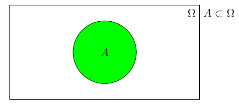
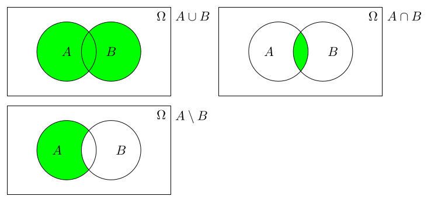
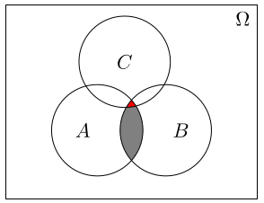
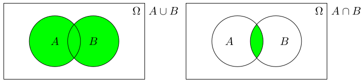
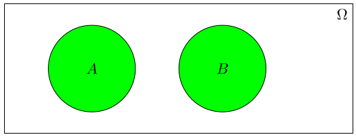
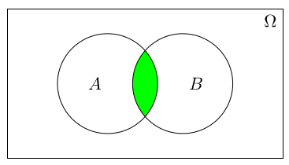
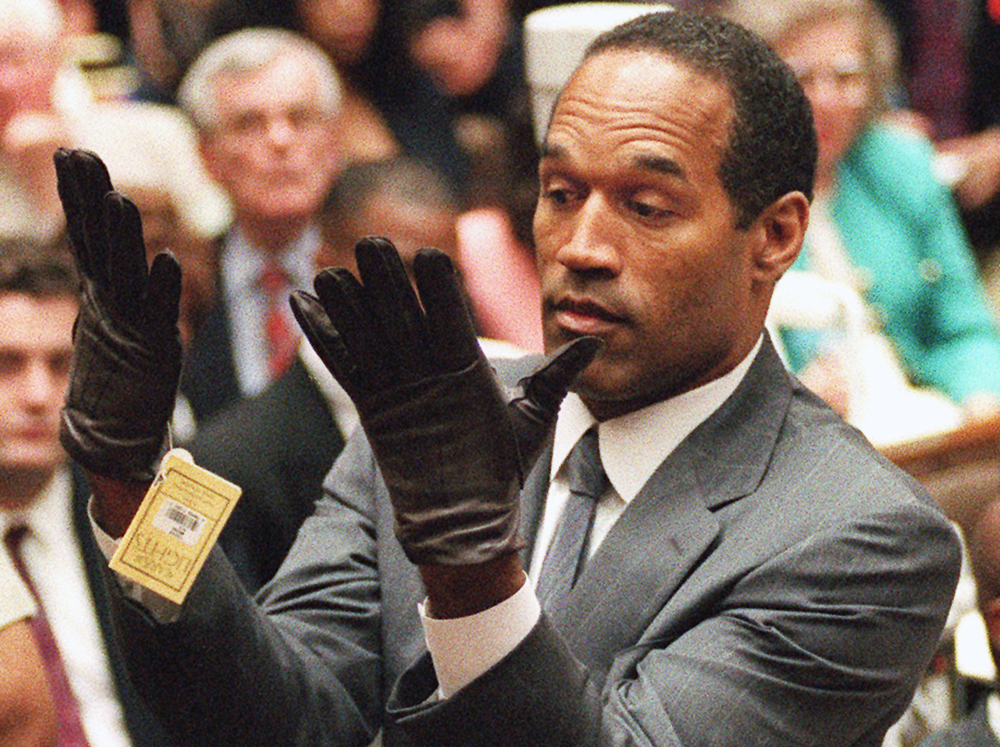
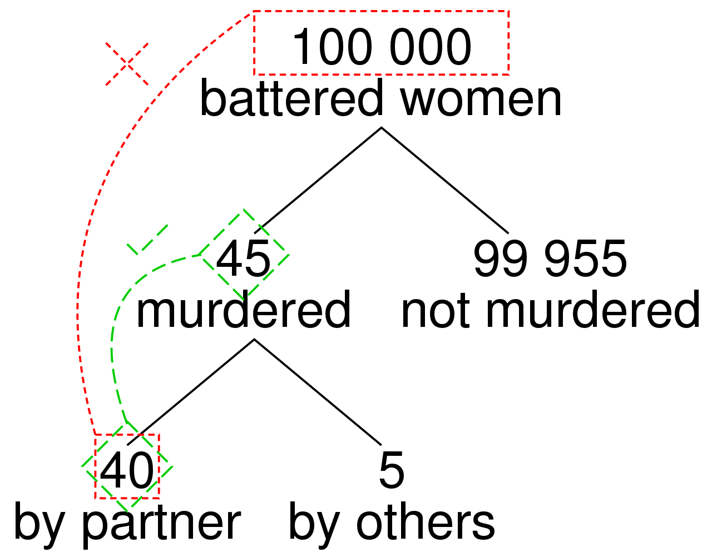

<style>
.column-left{
  float: left;
  width: 49%;
  text-align: left;
}
.column-right{
  float: right;
  width: 49%;
  text-align: right;
}
body {
text-align: justify}
</style>

<style>
.title-slide {
  background-image: url("https://raw.githubusercontent.com/tcui001/tcui001.github.io/master/assets/img/casino.jpg");
  background-size: 100% 100%;
  opacity: 0.1;
}
</style>

```{r Lec1, echo=FALSE, warning=FALSE, message=FALSE, cache=FALSE}
library(knitr)
opts_chunk$set(tidy = TRUE, cache = FALSE) 
library(knitr)
```

```{r child='Module3.Rmd'}
```

## <span class="fa-stack fa"><i class="fa fa-circle fa-stack-2x"></i><i class="fa fa-map-marker fa-stack-1x fa-inverse"></i></span>Outline

<div class="thinkingbox"> 
### [Definitions](#6)
### [Basic properties](#12) 
### [Some Exercises](#20)   
### [The prosecutor's fallacy](#30)  
### [Summary](#39)  
</div>

<!---
## What is probability?

<div style="margin-top: 15px"></div>

<div class="thinkingbox">

<div style="margin-top: -15px"></div>

### <span class="fa-stack fa"><i class="fa fa-circle fa-stack-2x"></i><i class="fa fa-book fa-stack-1x fa-inverse"></i></span> Definition (Probability)

<div style="margin-top: 15px"></div>

The probability of an event is a measure of the likelihood of that event occurring.

<div style="margin-top: -25px"></div>

</div>

<div style="margin-top: 35px"></div>

Probability Theory is a set of mathematical tools which dates back centuries to casino type games. A modern mathematical theory was developed in the 1930s by the Russian mathematician A. N. Kolmogorov. [(History video)](http://www.youtube.com/watch?v=2y3PH4SqmlA)
--->

## Why study probability?

<div style="margin-top: 15px"></div>

Probability is an essential part of every day life. 

- "The most important questions of life ... are indeed for the most part only problems of probability." [(Laplace, Théorie Analytique des Probabilitiés, 1814)](http://bayes.wustl.edu/Manual/laplace_A_philosophical_essay_on_probabilities.pdf)
 
Probability Theory makes many problems easy. 

- "The theory of probabilities is basically just common sense reduced to calculus." [(Laplace, Essai philosophique sur les probabilités, 1814)](http://archive.org/details/essaiphilosophiq00lapluoft)

Probability (or the $p$-value) is crucial for decision making in Hypothesis Testing, which is essential to scientific research.


## Example: Why did the Chevalier lose money? 

<div style="margin-top: 10px"></div>

- The [Chevalier de Méré](https://en.wikipedia.org/wiki/Antoine_Gombaud) was a 17th century gambler, who played 2 games:

    - Game A: Roll a die 4 times. Win = at least 1 "ace". 
    - Game B: Roll a pair of dice 24 times: Win = at least 1 "double-ace".
    
    - Note: an "ace" means "1".

He reasoned:

|Game|1 roll| # rolls| Win|
|---|---|---|---|
|A|P(1 Ace) = 1/6|4|P(at least 1 Ace) = 4x1/6 = 2/3|
|B|P(1 Double-Ace) = 1/36|24|P(at least 1 Double-Ace) = 24*1/36 = 2/3|

<br>
<span class="fa-stack fa"><i class="fa fa-circle fa-stack-2x"></i><i class="fa fa-comment-alt fa-stack-1x fa-inverse"></i></span>
But he lost consistently in Game B. Why?

<!---
## Example: coin tossing during WWII

<div style="margin-top: 10px"></div>

John Edmund Kerrich (1903–1985) was a mathematician noted for a series of experiments in probability which he conducted while interned in Nazi-occupied Denmark (Viborg, Midtjylland) in the 1940s.

<div align="center">

</div>

Kerrich had travelled from South Africa to visit his in-laws in Copenhagen, and arrived just 2 days after Denmark was invaded by Nazi Germany. Fortunately Kerrich was imprisoned in a camp in Jutland run by the Danish Government in a ‘truly admirable way’.

## 

With a fellow internee Eric Christensen, Kerrich set up a sequence of experiments demonstrating the empirical validity of a number of fundamental laws of probability.

- They tossed a coin 10,000 times and counted the number of heads.
- They made 5000 draws from a container with 4 ping pong balls (2x2 different brands), "at the rate of 400 an hour, with - need it be stated -periods of rest between successive hours."
- They investigated tosses of a "biased coin", made from a wooden disk partly coated in lead.

In 1946 Kerrich published his finding in a monograph, [An Experimental Introduction to the Theory of Probability.](https://archive.org/details/experimentalintr00kerr) 

**How many heads do you think he counted? What is the probability of getting a head on a fair coin?**
--->

#  Definitions

##

<div class="thinkingbox">

<div style="margin-top: 10px"></div>

### <span class="fa-stack fa"><i class="fa fa-circle fa-stack-2x"></i><i class="fa fa-book fa-stack-1x fa-inverse"></i></span> Probability

<div style="margin-top: 10px"></div>

The frequentist definition of **probability** (or chance) is the percentage of time a certain event is expected to happen, if the same process is repeated long-term (infinitely often).

This differs from the Bayesian definition of probability which relates to the degree of belief that an event will occur (extension).

<div style="margin-top: -30px"></div>

</div>

## Describing simple probability models

We can describe probability models using set notation and the Venn diagram.

<div style="margin-top: -20px"></div>

<div align="center">

</div>

<div style="margin-top: -20px"></div>

| Symbol | Name | Meaning |
|---|---|---------|
| $\Omega$ | Sample Space | Everything that can occur |
| $A, B, \ldots$ | Events | A subset of the sample space |
| $A\subset \Omega$ | Belongs to | Event A belongs to sample space $\Omega$ | 
| $\emptyset$ | Empty Set | An event which cannot occur |
| $A^c$ or $A'$ | Complement | Everything not in A |

##

If $A$ and $B$ $\subset \Omega$:

<div style="margin-top: -20px"></div>

| Symbol | Name | Meaning  |
|--|--------|---------|
| $A \cup B$ | Union | $A$ or $B$ or both occur |
| $A \cap B$ | Intersection | Both $A$ and $B$ occur. |
| $A  \setminus B$ | Minus or Relative Complement | In $A$ but  not in $B$ |

<div align="center">

</div>

## Exercises

<div style="margin-top: 10px"></div>

For the following scenarios, what is $\Omega$?

<div style="margin-top: -10px"></div>

  - Roll a die once and report the outcome.   
  - Toss a coin three times, and count the number of heads. 
  - Measuring tomorrow’s rainfall.

<div style="margin-top: 10px"></div>

Describe the grey and red regions in set notation.

<div align="center">

</div>

## De Morgan's law

<div align="center">

</div>

<div style="margin-top: -20px"></div>

For any two events A and B:

<div style="margin-top: -20px"></div>

- The complement of their union is the intersection of their complements:
\[
(A \cup B)^c = A^c \cap B^c
\]
  - not (A or B) = (not A) and (not B) = "white area" on the left

- The complement of their intersection is the union of their complements:
\[
(A \cap B)^c = A^c \cup B^c
\]
  - not (A and B) = (not A) or (not B) = "any white area" on the right

# Properties


## Basic properties of Probability


###  1. "Classical" probability"

The sample space $\Omega$ consist of a finite, known number of equally likely outcomes (e.g., coins, dice, cards). The probability of an event $A \subset \Omega$ occurring is 

\[
\boxed{P(A) = \frac{\mbox{Number of ways $A$ can occur}}{\mbox{Total number of possible outcomes in } \Omega} }
\] 


### 2. Probabilities are between 0 (impossible) and 1 (certain)

$$ P(\mbox{Impossible event}) = 0 $$

$$ P(\mbox{Certain event}) = 1 $$
For example, we randomly toss a coin (two possible events: Head or Tail), $P$(either a Head or a Tail) = 1. We randomly roll a die, $P$(with an outcome 0) = 0.

##

### 3. Complement
The probability that an event $A$ does not occur is
\[ \boxed{ P(A) = 1 - P(A^c) } \]
For example, we randomly toss a coin, $P$(Head) = 1 - $P$(Tail). 


### 4. Mutually exclusive
Two events $A$ and $B$ are mutually exclusive if
\[ \boxed{ P(A \cap B) = 0 } \]

<div style="margin-top: -20px"></div>




##

### 5. Independence
Two events $A$ and $B$ are independent (the result of one does not affect the result of the other) if and only if

\[ \boxed{ P(A \cap B) = P(A)P(B)  }\]

<div align="center">

</div>

\[
P(A) = 0.2, \quad P(B) = 0.5, \quad P(A \cap B) = P(A)P(B) = 0.1
\]

Many of our assumptions are based on independence. It will simplify the analysis.


## 

### What's the difference between mutually exclusive and independence?

|Term|Definition|
|---|--------|
|Mutually exclusive| the occurrence of Event $B$ prevents Event $A$ occuring|
|Independence|the occurrence of Event $B$ does not change the chance of Event $A$|


## Conditional probability

For events $A$ and $B \subset \Omega$ where $P(B) \neq 0$, the conditional probability of $A$ given $B$ is

\[  \boxed{ P(A | B) = \frac{ P(A \cap B)}{P(B)} } \]

This leads to a second definition of independence:

Two events $A$ and $B$ are independent if and only if

\[ \boxed{ P(A | B) = P(A)  }\]

<!---

<div class="thinkingbox">
### <span class="fa-stack fa"><i class="fa fa-circle fa-stack-2x"></i><i class="fa fa-book fa-stack-1x fa-inverse"></i></span> Conditional probability

**Conditional probability** is the chance that a certain event (1) occurs, *given* another event (2) has occurred.

$$ \mbox{P}(\mbox{Event 1} | \mbox{Event 2}) $$

</div>
--->


## Multiplication and Addition Rule

Consider two events $A$ and $B$. 

<div style="margin-top: -20px"></div>

<div class="thinkingbox">

<div style="margin-top: -20px"></div>

### <span class="fa-stack fa"><i class="fa fa-circle fa-stack-2x"></i><i class="fa fa-book fa-stack-1x fa-inverse"></i></span> Multiplication rule

The probability that $A$ and $B$ occur is $P(A)$ **multiplied** by the conditional probability $P(B | A)$. 

<div style="margin-top: -20px"></div>

\[ \boxed{ P(A \cap B) = P(A)  P(B|A) } \]


<div style="margin-top: -40px"></div>

</div>

<div style="margin-top: 10px"></div>

<div class="thinkingbox">

<div style="margin-top: -20px"></div>

### <span class="fa-stack fa"><i class="fa fa-circle fa-stack-2x"></i><i class="fa fa-book fa-stack-1x fa-inverse"></i></span>  Addition rule (union rule)

The probability at least one of $A$ and $B$ occurs is $P(A)$ **plus**  $P(B)$ **minus** the probability that both events occur.
\[ \boxed{ P(A \cup B) = P(A) + P(B) – P(A \cap B) } \]
Imagine the area of the union of $A$ and $B$.

<div style="margin-top: -40px"></div>

</div>


##

### Addition and Multiplication Rule

|What|When|Formula|Condition|
|---|-----|-------|------|
Addition Rule| P(At least one of two events occurs)| $P(A) + P(B) – P(A \cap B)$ | always|
|||    $P(A) + P(B)$ |   if mutually exclusive  |
Multiplication Rule| P(Both events occur)| $P(A)  P(B|A)$| always|
||| $P(A)  P(B)$| if independent |

# Exercises

##

<div class="thinkingbox"> 

<div style="margin-top: -10px"></div>

### <span class="fa-stack fa"><i class="fa fa-circle fa-stack-2x"></i><i class="fas fa-pencil-alt fa-stack-1x fa-inverse"></i></span> Example

<div style="margin-top: 10px"></div>

A coin is tossed twice. If the coin lands heads on the 2nd toss, you win $1.

- If the 1st coin is a head, what is the chance of winning $1? 
- If the 1st coin is a tail, what is the chance of winning $1? 
- Are the tosses independent? 
- What is the chance of winning $1?

<div style="margin-top: -30px"></div>

</div>


## 
<div class="thinkingbox"> 

<div style="margin-top: -10px"></div>

### <span class="fa-stack fa"><i class="fa fa-circle fa-stack-2x"></i><i class="fas fa-pencil-alt fa-stack-1x fa-inverse"></i></span> Example

<div style="margin-top: 10px"></div>

A die is rolled twice. What is chance that:

- both the 1st and 2nd rolls are 1s?
- the 1st roll is a 1 or the 2nd roll is a 1?


<div style="margin-top: -30px"></div>

</div>

## 
<div class="thinkingbox"> 

<div style="margin-top: -10px"></div>

### <span class="fa-stack fa"><i class="fa fa-circle fa-stack-2x"></i><i class="fas fa-pencil-alt fa-stack-1x fa-inverse"></i></span> Example

<div style="margin-top: 10px"></div>

A standard deck of 52 playing cards, consisting of 13 cards of each suit (four suits). A deck of cards is shuffled.

What is chance that:

- both the top card and the bottom card are the ace of spades?
- the top card is the ace of spades or the bottom card is the ace of spades?

<div style="margin-top: -30px"></div>

</div>
<br>

## 

<div class="thinkingbox">

<div style="margin-top: -10px"></div>

### <span class="fa-stack fa"><i class="fa fa-circle fa-stack-2x"></i><i class="fas fa-pencil-alt fa-stack-1x fa-inverse"></i></span> Example

<div style="margin-top: 10px"></div>

Why did the Chevalier lose money? What is the chance of winning? 

  - Game A: Roll a die 4 times. Win = at least 1 "ace". 
  - Game B: Roll a pair of dice 24 times: Win = at least 1 "double-ace".
  - Note: an "ace" means "1".

<div style="margin-top: -30px"></div>

</div>

## 

<div class="thinkingbox"> 

<div style="margin-top: -10px"></div>

### <span class="fa-stack fa"><i class="fa fa-circle fa-stack-2x"></i><i class="fas fa-pencil-alt fa-stack-1x fa-inverse"></i></span> Example

<div style="margin-top: 10px"></div>

A chain is formed from n independent links, with a probability of $\theta$ that any link fails under a specified load. What is the probability that the chain fails under the load?

<div style="margin-top: -30px"></div>

</div>


##

<div class="thinkingbox"> 

<div style="margin-top: -10px"></div>

### <span class="fa-stack fa"><i class="fa fa-circle fa-stack-2x"></i><i class="fas fa-pencil-alt fa-stack-1x fa-inverse"></i></span> Example

<div style="margin-top: 10px"></div>

The probability that a component lasts at least $x$ hours is $e^{−x/100}$ , for $x > 0$. What is the probability that the component lasts at least 10 hours, given it has already lasted at least 6 hours?

<div style="margin-top: -30px"></div>

</div>

# The prosecutor's fallacy

## The prosecutor's fallacy

<div class="thinkingbox"> 

<div style="margin-top: -10px"></div>

### <span class="fa-stack fa"><i class="fa fa-circle fa-stack-2x"></i><i class="fa fa-book fa-stack-1x fa-inverse"></i></span> Prosecutor's fallacy

<div style="margin-top: 10px"></div>

The **prosecutor's fallacy** is a mistake in statistical thinking, whereby it is assumed that the probability of a random match is equal to the probability that the defendant is innocent.  

- It has used by the prosecution to argue for the guilt of a defendant during famous criminal trials. 
- It can also be used by defense lawyers to argue for the innocence of their client.

<div style="margin-top: -30px"></div>

</div>

<br>


## Example of prosecutor's fallacy

### Facts

- Suppose there are about 5 million people living in Sydney.
- A murder occurs with DNA left on the weapon.
- A person matching the DNA is arrested.

### Faulty argument
- The chance of a DNA match is 1 in 500,000 (very small).
- Hence, the chance that the arrested person is guilty is very high.

##

### Error in thinking 
- We fill out the following table:

||DNA Match|DNA doesn't match|
|-----|--------|---------|
|Guilty|<span style="color:lightblue">1</span>|<span style="color:purple">0</span>|
|Innocent|<span style="color:lightgreen">9</span>|<span style="color:blue">4,999,990</span>|

Note:

- Only <span style="color:lightblue">1</span> person is guilty and has a DNA match.
- No-one (<span style="color:purple">0</span>) is guilty and doesn't match DNA.
- If 1 in 500,000 people matches DNA, then for a city size about 5 million, we expect 10 people to match (which is <span style="color:lightblue">1</span> guilty person and <span style="color:lightgreen">9</span> innocent people).
- This leaves almost 5 million innocent people (<span style="color:blue">4,999,990</span>) that don't match.

##

Hence:

- The chance that DNA matches, given innocent person = tiny!
$$ \mbox{P}(\mbox{DNA Match} | \mbox{Innocent} ) = \frac{9}{4,999,999}    $$
- But the chance that the person is innocent, given a DNA match = 0.9 = high!
$$ \mbox{P}(\mbox{Innocent}| \mbox{DNA Match} ) = \frac{9}{10}    $$

- Note $\mbox{P}(\mbox{DNA Match} | \mbox{Innocent} ) \neq \mbox{P}(\mbox{Innocent} | \mbox{DNA Match} )$

- So for any person with DNA match, we can't say $\mbox{P}(\mbox{Guilty}| \mbox{DNA Match} )$ is high.
<font size="3">
$$\mbox{P}(\mbox{Guilty}| \mbox{DNA Match} )=1-\mbox{P}(\mbox{Innocent}| \mbox{DNA Match} ) \neq 1-\mbox{P}(\mbox{DNA Match} | \mbox{Innocent} )=1-\frac{9}{4,999,999}$$ 
</font>


## OJ Simpson (1994-2017, US)

<div align="center">

</div>


<i class="fa fa-link"></i>
[CBS News](https://www.cbsnews.com/pictures/the-o-j-simpson-murder-trial-20-years-later/)

##  Details of the case

- [Orenthal James Simpson ("OJ")](https://en.wikipedia.org/wiki/O._J._Simpson) (July 1947-present) was a  National Football League (NFL) player and actor. 

    - In 1994, OJ was tried for the murders of his former wife Nicole Brown Simpson and her friend Ron Goldman.

    - In 1995, he was **acquitted**.

    - In 1997, a civil court awarded a $33.5 million judgment **against** Simpson for the victims' wrongful deaths.

- In 2007, OJ was arrested for armed robbery and kidnapping, and subsequently sentenced to 33 years imprisonment. In 2017, he was granted parole.


## Mistake in the OJ case [(article)](https://opinionator.blogs.nytimes.com/2010/04/25/chances-are/?mcubz=0)

- **Fact**: The crime scene blood matched Simpson's blood, with characteristics shared by 1 in 400 people.
- **Mistake**: The prosecutor tried to imply that the probability that OJ was innocent given that the blood type matched was 1/400. But in LA there were more than 10,000 people whose blood type matched the one in the crime scene. 
- **Fact**: The prosecutor presented evidence that Simpson had been violent toward his wife. 
- **Mistake**: The defense argued that there was only 1 of 2500 of men who beat their domestic partners go to murder them, so that any history of Simpson being violent toward his wife was irrelevant. It was ignored that Simpson's wife had not only been subjected to domestic violence, but was also murdered</span>. 
    - **Defence lawyer:** $\mbox{P}(\mbox{murder}| \mbox{domestic violence})=\frac{1}{2500}$
    - **Prosecution:** $\mbox{P}(\mbox{murder}| \mbox{death & previous domestic violence })=\frac{8}{9}$
    
## Details of the [computation](https://en.wikipedia.org/wiki/Prosecutor%27s_fallacy)

<div align="center">

</div>


## Sally Clark (1998-2003, UK)

<div align="center">

</div>

<i class="fa fa-link"></i>
[Guardian](https://www.theguardian.com/society/2007/mar/17/childrensservices.uknews)

## Details of the case

- [Sally Clark](https://en.wikipedia.org/wiki/Sally_Clark) (August 1964 15 March 2007) was an English solicitor.

    - In December 1996, her 1st baby son Christopher died suddenly at home.
    - In January 1998, her 2nd son Harry died in a similar way.
    - In February 1998, Sally was arrested, and in November 1999 was **convicted** of both their murders.
    - Paediatrician Professor Sir Roy Meadow testified that the chance of two children from an affluent family suffering from sudden infant death syndrome (SIDS) was 1 in 73 million.

- In January 2003, a 2nd appeal was successful in **overturning** the conviction.
    - It was discovered that the prosecution forensic pathologist Dr Alan Williams, who had examined both of the babies, had incompetently failed to disclose microbiological reports that suggested the second of her sons had died of natural causes.


## Mistakes in the Sally Clark case

- **Mistake 1 (dependent probability)**: The chance of 2 SIDS deaths in an affluent family was claimed to be 1 in 73 million (tiny). This figure was improperly derived by ignoring the association between events. So The Royal Statistical Society in the UK issued a [public statement](http://www.inference.org.uk/sallyclark/RSS.html) pointing out the statistical invalidity of this number. 

<font size="3">
$$ \mbox{P(Two child deaths)} = \mbox{P(1st child death)} \times \mbox{P(2nd child death | 1st child death}) \neq \frac{1}{8500} \times \frac{1}{8500} \approx \frac{1}{73M} $$
</font>


- **Mistake 2 (Prosecutor's Fallacy)**: The chance Sally Clark was guilty was said to be very high.  

<font size="3">
$$ \mbox{P}(\mbox{Guilty|2 deaths})=1-\mbox{P}(\mbox{Innocent|2 deaths}) \neq 1-\mbox{P}(\mbox{2 deaths|Innocent})=1-\mbox{P}(\mbox{2 SIDS})=1-\frac{1}{73M} $$
</font>


## Summary

### [Definitions](#6)
### [Basic properties](#12) 
### [Some Exercises](#20)   
### [The prosecutor's fallacy](#27)  


