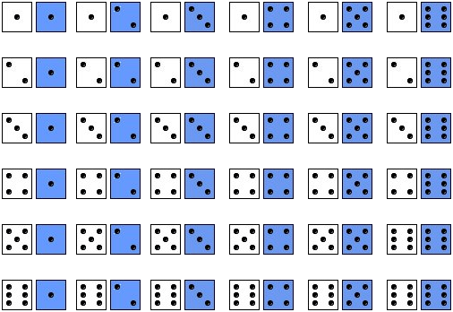
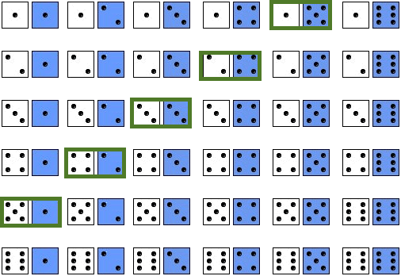

<style>
.column-left{
  float: left;
  width: 49%;
  text-align: left;
}
.column-right{
  float: right;
  width: 49%;
  text-align: right;
}
body {
text-align: justify}
</style>


<style>
.title-slide {
  background-image: url("https://raw.githubusercontent.com/tcui001/tcui001.github.io/master/assets/img/casino.jpg");
  background-size: 100% 100%;
  opacity: 0.1;
}
</style>

```{r Lec1, echo=FALSE, warning=FALSE, message=FALSE, cache=FALSE}
library(knitr)
opts_chunk$set(tidy = TRUE, cache = FALSE) 
library(knitr)
```


```{r child='Module3.Rmd'}
```

## <span class="fa-stack fa"><i class="fa fa-circle fa-stack-2x"></i><i class="fa fa-map-marker fa-stack-1x fa-inverse"></i></span>Simulating Chance

<div class="thinkingbox"> 
### ["Classical" probability](#4)  
### [Multiplication principle of counting](#20)  
### [Factorial](#22)  
### [Combinations](#28) 
### [Summary](#35)  
</div>


## "Classical" probability

The sample space $\Omega$ consist of a finite, known number of equally likely outcomes (e.g., coins, dice, cards). The probability of an event $A \subset \Omega$ occurring is 

\[
\boxed{P(A) = \frac{\mbox{Number of ways $A$ can occur}}{\mbox{Total number of possible outcomes in } \Omega} }
\] 

For example, suppose we want to know the probability of getting an even number when we roll a fair die. There are 6 equally likely possible outcomes,

<div style="margin-top: -10px"></div>

<h2 align="center">$\Omega = \{$ ⚀ ⚁ ⚂ ⚃ ⚄ ⚅ $\}$</h2>

<div style="margin-top: 10px"></div>

of which 3 are even. Therefore, the probability of rolling an even number is 
\[
P(\text{even number})= \frac{P(\text{number of outcomes that are even})}{P(\text{number of possible outcomes})}=\frac36.
\]

# Enumeration

##  Counting and drawing trees

- For simple problems, a good start is to enumerate all the possible outcomes using:

<div style="margin-top: -10px"></div>

  - Method 1
    - Write a list of all outcomes  
    - Count which outcomes belong to the event of interest.

  - Method 2
    - Draw a tree 


##

<div class="thinkingbox"> 

<div style="margin-top: -10px"></div>

### <span class="fa-stack fa"><i class="fa fa-circle fa-stack-2x"></i><i class="fas fa-pencil-alt fa-stack-1x fa-inverse"></i></span> Example

<div style="margin-top: 10px"></div>

Two dice are thrown. What is the chance that their sum is 6?

<div style="margin-top: -30px"></div>
</div>

<div style="margin-top: 10px"></div>

### Method 1: Write a full list of outcomes and count the outcomes of interest.


<div class="column-left">



</div>

<div style="margin-top: 10px"></div>

<div class="column-right">



</div>

So the chance is 5/36 (approx 0.14).


##
### Method 2: Summarise in a tree diagram

```{r, echo=F,warning =F,fig.height = 3}

library("DiagrammeR")

grViz(" 
  digraph CFA {

    # Top node
    node [shape = circle, color=Black]
    a [label = '@@1']; 

    # Multiple level nodes
    node [shape = circle, color=CornflowerBlue]
    b [label = '1']; 
    c [label = '2']; 
    d [label = '3'];
    e [label = '4'];
    f [label = '5'];
    g [label = '6'];
    {rank = same; b; g}

    # Terminal branch nodes
    node [shape = circle, color = Crimson] 
    h [label = '1'];
    i [label = '2'];
    j [label = '3'];
    k [label = '4'];
    l [label = '5'];
    m [label = '6'];
    {rank = same; h; i; j; k; l; m}

    # Connect nodes with edges and labels
    a -> b [label = '']
    a -> c [label = ''] 
    a -> d [label = ''] 
    a -> e [label = ''] 
    a -> f [label = ''] 
    a -> g [label = ''] 
    b -> h [label = '']
    b -> i [label = '']
    b -> j [label = '']
    b -> k [label = ''] 
    b -> l [label = ''] 
    b -> m [label = ''] 
  }

[1]: paste0('Start')  
#[2]: paste0('1st Draw\\n 1') 

")
```

<div style="margin-top: 10px"></div>

- One path has probability 1/36, because independence of 1st draw and 2nd draw means probabilities of edges can be  multiplied: 1/6*1/6=1/36
- Probability of paths can be added because events are mutually exclusive (if you throw (1,5) you can't have thrown (2,4) at the same time)

- Possible paths are (1,5), (2,4), (3,3), (4,2), (5,1), hence probability of 6 spots is 1/36+1/36+1/36+1/36+1/36=5/36.


# Sample with/without replacement

##
### Method 3: Simulate (in R)

- Use R and simulate  throwing 2 dice $x$ times and record the findings.

<!--
### Size 100

```{r, fig.height=3}
set.seed(1)
totals=sample(1:6, 100, rep = T)+sample(1:6, 100, rep = T)
table(totals)
barplot(table(totals), main="100 rolls: sum of 2 dice")
```

## 
So the (simulated) chance of getting a total of 6 is
`r length(totals[totals=="6"])`/100 =  
`r length(totals[totals=="6"])/100`.
-->

<!-- ## -->

<!-- ###  Simulate in R -->

```{r, fig.height=3}
set.seed(23) # set the random seed
totals=sample(1:6, 1000, rep = T)+sample(1:6, 1000, rep = T)
table(totals)
```

<div style="margin-top: 30px"></div>

- We set the random seed so this can be reproduced

- Sample from 1,2,3,4,5,6 (a die) with equal probability

- Sample 1000 times

- Sample **with replacement** using `rep=T` (independent experiments)


##
### Method 3: Simulate (in R)

```{r, fig.height=4}
barplot(table(totals), main="1000 rolls: sum of 2 dice")
```

<div style="margin-top: -30px"></div>

So the (simulated) chance of getting a total of 6 is
`r length(totals[totals=="6"])`/1000 =  `r length(totals[totals=="6"])/1000`, which is very close to
the exact answer of 5/36 = 0.139.

##

- What will happen if sample **without replacement** (without `rep=T`)? 

  - This implies dependent experiments - the next outcome depends on previous ones 
  - See code demo
  

<!--
## 
### More advanced code

```{r, fig.height=3}
set.seed(1)
Roll1Die = function(n) sample(1:6, n, rep = T) #Creates a function to roll die
roll1 = NULL  #Initialise variable.
roll2 = NULL
for (i in 1:100) {
    roll1[i] = Roll1Die(1)
    roll2[i] = Roll1Die(1)}
barplot(table(roll1 + roll2), main="100 rolls: sum of 2 dice") 
```

##

### More advanced code [simulating totals directly]

```{r fig.height=3}
set.seed(1)
s1=sample(2:12,size = 100,replace = TRUE, prob = table(outer(1:6,1:6,"+")) / 36)
table(s1)
barplot(table(s1))
```
-->
## A simple box model

<div style="margin-top: 10px"></div>

Many counting and probability problems can be reduced to a **box model**. In a box model, there are $N$ tickets in a box, and we draw $m$ tickets from the box.

- For example, three rolls of a fair die can be modeled as $m=3$
draws from the box 
\[\fbox{ $\fbox{1}\ \fbox{2}\ \fbox{3}\ \fbox{4}\ \fbox{5}\ \fbox{6}$ }\]
we have to place the ticket back in the box after each draw, so the outcome of one die roll does not affect the outcome of another. In other words, the $m=3$ draws are made with replacement.

- In other situations, the draws are made **without replacement**. For example, consider drawing four cards from a standard deck of 52 cards (without putting the drawn cards back). 

## 
<div class="thinkingbox"> 

<div style="margin-top: -10px"></div>
### <span class="fa-stack fa"><i class="fa fa-circle fa-stack-2x"></i><i class="fas fa-pencil-alt fa-stack-1x fa-inverse"></i></span> Example (a bit more complex)

<div style="margin-top: 10px"></div>

Three dice are thrown. What is the chance of getting a total equal to 6?

<div style="margin-top: -30px"></div>
</div>

<div style="margin-top: 10px"></div>

### Method 1: Write a list manually
- Total number of outcomes are 6x6x6 = 216
- The outcomes where the total is equal to 6 are: (1,1,4) (1,2,3) (1,3,2) (1,4,1) (2,1,3) (2,2,2) (2,3,1) (3,1,2) (3,2,1), (4,1,1)
- So exact chance of getting total of 6 is 10/216 (approx 0.046).

##
### Method 2: Summarise in a tree diagram

```{r, echo=F}
library("DiagrammeR")

grViz(" 
  digraph CFA {

    # Top node
    node [shape = circle, color=Black]
    a [label = '@@1']; 

    # Multiple level nodes
    node [shape = circle, color=CornflowerBlue]
    b [label = '1']; 
    c [label = '2']; 
    d [label = '3'];
    e [label = '4'];
    f [label = '5'];
    g [label = '6'];
    {rank = same; b; g}

    # Terminal branch nodes
    node [shape = circle, color = Crimson] 
    h [label = '1'];
    i [label = '2'];
    j [label = '3'];
    k [label = '4'];
    l [label = '5'];
    m [label = '6'];
  {rank = same; h; i; j; k; l; m}

# Terminal branch nodes
    node [shape = circle, color = Purple] 
    n [label = '1'];
    o [label = '2'];
    p [label = '3'];
    q [label = '4'];
    r [label = '5'];
    s [label = '6'];
    {rank = same; n; o; p; q; r; s}

    # Connect nodes with edges and labels
    a -> b [label = '']
    a -> c [label = ''] 
    a -> d [label = ''] 
    a -> e [label = ''] 
    a -> f [label = ''] 
    a -> g [label = ''] 
    b -> h [label = '']
    b -> i [label = '']
    b -> j [label = '']
    b -> k [label = ''] 
    b -> l [label = ''] 
    b -> m [label = ''] 
    h -> n [label = ''] 
    h -> o [label = ''] 
    h -> p [label = ''] 
    h -> q [label = ''] 
    h -> r [label = ''] 
    h -> s [label = ''] 
  }

[1]: paste0('Start')  
#[2]: paste0('1st Draw\\n 1') 

")
```


##

### Method 3: Simulate in R

```{r, fig.height=3}
set.seed(23)
totals=sample(1:6, 1000, rep = T)+sample(1:6, 1000, rep = T)+sample(1:6, 1000, rep = T)
table(totals)/1000
barplot(table(totals), main="1000 rolls: sum of 3 dice")
```

##

<div class="thinkingbox">

<div style="margin-top: -10px"></div>

### <span class="fa-stack fa"><i class="fa fa-circle fa-stack-2x"></i><i class="fas fa-pencil-alt fa-stack-1x fa-inverse"></i></span> Example

<div style="margin-top: 10px"></div>

Why did the Chevalier lose money? What is the chance of winning? 

  - Game A: Roll a die 4 times. Win = at least 1 "ace". 
  - Game B: Roll a pair of dice 24 times: Win = at least 1 "double-ace".
  - Note: an "ace" means "1".

<div style="margin-top: -30px"></div>

</div>

## 

### Method 3: Simulate in R (using a function)

```{r, fig.height=3}
gameA <- function(){
  rolls <- sample(1:6, size = 4, replace = TRUE)
  condition <- sum(rolls == 1) > 0
  return(condition)
}
simsA <- replicate(100000, gameA())
sum(simsA)/length(simsA)
```

```{r, fig.height=3}
gameB <- function(){
  first.die <- sample(1:6, size = 24, replace = TRUE)
  second.die <- sample(1:6, size = 24, replace = TRUE)
  condition <- sum((first.die == second.die) & (first.die == 1)) > 0
  return(condition)
}
simsB <- replicate(100000, gameB())
sum(simsB)/length(simsB)
```

Indeed, Game A is better. 


## Sample without replacement (using R)

<div style="margin-top: 10px"></div>

<div class="thinkingbox">

### <span class="fa-stack fa"><i class="fa fa-circle fa-stack-2x"></i><i class="fas fa-pencil-alt fa-stack-1x fa-inverse"></i></span> Example

<div style="margin-top: 10px"></div>

- A company has  10,000 male employees and 11,000 female employess. A representative committee is created by  randomly picking 10 employees.

- What is chance that  more than 75% in the committee are male?

<div style="margin-top: -30px"></div>
</div>

<div style="margin-top: 20px"></div>

```{r}
set.seed(1)
committee <- function(){
  committee <- sample(c(rep(1, 10000), rep(0, 11000)), size = 10, replace = FALSE)
  condition <-  mean(committee) > 0.75
  return(condition)
}
sim <- replicate(10000, committee())
mean(sim)
```


# Multiplication Principle of Counting

## Multiplication Principle of Counting

<div style="margin-top: 20px"></div>

<div class="thinkingbox"> 

<div style="margin-top: -10px"></div>

### <span class="fa-stack fa"><i class="fa fa-circle fa-stack-2x"></i><i class="fas fa-pencil-alt fa-stack-1x fa-inverse"></i></span> Multiplication Principle of Counting

<div style="margin-top: 10px"></div>

If a task can be performed in $n_1$ ways, and for each of these ways, a second task can be performed in $n_2$ ways, then the two tasks can be performed together in a total of $n_1 \times n_2$ ways. If there are $k$ tasks in such a sequence, then $k$ tasks can be performed together in a total of $n_1 \times n_2 \times \cdots n_k$ ways.

<div style="margin-top: -30px"></div>
</div>


<div style="margin-top: 30px"></div>

For example, there are a total number $6\times 6\times 6 = 216$ outcomes in rolling three dice. 

# Factorial 

## How many ways to arrange a deck of 52 cards?

<div style="margin-top: 10px"></div>

We can use the multiplication principle to determine the number of ways to arrange the deck. 

- The first card can be any one of $52$ cards. 
- No matter which one it is, the second card can be any one of the remaining $51$ cards. So there are $52 \times 51$ ways to choose the first 2 cards. 
- For every one of these  $52 \times 51$ ways, there are $50$ remaining cards to choose as the third card, which makes $52 \times 51 \times 50$ ways to choose the first 3 cards. 
- And so on. By the time we get to the last card in the deck, there is only 1 card left. So there are $52 \times 51 \times 50 \times \cdots \times 1$ ways to arrange the $52$ cards in a deck.

## Factorial

<div class="thinkingbox"> 

<div style="margin-top: -10px"></div>

### <span class="fa-stack fa"><i class="fa fa-circle fa-stack-2x"></i><i class="fas fa-pencil-alt fa-stack-1x fa-inverse"></i></span> Factorial

<div style="margin-top: 10px"></div>

The quantity $n!$ (pronounced: “n factorial”) is defined as 
\[
n! = n \times (n−1)\times \cdots \times 1. 
\]
It represents the number of ways to arrange n objects. 

<div style="margin-top: -30px"></div>
</div>

##
<div class="thinkingbox"> 

<div style="margin-top: -10px"></div>

### <span class="fa-stack fa"><i class="fa fa-circle fa-stack-2x"></i><i class="fas fa-pencil-alt fa-stack-1x fa-inverse"></i></span> Example

<div style="margin-top: 10px"></div>

A deck of 52 cards is shuffled thoroughly. What is the probability that the four aces are all next to each other? (Hint: First, count the number of positions that the block of four aces can go, then multiply this by the number of ways of ordering the four aces.)


<div style="margin-top: -30px"></div>
</div>

<div style="margin-top: 20px"></div>

There are $52!$ ways to order a deck of 52 cards (total number of outcomes in $\Omega$)

How many possible ways to have four aces next to each other? 

**Note**: A deck of cards has 13 ranks (ace, king, queen, jack, 10, ..., 2) and 4 suits (spades, clubs, hearts, and diamonds).

<div align="center">

</div>

##

- Step 1: Consider the block of four aces (next to each other) as a single block

  - then we have 48 other cards plus this one block, making a total of $48 + 1 = 49$ units to arrange.
  
- Step 2: there are $49!$ ways to arrange these 49 units.

- Step 3: Calculate the number of ways to arrange the aces (with different suits) within the block.

  - the four aces can be arranged among themselves in $4!$ ways.

- Step 4: Calculate the probability

\[
\frac{\mbox{Number of ways $A$ can occur}}{\mbox{Total number of possible outcomes in } \Omega} = \frac{49! \cdot 4!}{52!} = \frac{4 \cdot 3 \cdot 2 \cdot 1}{52 \cdot 51 \cdot 50} = \frac{1}{5525} 
\]

##

<div class="thinkingbox"> 

<div style="margin-top: -10px"></div>

### <span class="fa-stack fa"><i class="fa fa-circle fa-stack-2x"></i><i class="fas fa-pencil-alt fa-stack-1x fa-inverse"></i></span> Example

<div style="margin-top: 10px"></div>


If a five-letter word (in English) is formed at random (meaning that all sequences of five letters are equally likely), what is the probability that no letter occurs more than once?

<div style="margin-top: -30px"></div>
</div>

<div style="margin-top: 20px"></div>

Total number of outcomes in $\Omega$: $26^5$

Number of ways no letter occurs more than once: $26 \cdot 25 \cdot 24 \cdot 23 \cdot 22$ (taking out a letter from the box once it's been used)

So the probability is
\[
P = \frac{26 \cdot 25 \cdot 24 \cdot 23 \cdot 22}{26^5} \approx 0.6588
\]

# Combinations

## Example

<div style="margin-top: 10px"></div>

One of the most coveted hands in poker is a four-of-a-kind, which is when the hand contains all four cards of a particular rank. For example, the hand below is an example of a four-of-a-kind, since it contains all four 7s in the deck. (The last card, called the “kicker”, can be any other card.)

<div align="center">

</div>

Note: the order of the cards in the hand does not matter.

**What is the probability of a four-of-a-kind?**


<div style="margin-top: -30px"></div>

##

If drawing **without replacement**, the number of ways to draw $k$ tickets from the box
\[
\fbox{ $\fbox{1}\ \fbox{2}\ \fbox{3}\ \cdots \fbox{N}$ }
\]

<div style="margin-top: -25px"></div>

is

<div style="margin-top: -25px"></div>

\[
\underbrace{N \times (N-1) \times \cdots \times (N-k +1) }_{k \text{ terms}} = \frac{N!}{(N-k)!}
\]

<div style="margin-top: -15px"></div>

since the number of tickets remaining in the box decreases by 1 on each draw.

### How many possible poker hands are there?

If we assign a number 1 to 52 to each card in a standard playing deck, then a poker hand can be modeled as $k=5$ draws, without replacement, from the box 
\[
\fbox{ $\fbox{1}\ \fbox{2}\ \fbox{3}\ \cdots \fbox{52}$ }
\]
Number of possible **ordered** poker hands: $\frac{52!}{(52-5)!} = 52\cdot 51\cdot 50 \cdot 49\cdot 48$ $> 300 \times 10^6.$


##

Note that the order of cards in a hand matters here. We count not only how many hands of cards, but also how many **ordered** hands. 

Two hands formed by the same set of cards, but with different orders, for example
\[
\{ 2 \spadesuit, 3 \clubsuit, Ace \clubsuit, 9 \heartsuit, 5 \diamondsuit \}
\]
and
\[
\{ 9 \heartsuit,  3 \clubsuit, 5 \diamondsuit, 2 \spadesuit,  Ace \clubsuit\}
\]
are considered as two different hands by directly applying factorials. 

The factorial considers the different orders in which the cards might be drawn.

##

<div style="margin-top: -20px"></div>

### How many of these possible ordered outcomes result in a four-of-a-kind? 

Let’s start by assuming that the first four cards in the hand are the four-of-a-kind and the last card is the kicker.
        
- The first card can be any one of the $52$ cards.
- Once we have chosen the first card, the rank of the four-of-a-kind is determined. The second card must be one of the $3$ remaining cards of the same rank.
- The third card must be one of the $2$ remaining cards of that rank.
- The fourth card must be the $1$ remaining card of that rank.
- The last card, the kicker, is one of the other $48$ cards in the deck.
    
We assume the kicker is the last card in the hand. But the kicker can be in any one of 5 positions. So we need to multiply everything by 5 in the end.

There are $(52\cdot3\cdot2\cdot1\cdot 48)\cdot 5$ outcomes, the chance of getting a four-of-a-kind is
\[
\frac{(52\cdot3\cdot2\cdot1\cdot 48)\cdot 5}{52\cdot 51\cdot 50 \cdot 49\cdot 48} \approx 0.00024.
\]

## Combinations

The previous calculation was complicated because we had to consider the different orders in which the cards might be drawn. It is often easier to ignore the order when counting outcomes. 

<div class="thinkingbox"> 

<div style="margin-top: -10px"></div>

### <span class="fa-stack fa"><i class="fa fa-circle fa-stack-2x"></i><i class="fas fa-pencil-alt fa-stack-1x fa-inverse"></i></span> Combinations (**order doesn’t matter**)

<div style="margin-top: 10px"></div>

The number of ways to draw $k$ tickets from the box
\[
\fbox{ $\fbox{1}\ \fbox{2}\ \fbox{3}\ \cdots \fbox{N}$ }
\]
when the order doesn’t matter, is symbolized ${N \choose k}$ (pronounced: "N choose k") and is equal to 

<div style="margin-top: -35px"></div>

\[
{N \choose k} = \frac{N!}{{\color{blue}k!} (N-k)!}
\]

<div style="margin-top: -20px"></div>

${\color{blue}k!}$ is the number of ways of ordering the same set of $k$ objects. 

<div style="margin-top: -30px"></div>

</div>

##

<div style="margin-top: -20px"></div>

### Revisit the probability of a four-of-a-kind using combinations. 

If we ignore the order of the cards in the hand, there are ${52 \choose 5}=2,598,960$ possible poker hands. 

<div style="margin-top: -15px"></div>

```{r}
choose(52, 5)
```

<!---
Notice this number is much smaller than the 300+ million ordered poker hands. That is because when order matters, each distinct (unordered) poker hand gets counted $5!=120$ times, once for each possible way of reordering the 5 cards in the hand.
--->

### How many “unordered” four-of-a-kind hands are there? 

- Any one of the 13 ranks (Ace through King) could be the rank for the four-of-a-kind.
- Once we have chosen the rank, it completely determines 4 of the 5 cards in the four-of-a-kind. There are only 13 ways to include all 4 cards of a given rank.
- All that’s left is the kicker, which can be any one of the remaining 48 cards.

So when we ignore order, there are $13\cdot 48=624$ ways to get a four-of-a-kind. 

### The chance is $624/2,598,960 \approx 0.00024$

## Summary

### ["Classical" probability](#4)  
### [Sample with/without replacement](#9)  
### [Multiplication principle of counting](#20)  
### [Factorial](#22)  
### [Combinations](#28) 


### Key R Functions
`set.seed`, `sample`, `replicate`, `choose`